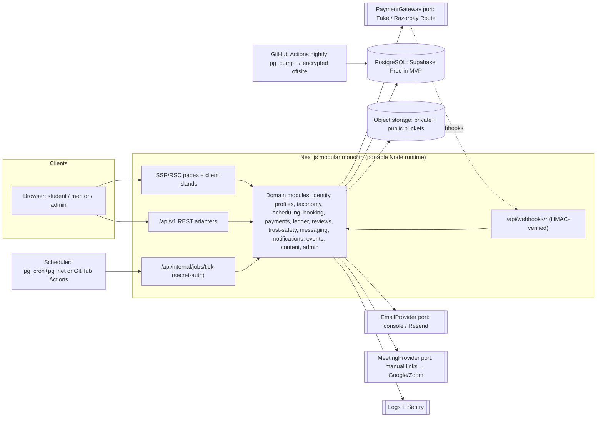

# Product & Engineering Blueprint

Status: Draft v0.1 · 2026-09-17 · Working brand name: **Aheadly** (temporary — see [22](22-ux-seo-design-system.md#5-brand-temporary))

This is the one-document summary. Each section links to the detailed document.

---

## 1. Product vision

A low-cost, trustworthy place where students get practical guidance from people who have **already done the thing they are preparing for**: landed the job, cleared the interview, got the admit, moved to the city.

Four layers, in order of cost to the student:

1. **Free knowledge**: guides, country and university pages, recorded webinars (SEO engine, trust builder).
2. **Free live events**: webinars and workshops (acquisition, mentor discovery).
3. **Affordable group sessions**: split a mentor's hour across 4–20 students (affordability wedge).
4. **Paid 1-on-1 sessions**: the core transaction (revenue).

Two sections share one engine: **Career & Academic** and **Study Abroad**.

Tagline (working): *"Guidance from people who've been there."*

## 2. Target users

| Side | Segment | Core need |
|------|---------|-----------|
| Demand | Indian undergraduates / final-year students | Placements, internships, interview prep, resume |
| Demand | Students planning a Master's abroad | Admissions, APS/uni-assist, visa process experience, housing, city life |
| Demand | Early-career switchers | Career switching, portfolio review |
| Supply | Working engineers / professionals | Side income, giving back, personal brand |
| Supply | Alumni of foreign universities | Side income, giving back |
| Supply | **Current** international students | Giving back, and side income **only where lawful** (see §20, risk R1) |
| Supply | Researchers / PhDs | Research guidance, publications |
| Staff | Admins, moderators, finance ops | Verification, safety, money ops |

Details and personas: [01 §3](01-product-requirements.md#3-personas).

## 3. Personas (summary)

- **Priya**, 21, final-year CSE student in Pune: budget ₹500–1,500 per session, wants mock interviews.
- **Arjun**, 23, applying for an MS in Germany: confused by APS, blocked account and housing; wants someone from TU Munich.
- **Dr. Meera**, 34, ML researcher: mentors on research papers; cares about reputation and fair pay.
- **Rahul**, 26, SDE at a product company: mentors on DSA and system design; wants a calendar that doesn't clash with work.
- **Lena**, 24, Master's student in Berlin (non-EU visa): wants to help, may be **legally unable to accept payment**.
- **Sana**, platform moderator: needs fast, fair, well-logged tools.

## 4. User journeys (MVP-critical)

1. Discover → mentor profile → pick slot (in own time zone) → see full price → pay → confirmation, calendar invite and reminders → join → confirm attendance → review.
2. Mentor application → email confirmed → credential verification (university or work email, or document review) → admin approval → payout KYC → availability → listed.
3. Browse free event → register (or join waitlist) → reminder → attend → recording → follow-up paid booking.
4. Something goes wrong → report or dispute → evidence → moderator decision → refund or enforcement → appeal.

Full journeys: [01 §4](01-product-requirements.md#4-user-journeys) and [22 §3](22-ux-seo-design-system.md#3-key-journeys-screen-level).

## 5. Feature matrix (abridged)

| Area | MVP | Beta | Future |
|------|-----|------|--------|
| Auth | Email + password, Google OAuth, email verification, reset, TOTP MFA (mandatory for staff) | Passkeys | SSO for university partners |
| Profiles | Student and mentor profiles, visibility controls | Portfolio uploads | Video intros |
| Verification | Scoped evidence badges (work/university email, document review), admin queue, expiry | DigiLocker degree pull (India) | Third-party background checks |
| Discovery | Filters, Postgres full-text search, explainable ranking, "help me choose" questionnaire (rules-based) | Saved searches, alerts | AI recommendations (with explanations) |
| Booking | 1:1 bookings, availability rules, DST-safe slots, holds, double-booking prevention, reschedule, cancel, ICS invites | Packages | Subscriptions, async reviews |
| Group sessions | Seat-based pricing, min/max participants, deadlines, waitlist | Dynamic group pricing | Cohorts |
| Events | Free webinars/workshops, capacity, waitlist, recordings (external links) | Paid events | Native streaming integrations |
| Payments | Provider-agnostic port, **Fake gateway + Razorpay test mode**, webhooks, refunds, split/hold payouts, ledger, reconciliation | Live payments (after legal/KYC) | Stripe for international, multi-currency |
| Reviews | Verified-session reviews, moderation, mentor response | Structured feedback tags | Review-integrity ML |
| T&S | Reports, moderation cases, policy engine (rules as data), strikes, restrictions, suspensions, bans, appeals, disputes, contact-info detection | Risk scoring | ML fraud models |
| Messaging | Async booking-scoped threads, pre-booking inquiry (limited), report/block, email notifications | Attachments, read receipts | Real-time chat |
| Notifications | In-app + email via outbox | Web push | WhatsApp/SMS |
| Admin | Users, mentors, verification, bookings, payments, refunds, disputes, reports, taxonomy, universities, events, settings, audit log, core analytics | Finance exports | BI warehouse |
| Content | Guides with source, last-verified date and disclaimers; country/university pages | Community Q&A | Courses |
| Community | — (content only) | Q&A per country/university/career | Discussions, groups |

## 6. Business model

- **Take rate**: configurable commission (default **10%**, mentor-borne), resolved from global → service type → category → promotion → mentor agreement. Snapshotted at booking. See [08 §7](08-payment-architecture.md#7-commission-engine).
- **Group sessions**: the same commission per seat; payment fees per seat make very cheap seats uneconomic, so there is a minimum seat price (config).
- **Free events**: cost centre funded by paid sessions; drives acquisition.
- **Unit economics reality check** (₹2,000 session, 10% commission GST-inclusive, platform absorbs Razorpay 2% + Route 0.1% + 18% GST on those fees): platform nets **≈₹120–127 (6.0–6.4%)** before hosting, refunds and support. A ₹600 group seat nets ≈₹36–38. Pricing must be validated. See [02 §4](02-market-research.md#4-unit-economics).
- Future: packages, subscriptions, async reviews, cohorts, sponsored events, university partnerships (see [20](20-future-roadmap.md)).

## 7. Marketplace mechanics

- **Wedge first**: launch with a narrow, high-pain niche. Recommended: *Indian students heading to Germany for STEM Master's*, plus *SWE interview prep*. Supply is abundant and community-organised; demand is searchable ("APS certificate", "TU Munich Indian students").
- **Supply quality over quantity**: manual approval, scoped verification, visible reliability metrics.
- **Liquidity levers**: free events hosted by mentors (discovery for them, value for students), group sessions (lower price point), founder-led outreach, university ambassadors. No spam, no fake supply. See [02 §5](02-market-research.md#5-cold-start-strategy).
- **Disintermediation defence**: payment protection (refunds and disputes only on-platform), payout holds, reviews and reputation tied to on-platform sessions, contact-info nudges before booking. No invasive surveillance. See [10 §9](10-trust-and-safety.md#9-off-platform-circumvention).

## 8. Trust & safety

- **Verification**: badges state exactly what was checked, how and when, e.g. *"Education: TU Berlin (university email confirmed Mar 2026)"*. There is no generic "Verified" label (misleading-advertising risk). Documents are private, reviewed by humans, and deleted after decision plus a retention window. **We do not collect Aadhaar or government ID images**; payout KYC is delegated to the regulated payment provider.
- **Policy engine**: signals (no-shows, late cancels, upheld reports, chargebacks) become *trust events* with points that decay. Rules (data, not code) propose actions. Warnings and temporary booking pauses can be automatic. **Suspensions and bans always require a human decision** and are appealable.
- **Mentor no-show default**: 3 confirmed no-shows (or 9 reliability points) within 90 days → 30-day suspension proposal. This replaces the brief's "3 *consecutive*" rule, which is gameable and unfair to low-volume mentors. Excused emergencies and platform failures never count. Details: [10 §5](10-trust-and-safety.md#5-mentor-reliability-policy-no-shows-and-cancellations).
- **Prohibited services** (critical for study abroad): no guaranteed admits or visas, no writing SOPs/LORs for students, no document forgery, no paid immigration advice where regulated, no off-platform payments.

## 9. Security model

- Target **OWASP ASVS 5.0 Level 2** for the whole app. Payment, authorization and admin paths aim for Level 3 controls where feasible.
- Server-side authorization on every request: RBAC roles plus ownership/relationship policies (`can(actor, action, resource)`), and a BOLA test matrix in CI.
- Database-backed sessions (instant revocation on ban or password change), `__Host-` cookies, SameSite=Lax plus Origin checks, CSP, rate limits, Turnstile on abuse-prone forms.
- Webhooks: HMAC on the raw body, dedupe by event id, out-of-order-safe state machines, re-fetch authoritative state.
- Idempotency keys on all money-moving and booking POSTs; append-only audit log and ledger.
- Lessons applied from **CVE-2025-29927** (Next.js middleware auth bypass: never rely on middleware alone for authz) and **CVE-2025-55182 / React2Shell** (keep framework patched, Dependabot and alerting).
- Full model: [11](11-security-threat-model.md).

## 10. Legal & compliance (⚖️ needs professional review)

Key items (full checklist in [12](12-privacy-compliance.md)):

- **DPDP Act 2023 + DPDP Rules 2025** (notified 14 Nov 2025; phased, substantive obligations from 13–14 May 2027). Notice, consent, rights, breach notification. **Verifiable parental consent for under-18s** → MVP is **18+ only**.
- **GDPR** likely applies to EU-resident mentors and students (e.g. mentors in Germany).
- **Consumer Protection (E-Commerce) Rules 2020**: grievance officer, price transparency. **CCPA Dark Patterns Guidelines 2023**: no drip pricing (show full price upfront), no false urgency.
- **IT Rules 2021 (amended 2026)**: intermediary due diligence, grievance acknowledgement within 24 h, shortened resolution timelines.
- **RBI Payment Aggregator Directions (15 Sep 2025)**: the platform must not pool and redistribute mentor money itself; use a licensed PA's split-settlement product (Razorpay Route / Cashfree Easy Split).
- **Tax**: GST registration as an e-commerce operator, possible TCS (s.52 CGST), TDS at 0.1% on payouts (formerly s.194-O; now s.393 of the Income-tax Act 2025), GST on commission, invoicing.
- **Visa work restrictions for current international students** (Germany, US F-1, UK Student visa…) → **R1 below**.
- **Regulated immigration advice** (UK OISC, Canada CICC/IRPA s.91, Australia OMARA, NZ IAA) → paid "immigration advice" is not an allowed service category; the product frames it as *personal experience* only.

## 11. Architecture

**Modular monolith**: Next.js (App Router, TypeScript) serves SSR pages and a versioned REST API. All business logic sits in a framework-independent **domain layer** under `src/server/modules/*`. PostgreSQL is the single system of record, with ports and adapters for payments, email, storage, meetings, captcha and error reporting.

Stack decisions (full comparison in [04](04-system-architecture.md) and ADRs in [21](21-architecture-decision-records.md)):

| Concern | Choice (MVP) | Why | Exit path |
|---------|--------------|-----|-----------|
| Web framework | Next.js (App Router), React, TypeScript strict | SSR/SEO, one deployable, mature ecosystem | Standard Node output; the domain layer is framework-free |
| API style | REST `/api/v1` + zod validation, RFC 9457 errors | Cacheable, simple, webhook-friendly; no GraphQL complexity | — |
| Database | PostgreSQL (Supabase Free), Drizzle ORM + SQL migrations | Exclusion constraints, transactions, FTS, numeric integrity | Any Postgres (Neon, RDS, Cloud SQL, self-hosted) |
| Auth | Hand-written on the platform pipeline, DB sessions in our Postgres (ADR-023) | No per-MAU cost, instant revocation, data ownership, one request pipeline | Library-level; data already ours |
| Storage | Supabase Storage via S3-compatible API | Private buckets + signed URLs | R2 / S3 / B2 |
| Payments | `PaymentGateway` port → FakeGateway (dev/test) + Razorpay test mode (Orders, Route transfers with holds, refunds) | India coverage, marketplace split under a licensed PA | Stripe adapter for international |
| Jobs | Transactional outbox table + tick endpoint; `FOR UPDATE SKIP LOCKED` | No extra infra; correctness never depends on tick timing | Queue service (SQS / Cloud Tasks / QStash) |
| Email | Console (dev) → Resend free (needs a domain) | Simple API, 3k/month free | Any SMTP/API provider |
| UI | Tailwind CSS + Radix-based components (shadcn/ui pattern), lucide icons | Accessible primitives, owned code | — |
| Hosting | Portable build. Dev previews on Vercel Hobby (non-commercial). Public beta host chosen at Phase 15 | Vercel Hobby forbids commercial use; Cloudflare free 3 MiB limit is too small for Next.js | Vercel Pro / Cloudflare Workers Paid / Netlify / container |

## 12. Database

About 60 tables across 8 bounded contexts. Money is `bigint` minor units plus ISO-4217 currency, with no floats. Times are `timestamptz` (UTC) and user time zones are IANA names. Double-booking is prevented by a **PostgreSQL `EXCLUDE USING gist` constraint** on `calendar_blocks(mentor_id, tstzrange)`. Audit log and ledger are append-only (DB grants plus hash chain on the audit log). Taxonomy, countries, cities, universities and programs are data, not enums, and are seeded from open datasets (ISO 3166, GeoNames, ROR and the university-domains list). See [05](05-database-design.md).

## 13. API

Resource-oriented REST, cursor pagination, `Idempotency-Key` on unsafe money and booking operations, `application/problem+json` errors with stable machine codes, per-route rate limits, and URL versioning. See [06](06-api-design.md).

## 14. Deployment

Environments: `local` (Homebrew Postgres 16, Fake gateway, console email), `preview` (per-PR), `staging` (Razorpay test mode), and `production` (only after the Production-critical checklist). CI runs on GitHub Actions: typecheck, lint, unit, integration against a Postgres service container, E2E smoke, dependency and secret scanning. See [14](14-deployment.md).

## 15. Cost

| Stage | Monthly cost | Notes |
|-------|--------------|-------|
| Local development | **₹0** | Everything runs locally |
| Hosted sandbox beta (test payments) | **₹0** | Free tiers; hard limits (see [14 §6](14-deployment.md#6-cost-sheet-and-free-tier-limits)) |
| Minimum *responsible* real-money launch | **≈ US$50–75/month plus a ~₹1,000/year domain** | Paid DB with backups and no auto-pause (~$25), commercial-use hosting ($5–20), email with custom domain; payment fees per transaction |

**Explicit statement: the ₹0 free-tier stack is suitable for development and a sandbox beta. It is NOT appropriate for real-money production** (no automated backups on Supabase Free, project pausing, non-commercial hosting terms, no SLA).

## 16. Testing

Vitest unit tests for pure domain rules (pricing, commission, refund math, state machines, DST slot generation). Integration tests against real Postgres cover the exclusion constraint under parallel transactions, webhook idempotency and the BOLA matrix. Playwright E2E covers critical journeys, with axe accessibility checks. Security gates: `npm audit`/OSV, gitleaks, ZAP baseline on staging. See [13](13-testing-strategy.md).

## 17. Scaling

Measure first. Upgrade triggers are defined (DB size > 350 MB, p95 API > 500 ms, search p95 > 300 ms, outbox lag > 5 min). The path: paid Postgres with a pooler → read replica and Redis cache/rate limiter → external search (Meilisearch/OpenSearch) → queue service → region split and data residency. See [16](16-migration-and-scaling.md).

## 18. MVP scope (Phases 4–15)

Auth · student and mentor profiles · verification queue · taxonomy/countries/universities (seeded) · discovery and search · availability · 1:1 booking with holds · group sessions · free events · payments (Fake + Razorpay test) with refunds, holds, ledger and webhooks · reviews · reports, moderation, policy engine, restrictions, appeals, disputes · booking-scoped messaging · in-app and email notifications · admin dashboard · audit log · guides with source metadata · SEO for public pages · CI · deployment. See [19](19-mvp-roadmap.md).

**Explicitly not in MVP**: real-time chat, community Q&A, AI features, native video, multi-currency charging, packages and subscriptions, mobile apps, live money.

## 19. Future scope

Community Q&A, packages and subscriptions, Stripe/international payouts, Google Calendar two-way sync and Meet auto-links, AI assistance (recommendations with explanations, resume feedback, moderation assist, never immigration or legal advice), cohorts, university partnerships. See [20](20-future-roadmap.md).

## 20. Major risks & "what could go catastrophically wrong?"

| # | Catastrophic scenario | Likelihood | Impact | Mitigation built into design |
|---|----------------------|-----------|--------|------------------------------|
| **R1** | **Paid mentoring by current international students violates their visa conditions** (Germany: self-employment needs Ausländerbehörde approval; US F-1: freelancing is unauthorized employment even for foreign clients; UK Student visa: self-employment prohibited). Users face status loss; the platform faces reputational and legal exposure. | High | Severe | Mentor **work-eligibility attestation** per country of residence and residence status. Current students on restricted visas are limited to **free sessions/events** ("Volunteer mentor") unless they upload proof of authorization. Country guidance pages. ⚖️ legal review before enabling paid mentoring for anyone residing abroad. |
| R2 | Platform holds and redistributes funds without PA authorisation → RBI violation | Medium | Severe | Mentor money flows only through a licensed PA's split settlement (Route/Easy Split). Platform never receives mentor share into its own bank account. ⚖️ confirm with counsel/PA. |
| R3 | Harm to a minor via 1:1 contact | Low–Med | Severe | 18+ only in MVP; age declaration; no off-platform contact encouragement; report/block; age policy configurable for a future guardian-consent flow. |
| R4 | Study-abroad fraud: fake admits, forged documents, "guaranteed visa" agents, SOP ghostwriting | High | Severe | Prohibited-services policy, claim-phrase detection in profiles and messages, scoped verification, fast takedown, disputes and refunds, reporting to authorities where required. |
| R5 | Harmful or incorrect immigration, legal or financial guidance acted upon | High | High | Persistent disclaimers, "experience, not official advice" framing, links to official sources, last-verified dates, no "immigration advice" service category in regulated jurisdictions. |
| R6 | Verification-document breach (IDs, degrees) | Medium | Severe | Minimise collection (no ID images; PA does KYC), private bucket, signed short-lived URLs, access audit, auto-delete after decision + 30 days, encryption at rest. |
| R7 | Mentor account takeover → payout redirected | Medium | High | MFA prompts for mentors, payout-account change requires recent re-auth + 72 h cooling-off + notification to prior email + admin review over threshold. |
| R8 | Payment/booking inconsistency (charged without booking, double charges) | Medium | High | Hold-before-pay, idempotency keys, webhook dedupe, reconciliation job, stuck-state monitors, auto-refund of orphaned payments, double-entry ledger. |
| R9 | Chargebacks/refunds after payout → platform loss | Medium | Medium | Transfers on hold until session end + dispute window; longer holds for new mentors; reversal API; mentor receivable netting. |
| R10 | Admin/moderator compromise or insider abuse | Low | Severe | Mandatory MFA for staff, least-privilege roles, step-up re-auth, 4-eyes on bans and large refunds, immutable audit log. |
| R11 | Free-tier data loss / project pause during beta | Medium | High | Nightly encrypted `pg_dump` offsite, restore drills, no real money on free tier. |
| R12 | Marketplace fails to reach liquidity | High | Fatal to business | Narrow wedge, free events as supply-side marketing, founder-led onboarding, content/SEO flywheel. |
| R13 | Non-compliance (DPDP penalties up to ₹250 crore per breach category; consumer and IT rules) | Medium | Severe | Privacy by design, compliance checklist, grievance officer, retention schedule, counsel review before launch. |
| R14 | Defamation/harassment via reviews or messages | Medium | Medium | Verified-session reviews only, moderation, mentor response, notice-and-action workflow with IT Rules timelines. |

## 21. Decisions needed from the founder

1. **Mentor eligibility for paid sessions** (R1): accept the proposed "volunteer-only unless authorized" default for current students abroad?
2. **Legal entity & payments**: Razorpay live mode and Route require a registered business (KYC, website, policies). Which entity type, and when?
3. **Repository visibility and license**: public (free CodeQL and unlimited Actions minutes) or private with a proprietary license? The default proposal is private with "All rights reserved".
4. **Brand name**: "Aheadly" is a placeholder; trademark and domain checks needed.
5. **Launch wedge**: confirm Germany-bound STEM Master's + SWE interview prep.

## Sources (research, accessed 2026-09-17)

See per-document "Sources" sections. Key ones: [Supabase pricing](https://supabase.com/pricing), [Supabase backups](https://supabase.com/docs/guides/platform/backups), [Neon plans](https://neon.com/docs/introduction/plans), [Cloudflare Workers limits](https://developers.cloudflare.com/workers/platform/limits), [Vercel Hobby plan](https://vercel.com/docs/plans/hobby), [Netlify credit-based plans](https://docs.netlify.com/manage/accounts-and-billing/billing/billing-for-credit-based-plans/credit-based-pricing-plans/), [Razorpay pricing](https://razorpay.com/pricing/), [Razorpay Route](https://razorpay.com/docs/payments/route/), [Stripe India marketplaces](https://support.stripe.com/questions/stripe-india-support-for-marketplaces), [RBI PA Directions 2025 (MediaNama explainer)](https://www.medianama.com/2025/09/223-explained-rbi-master-direction-payment-aggregators/), [DPDP Rules 2025 (PIB)](https://www.pib.gov.in/PressReleasePage.aspx?PRID=2190014), [OWASP Top 10:2025](https://owasp.org/Top10/2025/0x00_2025-Introduction/), [React2Shell advisory](https://github.com/vercel/next.js/security/advisories/GHSA-9qr9-h5gf-34mp), [Auth.js joins Better Auth](https://better-auth.com/blog/authjs-joins-better-auth), [UKCISA on student work](https://www.ukcisa.org.uk/news/navigating-work-and-study-with-a-student-visa/).
