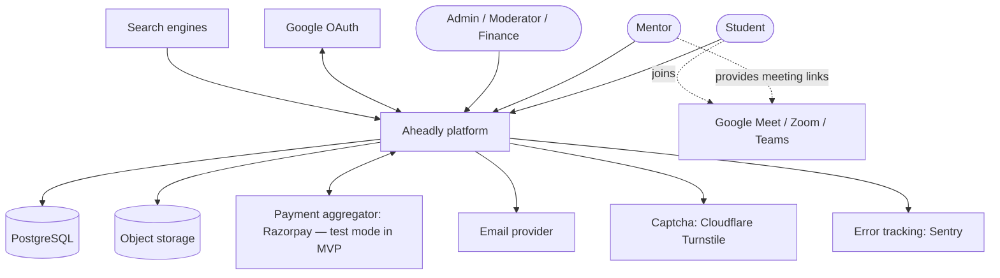
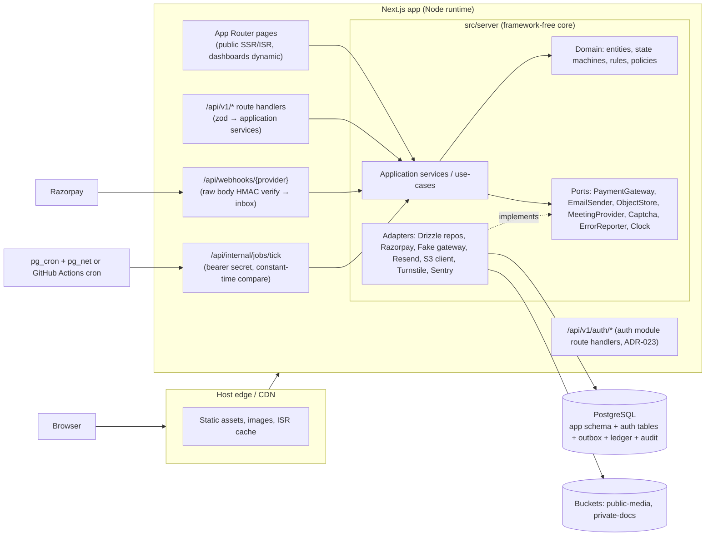
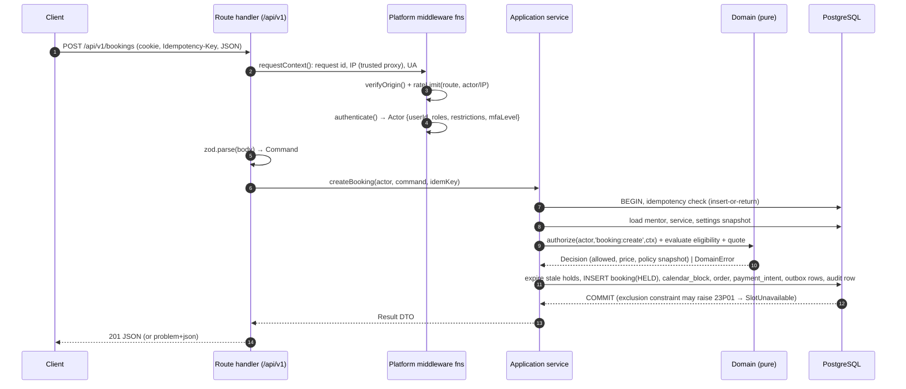
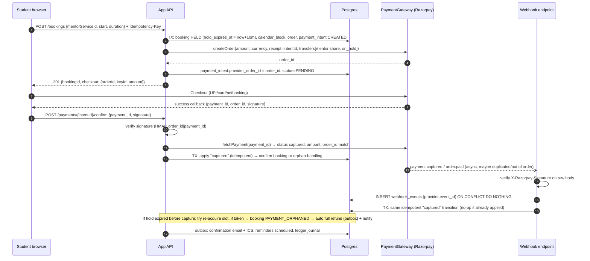

# 04 — System Architecture

Status: Draft v0.1 · 2026-09-17 · Decisions recorded in [21](21-architecture-decision-records.md)

## 1. Architectural principles

1. **Simple infrastructure, strong boundaries.** One deployable (modular monolith) and one database, with strict internal module boundaries so modules can be extracted later.
2. **The database enforces invariants that matter.** Double booking, uniqueness, money sign and state validity are enforced by constraints, not just application code.
3. **Server-authoritative.** The client never decides prices, eligibility, payment success or permissions.
4. **Business rules are data + pure functions.** Rules live in `domain/` modules, are parameterised by versioned settings, and are unit-testable without I/O.
5. **Ports & adapters for every external dependency** (payments, email, storage, meetings, captcha, error reporting, clock), so vendors can be swapped and tests run offline.
6. **Correctness never depends on timers.** Scheduled jobs *accelerate* cleanup and notifications; reads evaluate time-based state lazily (e.g. an expired hold is expired even if the sweeper hasn't run).
7. **Everything important is idempotent and auditable.**
8. **Portable by default.** No hosting-vendor-specific runtime APIs in domain or application code.

## 2. System context (C4 level 1)



## 3. Containers (C4 level 2)



## 4. Technology selection

### 4.1 Frontend/web framework

| Option | SEO/SSR | Full-stack in one deploy | Ecosystem | Hosting portability | Risks | Verdict |
|--------|---------|--------------------------|-----------|---------------------|-------|---------|
| **Next.js (App Router)** | Excellent (RSC, SSR, ISR, metadata API, sitemaps) | Yes (route handlers) | Largest | Node standalone, OpenNext adapters (Cloudflare, Netlify, AWS) | Complexity, frequent security patches (CVE-2025-29927, CVE-2025-55182) | **Chosen**, with strict patching policy |
| React Router v7 (framework mode) | Good SSR | Yes | Good | Very portable | Smaller ecosystem for SEO tooling | Strong alternative |
| Vite + React SPA | Poor without prerendering | No (needs separate API) | Good | Static hosting (GitHub Pages) | SEO for mentor/university pages suffers | Rejected |
| Astro + separate API | Excellent for content | No | Good | Good | Two apps; dashboards need islands | Rejected for MVP |

**GitHub Pages** is static-only and cannot run webhooks, auth or booking transactions. Not used for the app. It may host a static docs site later.

### 4.2 Hosting (app runtime)

| Option | ₹0 tier | Commercial use on free tier | Next.js fit | Cold starts | Notes |
|--------|---------|-----------------------------|-------------|-------------|-------|
| Vercel Hobby | Yes | **No**: personal/non-commercial only | Best | Minimal | Use for **development previews only** |
| Netlify Free | Yes (300 credits/month, hard stop) | Yes | Good (OpenNext-based runtime) | Some | Production deploys cost credits; site stops at cap |
| Cloudflare Workers Free | Yes (100k req/day, 10 ms CPU) | Yes | **3 MiB** worker limit, which full Next.js apps commonly exceed | None | Paid plan ($5/mo, 10 MiB) is the cheapest compliant production option |
| Render Free | Yes | Yes | Node server | Spins down on idle, slow cold starts | Poor UX for booking |
| VPS/container (later) | No | Yes | Node standalone | None | Most control; ops burden |

**Decision:** keep the app portable (standard Next.js Node output, no vendor APIs). Use Vercel Hobby for **private development previews**. Choose the public beta host at Phase 15 from measured bundle size and traffic: Netlify Free if within credits, otherwise Cloudflare Workers Paid or Vercel Pro. **Real-money production requires a paid, commercial-use plan.** (ADR-010)

### 4.3 Database

| Option | Free tier | Relational integrity | Exclusion constraints / txns | Auth/storage bundled | Pausing/cold start | Backups on free | Lock-in |
|--------|-----------|---------------------|------------------------------|---------------------|-------------------|-----------------|---------|
| **Supabase (Postgres)** | 500 MB DB, 1 GB storage, 5 GB egress | Full Postgres | Yes (`btree_gist`) | Yes (we use storage, not auth) | **Pauses after 7 days inactivity**; always-on compute while active | **None** (manual `pg_dump` recommended) | Low if used as plain Postgres |
| Neon (Postgres) | 0.5 GB/project, 100 CU-h/project/month | Full Postgres | Yes | No | Scale-to-zero after 5 min (sub-second resume) | 6-hour restore window | Low |
| Firebase Firestore | Generous | No joins, weak multi-doc constraints | Transactions, no range exclusion | Yes | None | Paid PITR | High |
| Cloudflare D1 (SQLite) | 5 GB | Relational, limited | No range exclusion, limited concurrency semantics | No | None | Time Travel | Medium |
| Local/self-hosted Postgres | ₹0 | Full | Yes | No | n/a | DIY | None |

**Decision:** PostgreSQL is mandatory for booking and money integrity. **MVP host: Supabase Free** (always-on compute while active, bundled S3-compatible storage, `pg_cron`/`pg_net` for the job scheduler), used **as plain Postgres**: no PostgREST client access, no Supabase Auth. Neon is the documented alternative (better restore window, but frequent job ticks would consume compute-hours). (ADR-002, ADR-003)

Connection handling: serverless-friendly transaction pooler (Supavisor, port 6543) with `prepare: false`; a direct connection for migrations only.

### 4.4 Authentication

| Option | Cost | Data ownership | Session revocation | MFA | Lock-in | Verdict |
|--------|------|----------------|-------------------|-----|---------|---------|
| Better Auth | Library, ₹0 | Our Postgres | DB sessions → immediate | TOTP plugin, passkeys | Low | Originally chosen (ADR-004) |
| Supabase Auth | 50k MAU free | `auth` schema in Supabase | JWT (valid until expiry unless short-lived) | TOTP | Medium | Good, but JWT revocation lag is a problem for bans |
| Auth.js | Library | Ours | DB sessions | No built-in | Low | Maintenance mode since Sep 2025 (team joined Better Auth) |
| Clerk | Free tier with limits | Vendor | Yes | Yes | High | Vendor dependency for core identity; cost grows with MAU |
| Firebase Auth | Free tier | Vendor | Token-based | Yes | High | Rejected with Firestore |
| **Hand-written on the platform pipeline** | ₹0, no new framework | Our Postgres | DB sessions → immediate | TOTP + backup codes, built | None | **Actually built (Phase 5), ADR-023** |

(ADR-004, superseded by ADR-023 once the platform layer already had its own hashed-session, audit and rate-limit primitives — see [21](21-architecture-decision-records.md#adr-023--auth-core-built-directly-on-the-platform-pipeline-instead-of-the-better-auth-library-phase-5-supersedes-adr-004))

### 4.5 Other components

| Concern | MVP choice | Alternatives considered | Why |
|---------|-----------|------------------------|-----|
| ORM / SQL | Drizzle ORM + generated SQL migrations reviewed by hand; raw SQL for constraints | Prisma (heavier engine, fewer Postgres features in schema), Kysely | Type-safe, thin, SQL-close, supports custom constraints via migrations |
| Validation | zod (shared request schemas) | valibot | Ubiquitous; generates OpenAPI via zod-to-openapi |
| Styling/UI | Tailwind CSS v4 + Radix primitives (shadcn/ui pattern) + lucide icons | MUI, Chakra | Accessible primitives, owned components, small CSS |
| Forms | react-hook-form + zod resolver | Formik | Performance, schema reuse |
| Dates/time | `Temporal` API via polyfill (`@js-temporal/polyfill`) or `@date-fns/tz` behind `time` utility module | Moment (legacy), manual offsets (forbidden) | Explicit IANA tz + disambiguation control |
| Email | Console adapter (dev), Resend (hosted) | Brevo, SES | Simple API; free 3k/month; requires own domain |
| Object storage | Supabase Storage (S3 API) | R2, B2, S3 | Bundled with DB vendor; S3 API keeps it swappable |
| Captcha/bot | Cloudflare Turnstile | hCaptcha, reCAPTCHA | Free, privacy-friendlier, no puzzles for most users |
| Errors | Sentry (free developer tier) behind `ErrorReporter` | GlitchTip self-host | Mature; swappable |
| Logging | pino (JSON) → host log drain | winston | Fast, structured |
| Background jobs | Postgres outbox + tick endpoint | QStash, Inngest, BullMQ+Redis | No extra vendor; transactional with state changes |
| Rate limiting | Postgres-backed fixed-window (MVP) behind `RateLimiter` port | Upstash Redis | No extra vendor; swap at scale |
| Search | Postgres FTS (`tsvector`) + `pg_trgm` + filter indexes | Meilisearch, Typesense, OpenSearch | Enough for < 50k mentors; no extra infra |
| Testing | Vitest, Playwright, axe-core, Testcontainers-free local Postgres (CI service container) | Jest, Cypress | Speed, ESM-native |
| Package manager | npm 11 with lockfile and `allowScripts` install-script denials | pnpm | Zero setup; supply-chain hygiene |
| Node | 24 LTS pinned via `.nvmrc`/`engines` | — | Required by Vitest 5; installed via nvm (ADR-022) |

## 5. Code organisation (planned)

```
/
├─ docs/                               # this documentation
├─ drizzle/                            # SQL migrations (reviewed, committed)
├─ scripts/                            # seeders (countries, universities), backup helpers
├─ src/
│  ├─ app/                             # Next.js routes — adapters only, no business logic
│  │  ├─ (public)/ ...                 # home, explore, mentor profile, study-abroad hubs, events, guides, legal
│  │  ├─ (auth)/ ...                   # sign-in, sign-up, reset
│  │  ├─ dashboard/ ...                # student + mentor areas (role-aware)
│  │  ├─ admin/ ...                    # staff area (MFA + role gated server-side)
│  │  ├─ api/v1/**/route.ts            # REST adapters: parse → authn → service → DTO
│  │  ├─ api/v1/auth/**/route.ts       # sign-up/in/out, MFA, sessions, Google OAuth (ADR-023; Phase 5)
│  │  ├─ api/webhooks/[provider]/route.ts
│  │  └─ api/internal/jobs/tick/route.ts
│  ├─ server/                          # imports 'server-only'
│  │  ├─ platform/                     # cross-cutting: db, tx, errors, authz, audit, outbox, idempotency,
│  │  │                                #   rate-limit, settings, clock, logger, request-context, crypto
│  │  └─ modules/
│  │     ├─ auth/ (✅ P5)  ├─ profiles/ (✅ P6) ├─ taxonomy/ (platform reference) ├─ verification/ (✅ P6, email only)
│  │     ├─ booking/ (✅ P7, scheduling + 1:1 sessions; group/events Phase 9) ├─ payments/ ├─ events/
│  │     ├─ ledger/       ├─ reviews/      ├─ trust-safety/ ├─ messaging/ (Phase 7b)
│  │     ├─ notifications/├─ content/      ├─ analytics/    └─ admin/
│  │        each module: domain/ (pure) · application/ (use-cases) · infra/ (repos, adapters) · http/ (schemas, DTOs) · index.ts (public API)
│  ├─ ui/                              # design-system components (client-safe)
│  ├─ lib/                             # client-safe utils: money & time formatting, brand config
│  └─ config/                          # brand.ts, env schema (zod-validated at boot)
└─ tests/ (e2e/, integration/, fixtures/)
```

**Boundary rules** (enforced by the Vitest architecture tests in `tests/architecture`, ADR-022):
- `domain/` imports nothing outside its module's `domain/` and `platform/primitives` (no DB, no HTTP, no Next.js).
- Modules talk to each other only via their `index.ts` public API or domain events. No reaching into another module's tables.
- `app/` imports `server/modules/*/index.ts` and `ui/` only.
- Client components never import `server/` (guarded by `server-only`).

## 6. Request lifecycle (mutating API call)



Platform middleware functions are **explicit calls inside handlers**, not Next.js `middleware.ts`. Middleware may add security headers and coarse redirects, but **authorization never depends on it** (lesson from CVE-2025-29927).

## 7. Key flow: book and pay (1:1)



Both the client confirmation and the webhook call the same idempotent transition, so **whichever arrives first wins** and the other is a no-op. If neither arrives (browser closed, webhook delayed), the **payment sweeper** polls the provider for PENDING intents older than 2 minutes.

## 8. Background processing (transactional outbox)

- `outbox_jobs(id, type, payload jsonb, run_at, status, attempts, max_attempts, locked_until, last_error, dedupe_key unique)`.
- Rows are inserted **in the same transaction** as the state change that caused them (no lost emails when a TX commits, and no ghost emails when it rolls back).
- Tick endpoint: `SELECT … WHERE status='pending' AND run_at<=now() ORDER BY run_at FOR UPDATE SKIP LOCKED LIMIT 25`, processes with a per-job timeout, exponential backoff (1m, 5m, 30m, 2h, 12h), and dead-letter status `failed` surfaced in admin.
- Triggers: `pg_cron` job every minute calling `pg_net.http_post` to the tick URL with a secret header (Supabase), **or** GitHub Actions cron (≥ 5 min, best effort). Also opportunistically after relevant API requests (non-blocking).
- Recurring jobs (implemented as self-rescheduling outbox rows): hold sweeper, payment sweeper, reminder scheduler, attendance finaliser, transfer releaser, verification expiry, strike decay, reconciliation (daily), data-retention purge (daily), sitemap regeneration (daily).

## 9. Ports (interfaces)

```ts
interface PaymentGateway {
  readonly provider: 'fake' | 'razorpay' | 'stripe';
  createOrder(i: CreateOrderInput): Promise<ProviderOrder>;            // with optional split transfers
  verifyClientConfirmation(i: ClientConfirmation): boolean;             // signature check
  fetchPayment(providerPaymentId: string): Promise<ProviderPayment>;   // authoritative state
  fetchOrderPayments(providerOrderId: string): Promise<ProviderPayment[]>;
  refund(i: RefundInput): Promise<ProviderRefund>;                     // idempotency key passed through
  releaseTransfer(i: { providerTransferId: string }): Promise<void>;
  reverseTransfer(i: { providerTransferId: string; amountMinor: bigint }): Promise<ProviderReversal>;
  createPayee(i: PayeeOnboardingInput): Promise<ProviderPayee>;        // linked account + KYC link
  parseWebhook(rawBody: Buffer, headers: Headers): VerifiedWebhookEvent; // throws on bad signature
}
interface EmailSender { send(m: EmailMessage): Promise<{ providerMessageId: string }>; }
interface ObjectStore { presignPut(k: ObjectKeySpec): Promise<PresignedPut>; presignGet(key: string, ttlSec: number, disposition: 'inline'|'attachment'): Promise<string>; head(key: string): Promise<ObjectMeta|null>; delete(key: string): Promise<void>; }
interface MeetingProvider { kind: 'manual'|'google_meet'|'zoom'; createMeeting?(s: SessionInfo): Promise<MeetingInfo>; validateLink(url: string): LinkValidation; }
interface Clock { now(): Temporal.Instant; }
```

## 10. Caching & rendering strategy

| Surface | Rendering | Cache |
|---------|----------|-------|
| Home, section hubs, guides, country/university pages | Static + ISR (revalidate on content change via tag) | CDN |
| Mentor public profile | ISR (revalidate 10 min + on profile change); availability loaded client-side from API (never cached across users) | CDN for shell; `no-store` for slots |
| Explore/search | SSR (query params), `private, no-store` for personalised bits | Short CDN cache for anonymous popular queries (Beta) |
| Dashboards/admin | Dynamic SSR, `no-store` | None |
| API | `no-store` default; public taxonomy endpoints `s-maxage=300` | CDN |

## 11. Configuration & feature flags

- **Env config** (secrets, URLs) validated with zod at boot; the app refuses to start on invalid config.
- **Business settings** (`platform_settings`, versioned rows with `effective_from`) cover commission defaults, cancellation windows, hold TTL, strike thresholds, age policy and so on. Cached in-process for 60 s; every change is audited.
- **Feature flags** (`feature_flags` table): `payments.live`, `community.enabled`, `group_sessions.enabled`, `mentor.paid_sessions.country_rules`, and more. Evaluated server-side.
- **Brand config** (`src/config/brand.ts`) holds name, domain, colours and support emails, so the product name appears in exactly one place.

## 12. Internationalisation architecture

- UI strings via message catalogs (`next-intl`), English only initially; locale in URL prefix reserved for later (`/en/...` not used in MVP to keep URLs clean; hreflang when added).
- Money: `Money { amountMinor: bigint; currency: CurrencyCode }` formatted with `Intl.NumberFormat(locale, {style:'currency'})`; currency exponent from `currencies` table.
- Time: all instants UTC (`timestamptz`); user and mentor IANA time zones; formatting with `Intl.DateTimeFormat` + explicit zone name.
- Taxonomy names translatable via `*_translations` tables.
- Country-specific rules (tax, age, payment availability, mentor eligibility) are keyed by ISO country code in settings, not hard-coded.

## Sources (accessed 2026-09-17)

- Vercel Hobby terms: https://vercel.com/docs/plans/hobby ; https://vercel.com/docs/limits/fair-use-guidelines
- Netlify credits: https://docs.netlify.com/manage/accounts-and-billing/billing/billing-for-credit-based-plans/credit-based-pricing-plans/
- Cloudflare Workers limits: https://developers.cloudflare.com/workers/platform/limits ; OpenNext troubleshooting (3 MiB): https://opennext.js.org/cloudflare/troubleshooting
- Supabase free tier & backups: https://supabase.com/pricing ; https://supabase.com/docs/guides/platform/backups
- Neon plans: https://neon.com/docs/introduction/plans
- Better Auth / Auth.js: https://better-auth.com/blog/authjs-joins-better-auth
- Next.js advisories: https://github.com/vercel/next.js/security/advisories/GHSA-9qr9-h5gf-34mp
- Razorpay webhooks validation: https://razorpay.com/docs/webhooks/validate-test/
