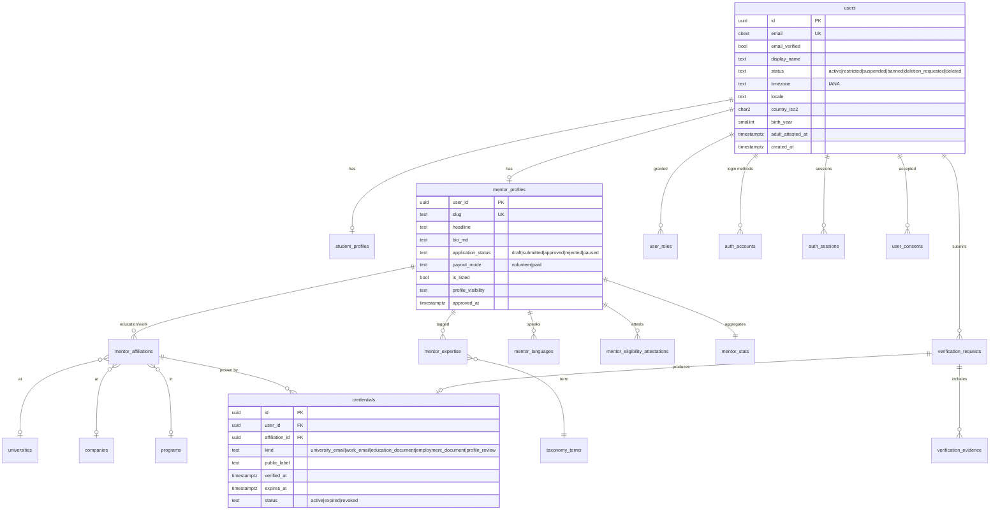
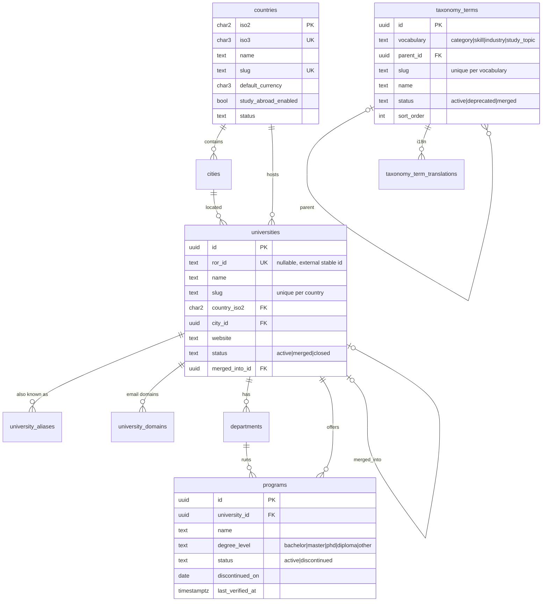
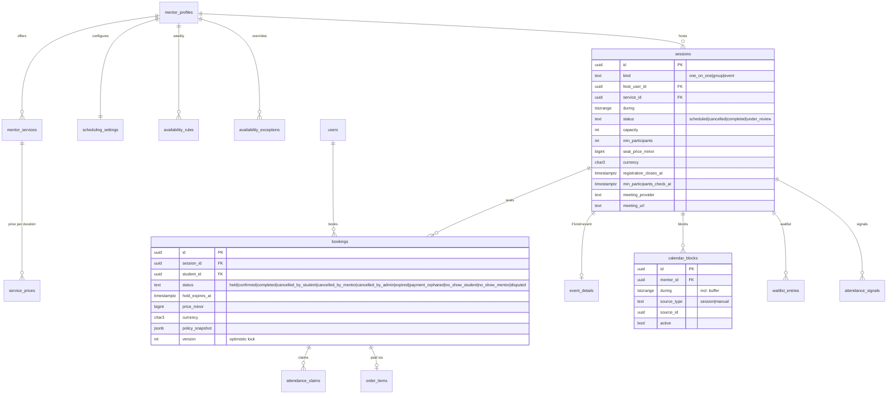
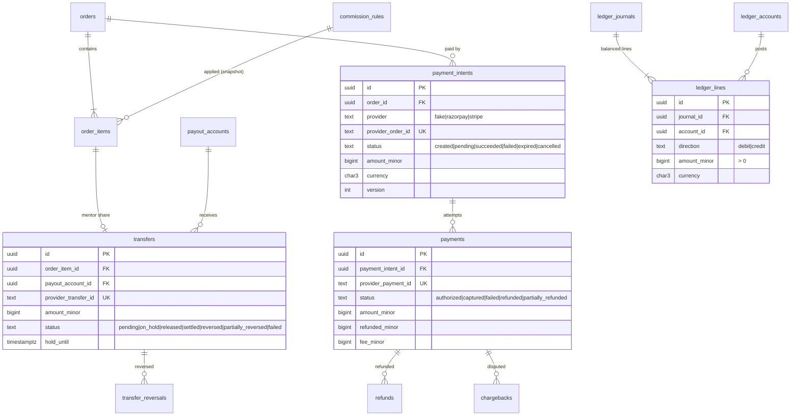
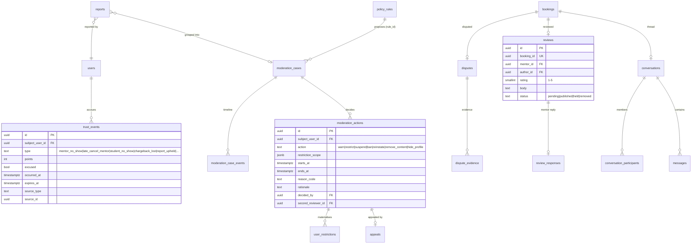

# 05 — Database Design

Status: Draft v0.1 · 2026-09-17 · Target: PostgreSQL 15+ (Supabase), portable to any Postgres

## 1. Conventions

| Topic | Convention | Reason |
|-------|-----------|--------|
| Schema | All app tables in schema **`app`** (not `public`). Supabase Data API (PostgREST) **disabled**; `anon`/`authenticated` roles get no grants on `app`. | Supabase exposes `public` over REST by default; our app talks to Postgres directly |
| Primary keys | `uuid`, **UUIDv7 generated in the app** (time-ordered) | Index locality; no enumeration; merge-safe |
| Public identifiers | Slugs for mentors, universities, events and articles; never sequential ids | SEO + anti-enumeration |
| Timestamps | `timestamptz` everywhere, stored UTC; `created_at`/`updated_at` default `now()` | Time-zone safety |
| Time ranges | `tstzrange` with `[)` bounds | Overlap math + exclusion constraints |
| Money | `amount_minor bigint` + `currency char(3)` (ISO 4217), `CHECK (amount_minor >= 0)` unless a signed ledger field | No floats; multi-currency |
| Rates | Basis points `int` (`1000` = 10.00%) | Integer math |
| Status fields | `text` + `CHECK (status IN (...))` | Easier to evolve than PG enums |
| Names | `snake_case`, plural table names | Consistency |
| Booleans | `NOT NULL DEFAULT false` | No tri-state surprises |
| JSON | `jsonb` only for snapshots, provider payload excerpts, rule params; **never** for queryable core fields | Integrity & indexing |
| Foreign keys | Always declared; `ON DELETE RESTRICT` by default; `CASCADE` only for pure child rows (e.g. translations) | Prevent orphan and accidental data loss |
| Migrations | Drizzle-generated SQL, hand-reviewed, forward-only; destructive changes via expand → migrate → contract | Zero-downtime-friendly |
| Extensions | `btree_gist`, `pg_trgm`, `citext`, `pgcrypto`; `pg_cron`, `pg_net` (Supabase only, optional) | Constraints, search, case-insensitive email |

## 2. Bounded contexts

| Context | Tables (MVP unless noted) |
|---------|--------------------------|
| Identity & access | `users`, `auth_accounts`, `auth_sessions`, `auth_verifications`, `auth_two_factors`, `user_roles`, `user_consents`, `user_settings` |
| Profiles | `student_profiles`, `mentor_profiles`, `mentor_affiliations`, `mentor_languages`, `mentor_links`, `mentor_expertise`, `mentor_eligibility_attestations`, `saved_mentors`, `mentor_stats` |
| Taxonomy & geography | `taxonomy_terms`, `taxonomy_term_translations`, `countries`, `cities`, `universities`, `university_aliases`, `university_domains`, `departments`, `programs`, `companies`, `company_domains` |
| Verification | `verification_requests`, `verification_evidence`, `credentials`, `verified_email_fingerprints` |
| Scheduling & booking | `mentor_services`, `service_prices`, `scheduling_settings`, `availability_rules`, `availability_exceptions`, `sessions`, `calendar_blocks`, `bookings`, `reschedule_requests`¹, `attendance_signals`, `attendance_claims`, `waitlist_entries`², `event_details`², `event_invites`² |
| Payments & ledger | `orders`, `order_items`, `payment_intents`, `payments`, `refunds`, `payout_accounts`, `transfers`, `transfer_reversals`, `chargebacks`, `commission_rules`, `ledger_accounts`, `ledger_journals`, `ledger_lines`, `webhook_events`, `invoices`, `invoice_sequences`, `coupons` (B) |
| Trust & safety | `reports`, `moderation_cases`, `moderation_case_events`, `moderation_actions`, `user_restrictions`, `appeals`, `trust_events`, `policy_rules`, `disputes`, `dispute_evidence`, `user_blocks`, `risk_signals` (B) |
| Reviews | `reviews`, `review_responses`, `review_reports` (via `reports`) |
| Messaging & notifications | `conversations`, `conversation_participants`, `messages`, `notifications`, `notification_preferences`, `email_deliveries` |
| Content & community | `articles`, `article_sources`, `community_spaces` (B), `community_posts` (B), `community_comments` (B), `community_votes` (B) |
| Platform | `platform_settings`, `feature_flags`, `outbox_jobs`, `idempotency_keys`, `rate_limit_buckets`, `audit_logs`, `analytics_events`, `mentor_search_documents`, `data_requests` |

¹ `reschedule_requests` was missing from this row even though docs/09 §7.1 calls for it as its own entity — added here to match, not a new decision.
² Group/event tables (`waitlist_entries`, `event_details`, `event_invites`) don't exist yet — `sessions.kind` already includes `group`/`event` so Phase 9 can add them without a breaking migration (docs/19 Phase 7 deviations). `booking_intake_answers` was folded into a `bookings.intake_answers` jsonb column instead of a separate table — intake answers are read only alongside their booking, never queried independently, so the join bought nothing.

**Implementation note (Phase 7):** built in `src/server/modules/booking`, including a hand-written `EXCLUDE USING gist` migration for `calendar_blocks` (§4.1) since Drizzle ORM has no first-class range/exclusion-constraint support (ADR-027) — the table itself is still generated normally via `drizzle-kit`, only the constraint is hand-added.

## 3. ERDs

### 3.1 Identity, profiles, verification



### 3.2 Taxonomy & geography



### 3.3 Scheduling, sessions, bookings, events



### 3.4 Payments & ledger



### 3.5 Trust & safety, reviews, messaging



## 4. Critical constraints (DDL excerpts)

### 4.1 No double booking (mentor calendar)

```sql
CREATE EXTENSION IF NOT EXISTS btree_gist;

CREATE TABLE app.calendar_blocks (
  id           uuid PRIMARY KEY,
  mentor_id    uuid NOT NULL REFERENCES app.mentor_profiles(user_id),
  source_type  text NOT NULL CHECK (source_type IN ('session','manual')),
  source_id    uuid,
  during       tstzrange NOT NULL
               CHECK (NOT isempty(during) AND lower_inc(during) AND NOT upper_inc(during)
                      AND upper(during) - lower(during) <= interval '12 hours'),
  active       boolean NOT NULL DEFAULT true,
  released_at  timestamptz,
  created_at   timestamptz NOT NULL DEFAULT now(),
  CONSTRAINT calendar_blocks_no_overlap
    EXCLUDE USING gist (mentor_id WITH =, during WITH &&) WHERE (active)
);
```

- `during` = `[session_start, session_end + buffer_after)`. The buffer is snapshotted at booking time.
- Any concurrent insert that overlaps an active block fails with SQLSTATE **`23P01`**, which maps to the domain error `SLOT_UNAVAILABLE`. That holds at any isolation level, because exclusion constraints are checked via the index at insert time.
- Stale holds are released **in the same transaction** before insert (see [09 §6](09-booking-system.md#6-concurrency-control)).

### 4.2 One active seat per student per session; capacity

```sql
CREATE UNIQUE INDEX bookings_one_active_seat
  ON app.bookings (session_id, student_id)
  WHERE status IN ('held','confirmed','completed','no_show_student','no_show_mentor','disputed');
```

Capacity is enforced in the booking transaction with `SELECT … FROM app.sessions WHERE id = $1 FOR UPDATE`, followed by counting live seats (held-and-unexpired + confirmed). The row lock serialises seat allocation per session.

### 4.3 Money & ledger integrity

```sql
CREATE TABLE app.ledger_lines (
  id          uuid PRIMARY KEY,
  journal_id  uuid NOT NULL REFERENCES app.ledger_journals(id),
  account_id  uuid NOT NULL REFERENCES app.ledger_accounts(id),
  direction   text NOT NULL CHECK (direction IN ('debit','credit')),
  amount_minor bigint NOT NULL CHECK (amount_minor > 0),
  currency    char(3) NOT NULL
);
-- Balanced journal check at COMMIT
CREATE CONSTRAINT TRIGGER ledger_journal_balanced
  AFTER INSERT ON app.ledger_lines DEFERRABLE INITIALLY DEFERRED
  FOR EACH ROW EXECUTE FUNCTION app.assert_journal_balanced();   -- sum(debits)=sum(credits) per currency
-- Immutability
REVOKE UPDATE, DELETE ON app.ledger_lines, app.ledger_journals FROM app_runtime;
CREATE TRIGGER ledger_lines_immutable BEFORE UPDATE OR DELETE ON app.ledger_lines
  FOR EACH ROW EXECUTE FUNCTION app.raise_immutable();
```

Other money checks:
- `payments`: `CHECK (refunded_minor BETWEEN 0 AND amount_minor)`.
- `refunds`: `UNIQUE (idempotency_key)`, `UNIQUE (provider, provider_refund_id)`.
- `order_items`: `CHECK (commission_minor + mentor_share_minor = unit_amount_minor * quantity)` and `CHECK (student_fee_minor >= 0)`, so the split always sums exactly. A student-borne fee is a separate line added to the order total.
- `ledger_journals`: `UNIQUE (idempotency_key)`, so the same business event can't post twice.

### 4.4 Webhooks & idempotency

```sql
CREATE TABLE app.webhook_events (
  id uuid PRIMARY KEY,
  provider text NOT NULL,
  provider_event_id text NOT NULL,
  event_type text NOT NULL,
  received_at timestamptz NOT NULL DEFAULT now(),
  payload_redacted jsonb NOT NULL,
  processing_status text NOT NULL CHECK (processing_status IN ('received','processed','ignored','failed')),
  attempts int NOT NULL DEFAULT 0,
  last_error text,
  UNIQUE (provider, provider_event_id)
);

CREATE TABLE app.idempotency_keys (
  actor_id uuid NOT NULL,
  route text NOT NULL,
  key text NOT NULL CHECK (length(key) BETWEEN 16 AND 128),
  request_hash bytea NOT NULL,
  state text NOT NULL CHECK (state IN ('in_progress','completed')),
  response_status int,
  response_body jsonb,
  created_at timestamptz NOT NULL DEFAULT now(),
  expires_at timestamptz NOT NULL,
  PRIMARY KEY (actor_id, route, key)
);
```

### 4.5 State validity

- Every stateful table has a `CHECK` on allowed statuses.
- State **transitions** are validated in the domain layer (pure transition tables) **and** guarded in SQL with compare-and-set updates: `UPDATE bookings SET status='confirmed', version=version+1 WHERE id=$1 AND status='held' AND version=$2`. Zero rows updated means a concurrent change, so the service reloads and re-decides.
- Coupled-field checks, e.g. `CHECK ((status='held') = (hold_expires_at IS NOT NULL))`.

### 4.6 Reviews, verification, safety

```sql
ALTER TABLE app.reviews ADD CONSTRAINT reviews_one_per_booking UNIQUE (booking_id);
ALTER TABLE app.reviews ADD CONSTRAINT reviews_rating_range CHECK (rating BETWEEN 1 AND 5);
ALTER TABLE app.reviews ADD CONSTRAINT reviews_not_self CHECK (author_id <> mentor_id);
-- A verified institutional email can back only one account (prevents one address verifying many mentors)
CREATE TABLE app.verified_email_fingerprints (
  fingerprint bytea PRIMARY KEY,          -- HMAC-SHA256(pepper, lower(email))
  user_id uuid NOT NULL REFERENCES app.users(id),
  domain text NOT NULL,
  verified_at timestamptz NOT NULL
);
ALTER TABLE app.user_blocks ADD CONSTRAINT user_blocks_not_self CHECK (blocker_id <> blocked_id);
```

### 4.7 Audit log (append-only, tamper-evident)

```sql
CREATE TABLE app.audit_logs (
  id bigint GENERATED ALWAYS AS IDENTITY PRIMARY KEY,   -- total order for the hash chain
  occurred_at timestamptz NOT NULL DEFAULT now(),
  actor_user_id uuid,                     -- null for system
  actor_type text NOT NULL CHECK (actor_type IN ('user','staff','system','provider')),
  action text NOT NULL,                   -- e.g. 'moderation.ban.applied'
  target_type text, target_id text,
  request_id text, ip_prefix inet, user_agent_hash bytea,
  metadata jsonb NOT NULL DEFAULT '{}',   -- redacted; never secrets/tokens/passwords/full card or bank data
  prev_hash bytea, row_hash bytea NOT NULL
);
REVOKE UPDATE, DELETE, TRUNCATE ON app.audit_logs FROM app_runtime;
```

`row_hash = sha256(prev_hash ‖ canonical_json(row))` is computed in a trigger under `pg_advisory_xact_lock`. A daily job verifies the chain and alerts on mismatch. At higher volume, partition the chain per day.

## 5. Index strategy

Guiding rule: index for the **actual** query patterns in [06](06-api-design.md), verify with `EXPLAIN (ANALYZE, BUFFERS)` in integration tests on seeded data, and avoid speculative indexes.

| Table | Index | Serves |
|-------|-------|--------|
| `calendar_blocks` | GiST exclusion (above) + `(mentor_id, lower(during))` | Overlap checks, slot generation |
| `bookings` | `(student_id, status, created_at DESC)`; `(session_id, status)`; partial `(hold_expires_at) WHERE status='held'` | Dashboards, capacity count, hold sweeper |
| `sessions` | `(host_user_id, lower(during))`; `(kind, status, lower(during))` WHERE `kind IN ('group','event')` | Mentor schedule, events listing |
| `payment_intents` | `UNIQUE(provider_order_id)`; partial `(updated_at) WHERE status='pending'` | Webhook lookup, payment sweeper |
| `transfers` | partial `(hold_until) WHERE status='on_hold'` | Release job |
| `outbox_jobs` | partial `(run_at) WHERE status='pending'`; `UNIQUE(dedupe_key)` | Job pickup |
| `mentor_search_documents` | GIN `(tsv)`; GIN `(category_ids)`, `(university_ids)`, `(country_codes)`, `(language_codes)`, `(verification_kinds)`; btree `(price_min_minor)`, `(ranking_score DESC)`; GIN trigram on `display_name` | Discovery filters |
| `universities` | `UNIQUE(country_iso2, slug)`; GIN trigram `(name)`; `UNIQUE(ror_id)` | Typeahead, SEO routing |
| `university_aliases` | GIN trigram `(name)` | Typeahead across former names |
| `university_domains` | `UNIQUE(domain)` | Email verification |
| `messages` | `(conversation_id, created_at)` | Thread pagination |
| `notifications` | `(user_id, created_at DESC)`; partial `(user_id) WHERE read_at IS NULL` | Inbox, unread count |
| `reviews` | `(mentor_id, status, published_at DESC)` | Profile reviews |
| `trust_events` | `(subject_user_id, occurred_at DESC)` partial `WHERE NOT excused` | Policy evaluation windows |
| `reports`, `moderation_cases` | `(status, priority, created_at)` | Queues |
| `audit_logs` | `(target_type, target_id, occurred_at)`; `(actor_user_id, occurred_at)`; BRIN `(occurred_at)` | Investigations |
| `analytics_events` | BRIN `(occurred_at)`; `(event_name, occurred_at)` | Funnels |

## 6. Denormalisation (deliberate)

| Denormalised structure | Source of truth | Refresh | Why |
|-----------------------|-----------------|---------|-----|
| `mentor_search_documents` | profiles, affiliations, credentials, services, stats, availability | Outbox job on any source change + nightly full rebuild | Fast multi-filter search without 10-way joins |
| `mentor_stats` | bookings, reviews, trust events, messages | Incremental on events + nightly recompute | Profile badges and ranking |
| `bookings.policy_snapshot`, `order_items` commission fields | settings and commission rules at quote time | Written once | Later rule changes must not alter past deals |
| `sessions.during` for 1:1 | Booking request | Written once (reschedule creates a new block) | Calendar math |

## 7. Soft deletion, erasure & retention

| Data class | Strategy |
|-----------|----------|
| Users | `status` lifecycle: `deletion_requested` → 14-day grace → `deleted`. PII columns nulled or replaced (`email` → `deleted+{id}@invalid.local`), auth accounts and sessions hard-deleted, profiles unlisted and scrubbed. `users.id` kept for referential integrity. |
| Financial/legal records (orders, payments, refunds, transfers, invoices, ledger) | **Never deleted** within statutory retention (⚖️ likely 8 years for GST/accounting in India). Personal fields referenced via `user_id` only; the user row is pseudonymised on erasure. |
| Moderation, disputes, audit logs | Retained per schedule (proposal: 3 years after closure; bans kept while ban active + 3 years). Pseudonymised on erasure where lawful. |
| Messages | Soft delete (`deleted_at`, body replaced with tombstone). Hard purge 12 months after conversation close unless under legal hold or an open case. |
| Reviews | On author deletion: author shown as "Former student"; body retained unless it contains PII (moderator check) or the author requests removal. |
| Verification evidence (files) | Hard-deleted **30 days after decision** (`retention_delete_at`); only the decision metadata and credential remain. |
| Taxonomy/universities/programs | Never hard-deleted once referenced: `status = deprecated/merged/discontinued`, `merged_into_id`, aliases keep former names searchable. |
| Analytics events | Pseudonymous; 13-month retention; aggregated beyond. |
| Webhook payloads | Redacted on ingest; raw bodies not stored; 180-day retention. |

A `data_requests` table tracks export and erasure requests (DPDP/GDPR) with SLA timestamps. Each export is produced as a ZIP stored privately and downloadable via a short-lived signed URL for 7 days.

## 8. Seeding reference data (no hard-coded universities)

**Implementation note (Phase 6):** the schema below is built and the `universities`/`companies`/domain tables exist, but the ROR/GeoNames importers described here are not — `src/server/platform/db/seed/geo-data.ts` hand-curates 29 real universities and 9 real companies for India and Germany instead, using the same idempotent-upsert pattern as the country/taxonomy seed (ADR-026). The schema (`ror_id`, `merged_into_id`, alias table) is already shaped for a future importer.

| Dataset | Use | License (verify before import) |
|---------|-----|-------------------------------|
| ISO 3166-1 country codes | `countries` | Public codes |
| ISO 4217 currencies (with minor unit exponents) | `currencies` config | Public codes |
| GeoNames cities (cities15000) | `cities` for supported countries | CC BY 4.0 (attribution required) |
| **ROR (Research Organization Registry)** | `universities` with stable `ror_id`, aliases, acronyms, country, website | CC0 |
| Hipo `university-domains-list` | `university_domains` | MIT |
| Admin/mentor submissions (moderated) | `programs`, `departments`, missing universities | Our own data |

Import scripts are idempotent upserts keyed by external ids (`ror_id`, `geonames_id`). Universities are imported **per enabled country** (lazy growth, not the whole world on day one). Name changes add an alias with `valid_to`. Mergers set `merged_into_id` and redirect slugs (HTTP 301).

## 9. Database roles

| Role | Grants | Used by |
|------|--------|---------|
| `app_migrator` | DDL on `app` | CI migrations only |
| `app_runtime` | DML on `app` except UPDATE/DELETE on `audit_logs`, `ledger_*`; no DDL | Application |
| `app_readonly` | SELECT on non-sensitive views | Analytics/admin reporting (Beta) |
| `anon`, `authenticated` (Supabase) | **None** on `app` | Not used |

Row-Level Security: not the primary authorization mechanism (the app enforces policies). **Beta hardening:** enable RLS with a `current_setting('app.actor_id')` policy on the highest-risk tables (`messages`, `verification_evidence`, `payout_accounts`) as defense in depth.
