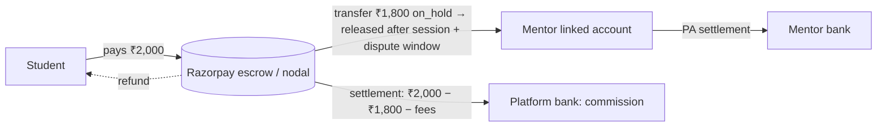
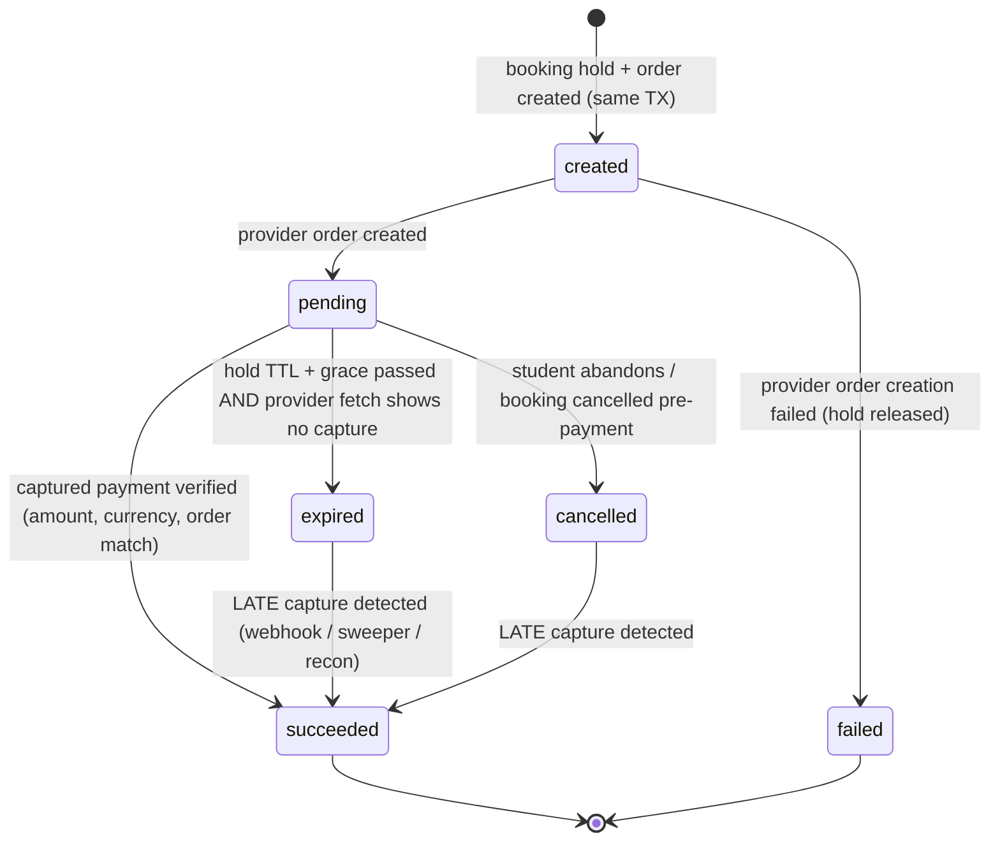
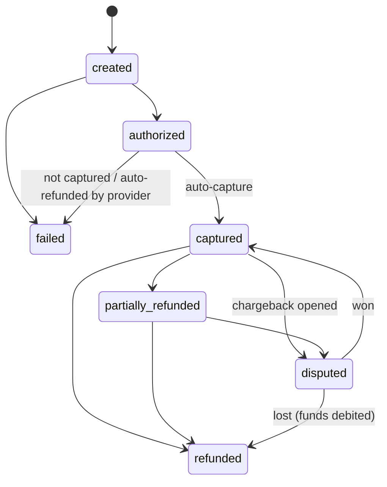
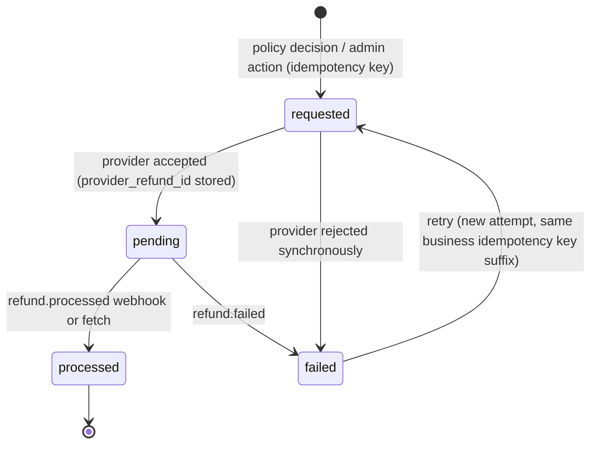
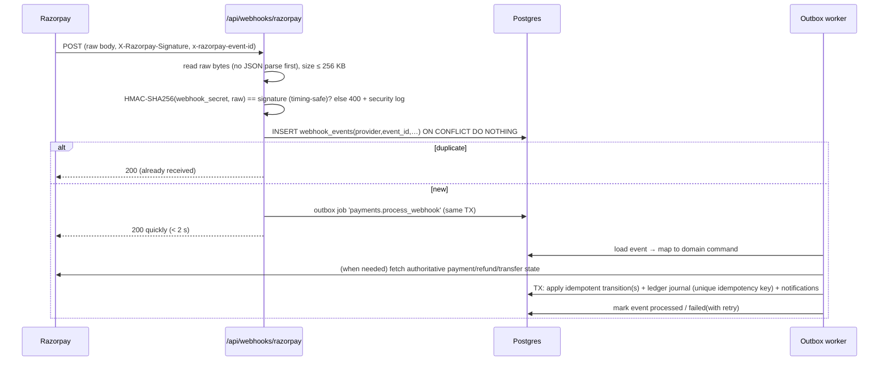

# 08 — Payment Architecture

Status: Draft v0.1 · 2026-09-17 · Maturity: **MVP = sandbox only (Fake gateway + Razorpay test mode). Live money is Production-critical-gated** (see §13).

⚖️ Payment regulation, tax and invoicing sections require review by a payments lawyer and a chartered accountant before live mode.

## 1. Requirements recap

Student payment · mentor payout · configurable commission · full/partial refunds · cancellation fees · failure handling · reconciliation · webhooks · idempotency · history · receipts/invoices · taxes · multi-currency readiness. **Payment state is verified server-side only; webhook signatures are verified; all operations are idempotent.**

## 2. Provider research & selection

| Provider | India domestic methods | Marketplace split & payouts | Holds / reversals | Test mode | Notes | Verdict |
|----------|----------------------|-----------------------------|-------------------|-----------|-------|---------|
| **Razorpay** | UPI, cards, netbanking, wallets | **Route**: linked accounts (KYC'd sub-merchants), transfers from payments/orders | `on_hold` / `on_hold_until` on transfers; transfer reversal API; refund with `reverse_all` | Free, no KYC needed for test keys | Standard fee 2% domestic; Route "0.1% + platform fees" (pricing page, verify at contract); webhooks HMAC-SHA256 via `X-Razorpay-Signature`, dedupe via `x-razorpay-event-id`, **ordering not guaranteed** | **Primary adapter** |
| Cashfree | UPI, cards, netbanking, wallets | **Easy Split**: vendors, commission, settlement cycles, refund adjustment | Settlement cycles; vendor adjustments | Sandbox | Pricing for Easy Split not public (sales) | **Secondary adapter** (fallback) |
| Stripe | Invite-only in India since May 2024 | Indian platforms: separate charges and transfers **not supported**; destination charges with application fees to Indian sellers not supported | — | — | Viable for a **non-Indian entity** serving international users later | Future (international) |
| PayPal | Stopped domestic India payments (2021) | Cross-border only | — | — | Possible later for international mentor payouts | Not for MVP |

**Selection: Razorpay Route** behind a provider-agnostic `PaymentGateway` port, plus a **FakeGateway** for local development and deterministic tests. Cashfree Easy Split is a documented alternative adapter. (ADR-005)

## 3. Regulatory funds-flow principle ⚖️

Under the RBI Payment Aggregator Directions (15 Sep 2025), aggregating and settling funds for merchants is regulated. Non-bank PAs must hold merchant funds in escrow with scheduled commercial banks and must not let marketplaces accept payments for sellers not onboarded onto the marketplace.

**Our design rule:** mentor money is **never** collected into the platform's own bank account and paid out later. Payments are collected by the licensed PA. The mentor share is **transferred to the mentor's KYC'd linked account inside the PA** (Route) and settled by the PA to the mentor's bank. The platform's commission settles to the platform. This keeps the platform out of pooling and redistributing funds. **Needs confirmation with Razorpay and counsel during onboarding.**



**Cross-border mentors** (bank accounts outside India) cannot be paid via Route. MVP rule: paid mode requires an Indian bank account that the PA accepts (includes eligible NRO accounts, ⚖️ FEMA/tax implications for NRIs). International payouts are a Future item requiring a different provider/entity.

## 4. Core objects

| Object | Meaning |
|--------|---------|
| `order` | A student's purchase (1+ items; MVP always 1) in one currency |
| `order_item` | What was bought (booking seat) with **price, commission rule and split snapshot** |
| `payment_intent` | Our intent to collect `order.total` via a provider order; owns the state machine |
| `payment` | A provider payment attempt (many per intent: failed UPI then successful card) |
| `refund` | A provider refund against a captured payment |
| `payout_account` | Mentor's provider linked account + KYC status |
| `transfer` | Mentor share moved to their linked account (held → released) |
| `transfer_reversal` | Claw back from the linked account |
| `chargeback` | Provider dispute against a payment |
| `ledger_journal` / `ledger_line` | Double-entry record of every money movement |
| `webhook_event` | Deduplicated inbound provider event |

## 5. State machines

### 5.1 Payment intent



- A single `payment.failed` event **does not** fail the intent: the student may retry with another method on the same provider order while the hold is valid.
- **Late success** (`expired|cancelled → succeeded`) triggers *orphan handling*: try to re-acquire the slot; if impossible, auto-refund in full ([09 §6.3](09-booking-system.md#63-payment-arrives-after-hold-expiry)).

### 5.2 Payment (provider attempt)



Transitions are **monotonic by rank** (`created < authorized < captured < partially_refunded < refunded`). An out-of-order older event (e.g. `authorized` after `captured`) is recorded and ignored.

### 5.3 Refund



### 5.4 Transfer (mentor share)

```mermaid
stateDiagram-v2
  [*] --> pending: created with provider order (awaiting capture)
  pending --> on_hold: payment captured → transfer created on_hold=true, hold_until=session_end+window
  pending --> cancelled: payment never captured
  on_hold --> released: hold_until passed AND no open dispute AND payout account active
  on_hold --> reversed: full refund before release
  on_hold --> partially_reversed: partial refund before release
  released --> settled: provider settlement to mentor bank
  released --> partially_reversed: post-release clawback
  settled --> partially_reversed: clawback (may create mentor receivable if balance insufficient)
  released --> reversed
  settled --> reversed
  on_hold --> failed
  failed --> on_hold: retried
```



## 6. Webhook processing



Rules:
1. **Verify before parse.** Signature over the exact raw bytes. Separate secrets per environment and mode.
2. **Dedupe** on `(provider, provider_event_id)`.
3. **Acknowledge fast, process async** via outbox, so provider retries don't pile up behind slow work.
4. **Don't trust event order.** Transitions are monotonic and idempotent. For money-affecting decisions, re-fetch the entity from the provider API.
5. **Webhooks are hints, the API is the truth.** The same code path handles client confirmation, webhooks, sweepers and reconciliation.
6. Unknown event types are stored as `ignored`.
7. Payload is **redacted** before storage (no VPA, card, bank, email or phone).

Subscribed Razorpay events (MVP): `payment.authorized`, `payment.captured`, `payment.failed`, `order.paid`, `refund.created`, `refund.processed`, `refund.failed`, `transfer.processed`, `transfer.failed`, `settlement.processed`, `payment.dispute.created`, `payment.dispute.won`, `payment.dispute.lost`, `payment.dispute.closed`, `account.*` (linked account activation). Verify exact names against current docs at implementation.

## 7. Commission engine

### 7.1 Rule model (`commission_rules`)
| Field | Example |
|-------|---------|
| `scope_type` | `global` · `service_kind` · `category` · `promotion` · `mentor` |
| `scope_ref` | `one_on_one` / category id / promo code / mentor id |
| `percent_bps` | `1000` (10%) |
| `fixed_minor` + `currency` | `0` |
| `min_fee_minor`, `max_fee_minor` | caps (optional) |
| `fee_bearer` | `mentor` (default) · `student` · `split` |
| `student_fee_bps` | used when bearer is `student`/`split` |
| `valid_from`, `valid_to` | time-boxed promotions and founding-mentor deals |
| `priority` | tie-breaker |

### 7.2 Resolution
1. Collect active rules matching the booking context at **quote time**.
2. Precedence: `mentor` > `promotion` > `category` > `service_kind` > `global`. Within a level: highest `priority`, then newest `valid_from`.
3. Compute fees in integer minor units:
   - `commission = min(max(floor(base * bps / 10000) + fixed, min_fee), max_fee)`, capped at `base`.
   - `mentor_share = base − commission` (flooring the commission gives any rounding paisa to the mentor).
   - Student-borne fee (if any): `student_fee = floor(base * student_fee_bps / 10000)`, shown **upfront** in the price (no drip pricing).
4. Snapshot `commission_rule_id`, `percent_bps`, computed amounts and `policy_version` onto `order_items`. **Later rule changes never alter existing bookings.**
5. Admin rule changes are audited, require a reason, and are validated so that exactly one global rule is active per currency.

Pure function signature: `quoteOrderItem(ctx: QuoteContext, rules: CommissionRule[], settings: MoneySettings): Quote`, with exhaustive unit tests including rounding boundaries.

## 8. Refunds, cancellation fees, adjustments

Refund amounts come from **business rules** ([17](17-business-rules.md)) evaluated against the booking's `policy_snapshot`. The money engine only executes them:

```
retained = paid − refund
commission_after = recompute(retained)            // same snapshotted rule
mentor_share_after = retained − commission_after
reversal = original_mentor_share − mentor_share_after
```

| Scenario (defaults) | Student refund | Mentor share | Commission |
|--------------------|----------------|--------------|-----------|
| Student cancels ≥ 24 h before | 100% | reversed 100% | refunded |
| Student cancels 6–24 h before | 50% | 50% of original share | on retained 50% |
| Student cancels < 6 h / student no-show | 0% | 100% | 100% |
| Mentor cancels (any time) / mentor no-show | 100% | reversed 100% | refunded |
| Platform/technical failure (ours) | 100% or free reschedule | reversed | refunded (platform absorbs gateway fee) |
| Group session below minimum participants | 100% to all | reversed | refunded |
| Payment orphaned (slot lost) | 100% | reversed | refunded |
| Dispute resolved split | per decision | per decision | recomputed |
| Goodwill refund (admin) | per decision | unchanged by default (platform-funded) unless mentor at fault | recomputed if mentor-funded |

Provider gateway fees are generally **not returned** on refunds, so the platform records them as `expense:refund_costs`.

## 9. Double-entry ledger

Accounts (per currency): `asset:psp_clearing:razorpay`, `liability:mentor_payable:{mentorId}`, `revenue:commission`, `liability:gst_output`, `expense:psp_fees`, `asset:gst_input_credit`, `liability:tds_payable`, `asset:mentor_receivable:{mentorId}`, `expense:refund_costs`, `expense:chargeback_losses`, `liability:student_credits:{studentId}` (Beta).

Journals for a ₹2,000 booking (10% commission, GST-inclusive; fees illustrative):

| Event | Debit | Credit |
|-------|-------|--------|
| Capture | psp_clearing 2,000.00 | mentor_payable 1,800.00 · commission 169.49 · gst_output 30.51 |
| PSP fees (from settlement report) | psp_fees 42.00 · gst_input_credit 7.56 | psp_clearing 49.56 |
| Transfer released (TDS below threshold → 0) | mentor_payable 1,800.00 | psp_clearing 1,800.00 |
| Full refund **before** release | mentor_payable 1,800.00 · commission 169.49 · gst_output 30.51 | psp_clearing 2,000.00 |
| Refund **after** release, step 1: transfer reversal succeeds | psp_clearing 1,800.00 | mentor_payable 1,800.00 |
| Refund after release, step 2: refund to student | mentor_payable 1,800.00 · commission 169.49 · gst_output 30.51 | psp_clearing 2,000.00 |
| Refund after release, reversal **fails** (mentor balance empty) | mentor_receivable 1,800.00 · commission 169.49 · gst_output 30.51 | psp_clearing 2,000.00 (receivable netted from future transfers) |
| Chargeback lost (student fraud) | chargeback_losses 2,000.00 | psp_clearing 2,000.00 |

Invariants checked nightly:
- All journals balance per currency (DB-enforced at commit).
- `mentor_payable` balance for each mentor equals the sum of `on_hold` + `pending` transfers.
- `psp_clearing` balance ≈ provider-reported unsettled balance (tolerance: fees in flight). Mismatch raises a reconciliation item.

## 10. Reconciliation

| Job | Frequency | Compares | Output |
|-----|-----------|----------|--------|
| Payment sweeper | Every tick (≥ 1 min) | `payment_intents` pending > 2 min vs provider order payments | Applies missed captures/failures |
| Refund sweeper | Hourly | `refunds` pending > 1 h vs provider | Applies status |
| Transfer releaser | Every tick | `transfers` on_hold with `hold_until` ≤ now and eligible | Release calls |
| Daily reconciliation | Daily 03:00 IST | Provider payments, refunds, transfers, settlements (last 7 days) vs local rows + ledger | `reconciliation_items` (missing_local, missing_provider, amount_mismatch, status_mismatch) |
| Ledger invariants | Daily | See §9 | Alerts |

Auto-fix only for safe classes (status catch-up through the normal state machine). Everything else goes to the admin finance queue with a 24 h SLA alert.

## 11. Failure scenario matrix (payment concurrency, brief §38)

| Scenario | Handling |
|----------|----------|
| Payment initiated, student closes browser | Payment sweeper polls provider → captured → confirm booking (or orphan-refund). Student sees the result in dashboard + email |
| Payment succeeds but frontend never gets the callback | Webhook and/or sweeper confirm. Client polls `GET /payment-intents/{id}` on return |
| Payment fails | `payments.failed` recorded; intent stays `pending`; student can retry until hold expiry |
| Webhook delayed | Client confirm path (signature + API fetch) already confirmed; webhook later is a no-op |
| Webhook duplicated | `(provider,event_id)` unique → second insert ignored |
| Webhook out of order | Monotonic transitions; re-fetch provider state for decisions |
| Webhook forged | Signature fails → 400, security log, alert on spikes |
| Client sends fake "success" | Signature + provider fetch must match order id, amount and currency, else `PAYMENT_VERIFICATION_FAILED` |
| Amount tampering in client | Amount is never taken from the client; the provider order was created server-side |
| Double click on "Pay" / duplicate booking request | Idempotency key returns the same booking and order |
| Two students pay for the same slot | Only one hold can exist (exclusion constraint); second student can't reach checkout |
| Capture arrives after hold expired, slot still free | Re-acquire block → confirm (late but valid) |
| Capture after hold expired, slot taken | Booking `payment_orphaned` → full refund within 15 min + apology notification + suggested slots |
| Refund initiated, provider timeout | Refund stays `requested`; retried with the same idempotency key; sweeper checks provider by our receipt/notes |
| Refund webhook delayed | Refund sweeper fetch |
| Refund fails (e.g. closed UPI account) | `failed` → finance queue; student contacted for alternative ⚖️ |
| Refund after transfer released | Transfer reversal; if insufficient balance → mentor receivable, netted from future transfers; repeated non-recovery → T&S case |
| Chargeback after payout | Freeze mentor's pending transfers up to disputed amount; evidence from attendance signals; outcome drives ledger + trust events |
| Provider outage during booking | Hold is created, then provider order creation fails → `503 PROVIDER_UNAVAILABLE`; hold released; client retries with the same idempotency key |
| DB outage after provider capture | Provider retries webhooks; sweeper and reconciliation recover when DB returns |
| Mentor payout account deactivated/KYC fails | Transfers stay `on_hold`; mentor notified; paid bookings disabled until resolved |
| Mentor banned with held transfers | Held pending review; fraud-related bans → refunds to affected students |
| Currency mismatch | Rejected at quote time (service currency must be provider-supported) |

## 12. Taxes, receipts, invoices ⚖️

| Topic | Current understanding (to verify with CA) | System support |
|-------|------------------------------------------|----------------|
| Platform GST registration | E-commerce operators generally must register; commission is the platform's taxable supply (18%) | `tax_profiles` for the platform entity; GST on commission computed and journaled |
| TCS under s.52 CGST | ECOs may need to collect TCS on net taxable supplies made through them by registered suppliers; many individual mentors may be below the registration threshold | Mentor tax profile: GSTIN (optional), state; TCS computation hook (disabled by default) |
| TDS on payouts | 0.1% on gross amount facilitated (earlier s.194-O, now s.393(1) Income-tax Act 2025), threshold ₹5 lakh/FY for individuals/HUF with PAN; higher rate without PAN | Mentor PAN captured by PA KYC (we store masked + status); FY gross tracker; TDS withheld from transfer; `liability:tds_payable`; quarterly report export (Beta) |
| Invoices | Receipt to student (supply by mentor via platform); tax invoice for commission to mentor; credit notes on refunds; consecutive numbering unique per FY (≤ 16 chars) | `invoices` + `invoice_sequences` (row-locked per series/FY); PDF generation job; immutable once issued |
| Place of supply / IGST vs CGST+SGST | Depends on the mentor's registered state | Mentor state field; tax calculator port |
| International users | GST on exports/imports of services; foreign-currency receipts | Out of scope for MVP |

## 13. Production-critical gate for live payments

Live mode (`PAYMENTS_MODE=live`) must stay disabled until **all** of these are done:

1. Registered legal entity; Razorpay KYC + Route activation approved for the marketplace use case.
2. Counsel sign-off on funds flow (RBI PA), Terms, Refund Policy, Mentor Agreement; CA sign-off on GST/TCS/TDS/invoicing.
3. Paid database with automated backups + PITR; tested restore.
4. Commercial-use hosting plan.
5. Reconciliation job running with zero unexplained items for 14 days in test mode.
6. Security review of the payment paths (see [11](11-security-threat-model.md)), including webhook forgery tests and amount-tampering tests.
7. Monitoring and alerting for stuck states, with an on-call owner.
8. Grievance officer and support process published.
9. Boot-time guard: live key prefix (`rzp_live_`) accepted only when `NODE_ENV=production` and `PAYMENTS_MODE=live` and feature flag `payments.live` is on. Mismatch means the app refuses to start.

## 14. Fake gateway (development & tests)

- Implements `PaymentGateway` fully, backed by tables in a separate `fake_psp` schema.
- Dev-only checkout page `/dev/fake-checkout/{orderId}` with outcome buttons: *succeed*, *fail*, *succeed after hold expiry*, *send duplicate webhook*, *send webhooks out of order*, *delay webhook 5 min*, *chargeback*.
- Webhooks are **HMAC-signed with a test secret and sent to the real webhook route**, so tests exercise the production code path.
- Route is compiled out or returns 404 unless `PAYMENTS_PROVIDER=fake` and `NODE_ENV !== 'production'`.

## Sources (accessed 2026-09-17)

- Razorpay pricing: https://razorpay.com/pricing/
- Route docs: https://razorpay.com/docs/payments/route/ ; settlement holds: https://razorpay.com/docs/api/payments/route/modify-settlement-hold/ ; reversals: https://razorpay.com/docs/api/payments/route/reverse-a-transfer/ ; refunds with reversal: https://razorpay.com/docs/api/payments/route/refund-payments-and-reverse-transfer/
- Webhook validation (signature, event id, no ordering guarantee): https://razorpay.com/docs/webhooks/validate-test/
- Stripe India: https://support.stripe.com/questions/stripe-accounts-are-invite-only-in-india ; https://support.stripe.com/questions/stripe-india-support-for-marketplaces
- Cashfree Easy Split: https://www.cashfree.com/docs/payments/split/overview
- RBI PA Directions 2025: https://www.medianama.com/2025/09/223-explained-rbi-master-direction-payment-aggregators/ ; https://www.khaitanco.com/sites/default/files/2025-10/ERGO%20-%20PA%20Master%20Directions%20-%203%20Oct%202025_0.pdf
- GST ECO / TCS: https://cleartax.in/s/gst-on-notified-services-ecommerce-operators-95 ; CBIC FAQ: https://gstcouncil.gov.in/sites/default/files/2024-02/faq-e-commerc.pdf
- TDS 0.1% / s.393: https://taxgarden.in/blog/tds-on-ecommerce-payments-section-194o-393-guide-india-fy-2026-27
