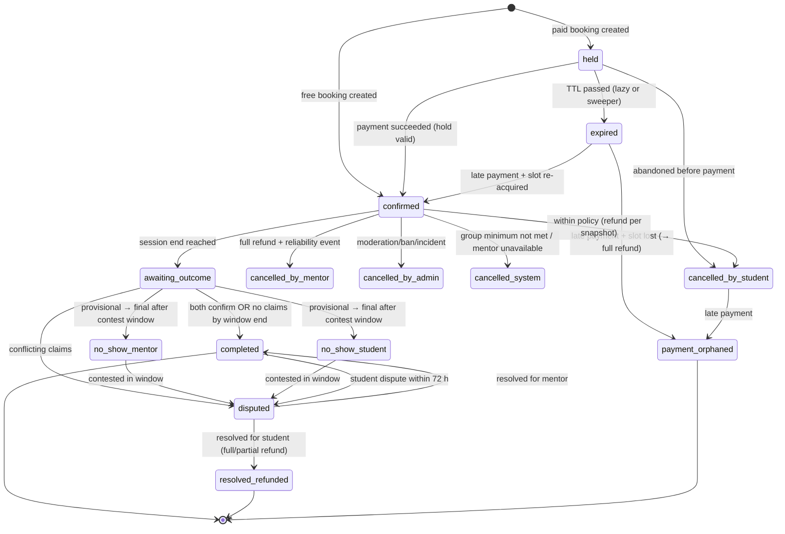

# 09 — Booking System

Status: Draft v0.1 · 2026-09-17

**Implementation note (Phase 7):** built in `src/server/modules/booking` — §1–§7 (services, availability, DST-safe slot generation, the booking transaction and its concurrency guards including the GiST exclusion constraint, the full state machine), §10 (cancellation quotes, the courtesy exception), §11 (attendance signals/claims/finaliser), §12 (join redirect) and §13 (reminders, ICS) are all real and tested (docs/19 Phase 7). Only `one_on_one` sessions exist — §8 (group sessions) and §9 (free events) are Phase 9. §7.3's reschedule flow is built; the money side of §5 step 2–4 (orders, payment intents, checkout) is not, since Phase 8 doesn't exist yet — every booking this phase is free, by construction of `evaluateBookingEligibility`'s payability gate, not by omitting the check. Booking-scoped messaging (mentioned throughout as the thread a booking's participants share) is not built — see docs/19 Phase 7 deviations.

## 1. Concepts

| Concept | Definition |
|---------|-----------|
| **Service** | What a mentor offers: kind (`one_on_one`, `group`, `event`; future `async_review`, `package`), allowed durations, per-duration prices, intake questions |
| **Availability** | Mentor's recurring weekly wall-clock windows in *their* IANA time zone, minus exceptions and existing blocks |
| **Session** | A concrete scheduled occurrence with an absolute UTC range: one student (1:1), many (group) or an audience (event) |
| **Booking** | One student's seat on a session, with its own lifecycle, price snapshot and policy snapshot |
| **Calendar block** | An active interval on the mentor's calendar (session + buffer, or manual block); guarded by the exclusion constraint |
| **Hold** | A booking in `held` status with `hold_expires_at`; blocks the slot while payment is in progress |

1:1: session and booking are created **together** at booking time. Group/event: the session is created by the host in advance; bookings are seats on it.

## 2. Availability model

```
scheduling_settings (per mentor)
  timezone            IANA, e.g. "Europe/Berlin"         (required; confirmed by mentor, default from browser)
  slot_step_min       15 | 30 | 60                        (default 30)
  buffer_after_min    0–60                                (default 15)
  min_notice_min      60–10080                            (default 720 = 12 h)
  max_advance_days    7–90                                (default 60)
  max_sessions_per_day 1–12 (per mentor-local calendar date, default 4)

availability_rules
  weekday (ISO 1–7), start_local "10:00", end_local "13:00", effective_from DATE, effective_to DATE?

availability_exceptions
  kind: 'unavailable' | 'extra_available'
  during tstzrange   (absolute; computed from the mentor's local input at save time)
  local_spec jsonb   (what the mentor typed, for display)
```

**Why rules are wall-clock and exceptions are absolute:** "I'm available Mondays 10:00–13:00" means *local* 10:00 all year, across DST. "I'm on vacation 24–26 Dec" is a fixed period on the calendar.

## 3. Time zones & DST (brief §21, §49)

### 3.1 Rules
1. **Instants are stored in UTC** (`timestamptz`); zones are **IANA names**, never offsets or abbreviations.
2. **Never add or subtract hours manually.** All conversions go through the time utility module (Temporal API polyfill), which uses the platform tz database.
3. Local wall-clock → instant conversions specify **disambiguation** explicitly:
   - **Skipped** local times (spring-forward gap) → moved **forward** past the gap; slots starting inside the gap are not offered.
   - **Repeated** local times (fall-back overlap) → the **earlier** instant for window starts, the **later** for window ends, so the window covers the real elapsed time.
4. UI always shows **the viewer's zone as primary** with an explicit label, plus the counterpart's local time as secondary: `Fri, 3 Oct · 14:00–15:00 IST` / `10:30–11:30 in Berlin (CEST)`.
5. Emails show the recipient's zone + UTC offset; ICS uses UTC (`Z`).
6. User time zone: detected via `Intl.DateTimeFormat().resolvedOptions().timeZone` at sign-up, **confirmed** in onboarding, and editable. A mismatch banner appears when the browser zone differs from the saved zone.
7. Runtime tz data: keep Node.js updated (ICU tzdata); the CI test suite includes DST fixtures that fail if tz data regresses.

### 3.2 Worked example (brief §49)

Mentor rule: Monday 10:00–11:00 `Europe/Berlin`. Student in `Asia/Kolkata` (UTC+5:30, no DST).

| Date | Berlin offset | Instant (UTC) | Student sees |
|------|--------------|---------------|--------------|
| Mon 12 Jan 2026 | CET, UTC+1 | 09:00Z | **14:30 IST** |
| Mon 30 Mar 2026 (after 29 Mar switch) | CEST, UTC+2 | 08:00Z | **13:30 IST** |
| Mon 26 Oct 2026 (after 25 Oct switch) | CET, UTC+1 | 09:00Z | **14:30 IST** |

A US-based mentor (DST starts 2nd Sunday of March) and a European student see their overlap shift for ~3 weeks each spring and ~1 week each autumn. The slot engine handles this with no special code because each date is converted independently.

### 3.3 DST edge fixtures (unit tests)
- Rule 02:00–04:00 on 29 Mar 2026 in `Europe/Berlin` → only 03:00–04:00 exists (1 h window).
- Rule 01:30–03:30 on 25 Oct 2026 in `Europe/Berlin` → 3 h of real time; 30-minute slots start at 01:30 CEST, 02:00 CEST, 02:30 CEST, 02:00 CET, 02:30 CET, 03:00 CET.
- `America/New_York` 8 Mar 2026 and 1 Nov 2026 transitions.
- Zones with 30/45-minute offsets (`Asia/Kolkata`, `Asia/Kathmandu`) and a half-hour DST zone (`Australia/Lord_Howe`).
- Booking made before a government tz-rule change: the instant is preserved; notifications show new local times (edge case documented in [18](18-edge-cases.md)).

## 4. Slot generation

```
function availableSlots(mentor, service, duration, fromInstant, toInstant, now):
  window = clamp([fromInstant, toInstant), [now + min_notice, now + max_advance_days))
  if window empty: return []
  localDates = all mentor-local dates overlapping window (±1 day for zone spread)
  candidates = []
  for date in localDates:
    for rule in rules where rule.weekday == date.weekday and rule effective on date:
      winStart = toInstant(date, rule.start_local, tz, 'forward/earlier')
      winEnd   = toInstant(date, rule.end_local,   tz, 'forward/later')
      for t = winStart; t + duration <= winEnd; t += slot_step:
        candidates.push([t, t + duration))
  add extra_available exceptions as windows (same stepping)
  remove candidates intersecting 'unavailable' exceptions
  remove candidates where [start, end + buffer_after) intersects any ACTIVE calendar block
        (held-and-unexpired or confirmed sessions, manual blocks, Beta: external busy)
  remove candidates on local dates where count(sessions) >= max_sessions_per_day
  return candidates ∩ window, sorted
```

- Computed **server-side** for a ≤ 31-day window; responses are `no-store`.
- The slot list is **advisory**. The booking transaction re-validates everything (§6), so a stale UI can never double book.
- Performance: blocks for the window are loaded in one indexed range query; typical cost is O(rules × days × steps), well under 10 ms for 31 days.

## 5. Booking flow (1:1)

1. **Quote** (client shows): price per duration from `service_prices` and total with any student fee; cancellation policy summary.
2. **Create** `POST /bookings` 🔑 → transaction (§6) → `held` booking + session + calendar block + order + payment intent.
3. **Provider order** created after commit. On failure: hold released, `503` with a retry-safe idempotency key.
4. **Checkout** → client confirm and/or webhook → `payment_intent.succeeded` → booking `confirmed`, all in one transaction together with outbox notifications (confirmation, ICS, reminders) and the ledger journal.
5. **Free 1:1** (volunteer mentors): booking goes straight to `confirmed` (no hold). Anti-abuse: max 2 upcoming free 1:1 bookings per student (config) and student no-show strikes.

### Eligibility checks (pure domain function `evaluateBookingEligibility`)
| Check | Error reason |
|-------|--------------|
| Student email verified, adult attestation present | `EMAIL_NOT_VERIFIED` / `AGE_POLICY` |
| Student not restricted from `booking.create`; mentor not restricted from `booking.accept` | `ACCOUNT_RESTRICTED` |
| Not self-booking; no block between the two users | `SELF_BOOKING` / `NOT_AVAILABLE` (block reason not revealed) |
| Mentor approved + listed + service active | `MENTOR_UNAVAILABLE` |
| Paid service → mentor `payout_mode=paid`, payout account active, eligibility attestation valid | `MENTOR_NOT_PAYABLE` (the service isn't bookable, so it is hidden in discovery) |
| Duration allowed for the service | `INVALID_DURATION` |
| `start ≥ now + min_notice` and `start ≤ now + max_advance` | `TOO_SOON` / `TOO_FAR` |
| Slot inside availability (rules ∪ extra − unavailable) | `OUTSIDE_AVAILABILITY` |
| Mentor-local day count < `max_sessions_per_day` | `DAILY_LIMIT` |
| Student active holds < 3; expired holds today < 5 | `TOO_MANY_HOLDS` |
| Student has no overlapping held/confirmed paid booking | `STUDENT_OVERLAP` |

## 6. Concurrency control

### 6.1 Booking transaction (Read Committed is sufficient; the constraint does the heavy lifting)

```sql
BEGIN;
-- 0. Idempotency: insert key row (PK conflict → return stored response / 409 in-progress)
-- 1. Serialize per mentor-local day (protects max_sessions_per_day, which a constraint can't express)
SELECT pg_advisory_xact_lock(hashtextextended($mentor_id || ':' || $mentor_local_date, 0));
-- 2. Lazily expire stale holds that overlap the requested range (correctness without the sweeper)
WITH stale AS (
  UPDATE app.bookings b SET status = 'expired', version = version + 1, updated_at = now()
  FROM app.sessions s
  WHERE b.session_id = s.id AND s.host_user_id = $mentor_id
    AND b.status = 'held' AND b.hold_expires_at <= now()
    AND s.during && $requested_block_range
  RETURNING b.session_id)
UPDATE app.calendar_blocks SET active = false, released_at = now()
WHERE source_type = 'session' AND source_id IN (SELECT session_id FROM stale) AND active;
-- 3. Re-validate eligibility with fresh reads (counts, availability, restrictions)
-- 4. Insert session, calendar block (EXCLUDE constraint), booking(held), order, order_item, payment_intent,
--    outbox rows, audit row
INSERT INTO app.calendar_blocks (id, mentor_id, source_type, source_id, during, active)
VALUES ($id, $mentor_id, 'session', $session_id, $requested_block_range, true);   -- may raise 23P01
COMMIT;
```

- `23P01` (exclusion violation) → rollback → `409 SLOT_UNAVAILABLE`, with fresh nearby slots suggested.
- Brief §37 scenario (A and B click Book on 10:00–11:00 simultaneously): both transactions reach the insert. The second waits on the first's uncommitted index entry. If A commits, B fails with `23P01`; if A rolls back, B succeeds. **Exactly one hold can exist.** Verified by an integration test running N parallel transactions ([13 §6](13-testing-strategy.md#6-concurrency-tests)).

### 6.2 Group seat transaction
```sql
BEGIN;
SELECT capacity, status, registration_closes_at FROM app.sessions WHERE id = $1 FOR UPDATE;  -- serializes seats per session
-- expire this session's stale holds (same pattern)
SELECT count(*) FROM app.bookings WHERE session_id = $1
  AND (status = 'confirmed' OR (status = 'held' AND hold_expires_at > now()));
-- if count < capacity → insert booking(held) (unique partial index prevents duplicate seat per student)
-- else → 409 SLOT_UNAVAILABLE with waitlist option
COMMIT;
```

### 6.3 Payment arrives after hold expiry
Within the payment-success transaction:
1. Booking `held` and hold still valid → `confirmed`.
2. Booking `expired` (or the hold lapsed and got swept) → **try to re-acquire**: re-insert the calendar block (1:1) or re-check capacity (group).
   - Success → `confirmed` (late but valid). Rules like min-notice are **not** re-checked, since the student acted in time.
   - `23P01` / full → booking `payment_orphaned` → outbox `refund.full` (reason `slot_lost`) + apology notification with alternative slots. SLA: refund initiated within 15 min.
3. Booking `cancelled_by_student` before capture (student abandoned, then paid in another tab) → same as 2.

### 6.4 Other races
| Race | Guard |
|------|-------|
| Mentor edits availability while a student books | Booking TX re-validates against rules read inside the TX |
| Mentor adds a vacation exception overlapping a hold | Exception save returns the conflicting bookings; existing holds/bookings are not auto-cancelled |
| Student cancels while payment webhook confirms | Both use compare-and-set on `version`; the loser reloads. If the cancel wins before capture, the capture is treated as late → refund; if the confirm wins, cancel proceeds with the normal policy |
| Two cancels (double click) | Idempotency key + state guard |
| Reschedule vs. another student's booking on the new slot | Reschedule TX deactivates the old block and inserts the new one in one TX; `23P01` → whole TX rolls back, original booking untouched |
| Waitlist offer claimed by two users for one seat | Seat TX lock + capacity count |

## 7. State machines

### 7.1 Booking



**Mapping to the brief's state list:** `DRAFT`/`AVAILABLE` are service and availability states, not booking states. `PAYMENT_PENDING` = `held`. `RESCHEDULE_REQUESTED`/`RESCHEDULED` are a separate `reschedule_requests` entity plus a history table (the booking stays `confirmed`). `IN_PROGRESS` is **derived** from time. `REFUNDED`/`PARTIALLY_REFUNDED` are **payment** states ([08 §5](08-payment-architecture.md#5-state-machines)). Keeping these orthogonal prevents impossible combinations such as "REFUNDED and IN_PROGRESS".

Transitions are defined once in `booking/domain/stateMachine.ts` as a table `{from, event, to, guard}`. Every transition goes through `transition(booking, event, ctx)`, which returns the new state plus side-effect intents (refund, trust event, notification). SQL uses compare-and-set on `status` + `version`.

### 7.2 Session (occurrence)

`scheduled → cancelled | completed | under_review`. `completed` when all bookings are terminal-non-disputed; `under_review` while any booking is disputed.

### 7.3 Reschedule request

`pending → accepted | declined | expired | withdrawn`. Rules:
- Student reschedule **≥ 24 h** before start: self-service, once per booking, to any valid slot (no consent needed).
- **< 24 h**, or a second reschedule: requires mentor acceptance within 12 h (or before the original start, whichever is earlier). If declined or expired, the original booking stands.
- Mentor-initiated reschedule: always needs student acceptance; if declined, the student may cancel with a full refund, and it counts as a mentor cancellation only if the student cancels.

## 8. Group sessions

| Setting | Default | Notes |
|---------|---------|-------|
| `capacity` | 4 (range 2–50) | Future: 100+ as "workshop" |
| `min_participants` | 2 (1–capacity) | Protects mentor time value |
| Pricing mode | **Per seat** | Mentor may enter a "target total"; the UI derives `seat_price = ceil(total / capacity)` and shows the mentor's earnings at min and max fill |
| `min_seat_price` | ₹150 | Unit-economics floor ([02 §4](02-market-research.md#4-unit-economics)) |
| `registration_closes_at` | start − 2 h | |
| `min_participants_check_at` | start − 24 h | If unmet → `cancelled_system`, refunds 100% |
| Student full-refund deadline | start − 24 h | After: no refund, but the seat can be transferred to a waitlisted student (Beta) |
| Waitlist | Enabled | FIFO; offers equal to freed seats; 2 h claim window (never beyond registration close) |
| Mentor changes after first seat sold | Price ✗, capacity below sold ✗, time → reschedule flow (all participants may cancel with full refund) | |

Brief example (₹2,400 total, 4 seats): seat price ₹600. With 4 seats sold the mentor earns ₹2,160 (at 10%); with 3 seats, ₹1,620. Both are displayed to the mentor **before** publishing.

## 9. Free events

- Hosts: platform admins or mentors with the `event_host` role.
- Registration = booking with price 0, confirmed immediately while capacity remains; otherwise waitlist with **auto-promotion** (no claim step) until start − 2 h, with a notification.
- Visibility: `public` (indexed, listed), `unlisted` (link only, `noindex`), `private` (invite tokens).
- Capacity hoarding control: 3 no-shows at free events within 90 days → max 2 upcoming free registrations for 30 days (automatic, low-severity restriction, appealable).
- Recording: host posts a URL (validated allowlist, e.g. YouTube/Drive/Vimeo), visibility `attendees` or `public`. Registration page discloses recording; host attests speaker and attendee notice.
- Integration path: `MeetingProvider` gains `zoom_webinar`, `youtube_live` adapters (Future) without schema change (`meeting_provider`, `meeting_external_id`).

## 10. Cancellation (summary; rules in [17](17-business-rules.md))

- Every booking stores a **`policy_snapshot`** (policy version + windows + refund percentages) at creation. Later policy changes never apply retroactively.
- `GET /bookings/{id}/cancellation-quote` shows the exact refund before confirming.
- Mentor cancellation always refunds 100% and records a reliability trust event scaled by notice (≥ 72 h: 0 points; 24–72 h: 1; < 24 h: 2; < 2 h: 3).

## 11. Attendance & no-show determination

Without native video, evidence is **signals + claims**:

| Signal | Source |
|--------|--------|
| `join_click` | `GET /sessions/{id}/join` redirect (timestamped, per user) |
| `check_in` | "I'm here" button in the join window (T−10 min … T+20 min) |
| Claim | Post-session prompt: `held`, `mentor_absent`, `student_absent` (allowed only after a grace wait: 10 min for 30-min sessions, 15 min otherwise), `technical_issue` |
| Messages | Booking thread activity in the window |
| Provider attendance reports | **Beta** (Google Meet / Zoom APIs) |

Outcome rules (1:1; finaliser runs at end + 2 h, contest window 48 h):

| Student claim | Mentor claim | Mentor join/check-in? | Student join/check-in? | Outcome |
|---------------|--------------|----------------------|-----------------------|---------|
| held / silent | held / silent | any | any | `completed` (both silent → completed at end + 72 h) |
| mentor_absent | silent | **no** | yes/no | provisional `no_show_mentor` → mentor notified → uncontested 48 h → final |
| mentor_absent | silent | yes | any | `disputed` (conflicting evidence) |
| mentor_absent | held | any | any | `disputed` |
| silent | student_absent | yes | **no** | provisional `no_show_student` → student notified → uncontested 48 h → final |
| held | student_absent | any | any | `disputed` |
| any | any, either `technical_issue` | — | — | Technical path: offer free reschedule (both consent) or refund per technical policy; **no strikes** for either unless a pattern emerges (≥ 3 in 90 days → review) |
| mentor_absent | student_absent | no | no | `disputed` |

Students receive "Did your session happen?" prompts at end + 1 h and end + 24 h, so silent mentor no-shows don't go unnoticed.

Known limitation: signals are weak evidence (a click doesn't prove presence). This is acceptable for MVP with human review of disputes. **Beta** adds provider attendance data for stronger evidence.

## 12. Meeting links

- Mentor sets a link per service or per session. Validation: `https:` only; parsed with the WHATWG URL parser; hostname must **exactly** match or be a subdomain of the allowlist (`meet.google.com`, `zoom.us`, `teams.microsoft.com`, `teams.live.com`, `whereby.com`, `meet.jit.si`; admin-configurable). Userinfo (`user@host`), IP literals, non-default ports and punycode lookalikes are rejected.
- Links are **never** in emails or ICS directly. Those carry `https://app/sessions/{id}/join`, which checks participation and time window (T−15 min … end), logs `join_click`, then redirects (`302`, `Referrer-Policy: no-referrer`).
- Mentors are advised to use per-session links rather than personal rooms (prevents strangers joining).
- Beta: `google_meet` adapter creates a Calendar event with conference data on the mentor's calendar via OAuth (sensitive scopes need Google verification, which takes weeks, so it is planned early).

## 13. Notifications, reminders & calendar files

| Trigger | Channels | Timing |
|---------|----------|--------|
| Booking confirmed | Email (+ ICS `METHOD:REQUEST`) + in-app, to student and mentor | Immediate |
| Reminder | Email + in-app | T−24 h, T−1 h |
| Join window open | In-app | T−15 min |
| Rescheduled | Email (ICS same `UID`, `SEQUENCE+1`) + in-app | Immediate |
| Cancelled | Email (ICS `METHOD:CANCEL`) + in-app + refund details | Immediate |
| Attendance prompt | Email + in-app | End + 1 h, end + 24 h |
| Review request | Email + in-app | After `completed`, then once more at day 7 |
| Mentor daily agenda | Email (opt-in) | 07:00 mentor local |

Reminder jobs are outbox rows with `dedupe_key = booking:{id}:reminder:{kind}:{startsAtEpoch}`. At send time the worker **re-validates** that the booking is still `confirmed` and the start time is unchanged, so no stale reminders go out after reschedules or cancellations.

ICS details: `UID: booking-{id}@{brand-domain}`, `DTSTAMP`, `DTSTART/DTEND` in UTC `Z`, `SEQUENCE`, `STATUS:CONFIRMED|CANCELLED`, `SUMMARY`, `DESCRIPTION` (join URL + policy link), `LOCATION` = join URL, `ORGANIZER` = no-reply address. No other participants' emails (privacy). Add-to-Google/Outlook deep links are generated from the same data.

## 14. Changes by mentors and students with existing bookings

| Change | Effect on existing bookings |
|--------|----------------------------|
| Mentor changes price | None (snapshot) |
| Mentor changes weekly hours | None; UI lists bookings now outside hours |
| Mentor changes time zone | Rules reinterpreted at the same wall-clock times in the new zone (confirmation dialog shows the shift); existing bookings unchanged (absolute instants) |
| Mentor pauses listing | No new bookings; existing continue |
| Mentor loses payout eligibility | New paid bookings blocked; existing continue; transfers held until resolved |
| Mentor suspended/banned | Future bookings `cancelled_by_admin`, 100% refunds, neutral notification to students |
| Mentor requests account deletion | Sessions in the next 14 days must be honoured or cancelled (as mentor cancellations); later sessions auto-cancelled with full refunds at deletion confirmation |
| Student changes time zone | Display only |
| Student requests account deletion | Upcoming bookings cancelled under the standard student policy (refund to original method still processed after deletion) |
| Student suspended/banned | Future bookings cancelled as if the student cancelled at that moment (standard policy), unless the suspension is for payment fraud (then case-by-case finance review) |

## Sources

- IANA time zone database: https://www.iana.org/time-zones
- TC39 Temporal (disambiguation semantics): https://tc39.es/proposal-temporal/docs/
- RFC 5545 iCalendar: https://www.rfc-editor.org/rfc/rfc5545
- PostgreSQL exclusion constraints & range types: https://www.postgresql.org/docs/current/rangetypes.html#RANGETYPES-CONSTRAINT
- Google Meet REST API (Beta integration planning): https://developers.google.com/workspace/meet/api/guides/overview
