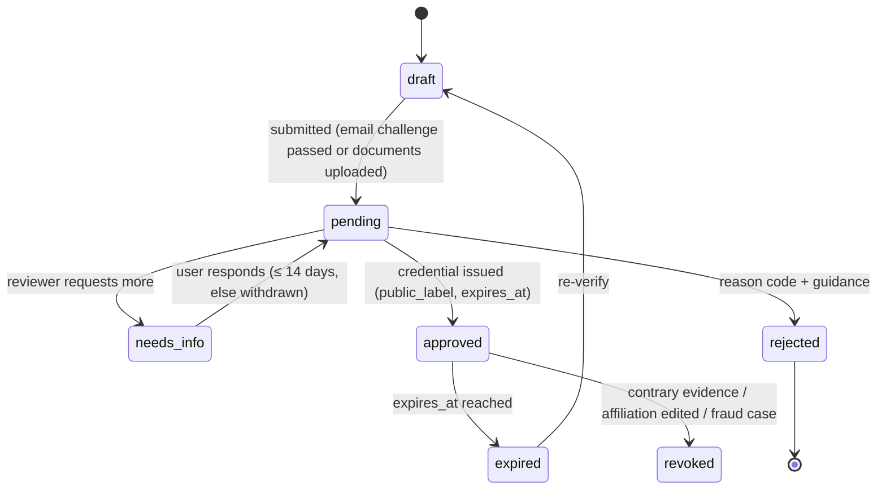
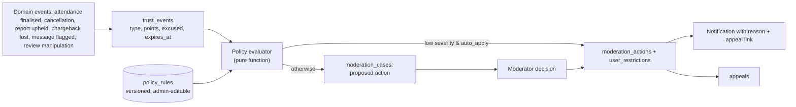
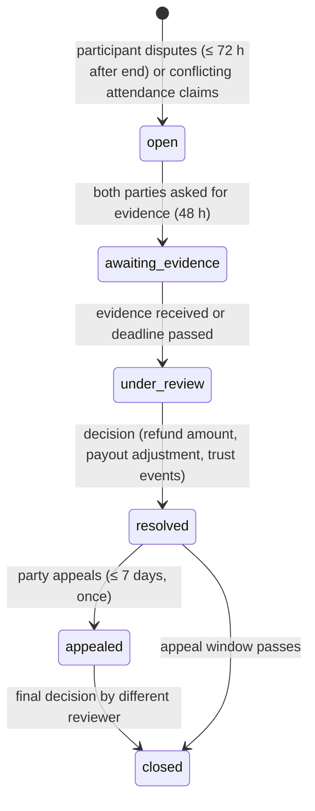

# 10 — Trust & Safety

Status: Draft v0.1 · 2026-09-17 · T&S is a first-class module (`src/server/modules/trust-safety`), not an afterthought.

**Implementation note (Phase 6):** §2's email-challenge verification (§2.4, auto-approve path) is built in `src/server/modules/verification`, including the domain-match, one-verified-email-per-account and scoped-badge rules in §2.1–2.2. Document-upload verification (§2.3) is not — it needs an `ObjectStore` decision, magic-byte checks and a reviewer UI, tracked as a deliberate follow-up (docs/19 Phase 6, deviations). §3's work-eligibility attestation and volunteer/paid resolution are built in `src/server/modules/profiles`. The rest of this document (reports, moderation, trust events, reviews) remains target-state, planned for Phase 10.

## 1. Principles

1. **Proportionate:** the response scales with severity, intent and history. First offences are usually educational.
2. **Evidence-based:** decisions cite evidence (signals, claims, messages, documents), never IP or device fingerprint alone.
3. **Human-in-the-loop for serious outcomes:** automation may warn, nudge, hold content for review or apply short low-severity restrictions. **Suspensions and bans are human decisions.**
4. **Transparent to the affected user:** a reason code, a plain-language explanation, the duration, and how to appeal (supports IT Rules grievance obligations).
5. **Fair to both sides:** mentors and students face equivalent, symmetric rules where the situations are symmetric.
6. **Excusable:** genuine emergencies and platform failures never count against users.
7. **Everything logged:** every case event, decision and override goes to the audit log.
8. **Privacy-respecting:** automated scanning is limited to safety and payment-policy signals, disclosed in the Privacy Policy. Humans read messages only when reported, flagged or during a dispute.

## 2. Verification system

### 2.1 Terminology decision ⚖️

The brief proposes labels like "Professional Verified". **Rejected**, because:
- Generic "Verified" implies the platform vouches for quality or overall identity. If a verified mentor misleads students, that becomes a potential **misleading-representation** exposure under consumer protection law (India's Consumer Protection Act 2019 and CCPA guidelines on misleading advertisements; comparable rules elsewhere).
- Users over-generalise badges: "university verified" is read as "trustworthy person".

**Adopted: scoped evidence badges** that say what was checked, how and when:

| Badge (public text) | Evidence method | Expiry |
|--------------------|-----------------|--------|
| `Education: TU Munich — university email confirmed (Mar 2026)` | Magic link to an address on a domain mapped to that university | Current students: 12 months or expected graduation, whichever is first; alumni addresses: 24 months |
| `Education: University of Bonn — degree document reviewed (Jan 2026)` | Human review of degree certificate/transcript (redaction guidance) | None (historical fact); revoked on contrary evidence |
| `Work: Company X — work email confirmed (Feb 2026)` | Magic link to a company-domain address | 12 months |
| `Work: Company X — employment document reviewed` | Offer letter / payslip header (redacted amounts) | 12 months |
| `Profile reviewed by Aheadly (Apr 2026)` | Human review of application, public links, short intro call (optional) | 24 months or on material profile change |
| `Payout identity checked by payment partner` | PA linked-account KYC status = active | While active |
| `Email confirmed` | Account email verification | — |

Internal **verification levels** (for filters and eligibility rules only, not shown as a single label):
`L0 registered` → `L1 email confirmed` → `L2 profile reviewed` → `L3 ≥ 1 credential confirmed` → `L4 ≥ 1 credential + payout identity checked`.

Listing requirement (MVP): **L2 + at least one credential relevant to each claimed specialty.** For example, a mentor listed under "TU Munich" must have a TU Munich education credential; a mentor listed under a company must have that work credential. **Unverified affiliations may be shown in the bio but are not filterable or badged.**

### 2.2 Anti-fraud checks in verification

| Threat | Control |
|--------|---------|
| Fake university (diploma mill) | Universities come from ROR + admin curation; unknown institutions need admin creation with an accreditation source link. No badges for unlisted institutions |
| Lookalike or free email domains | Domain must be in `university_domains` / `company_domains` (exact or subdomain match). Free-mail domains are blocklisted. Admin approval is required to add domains |
| Alumni email forwarding / shared addresses | Institutional alumni domains are flagged as "alumni address" (weaker label); one verified address → one account (`verified_email_fingerprints`) |
| Forged documents | Human review with a checklist (fonts, seals, dates, name consistency with PA KYC name, cross-check against public profiles). Tampering indicators → reject + T&S case. Never "auto-approve" uploads |
| Fake LinkedIn profiles | LinkedIn is **supporting context only**, never sufficient alone. Reviewers check account age, connections and consistency (manual, respecting LinkedIn ToS; no scraping) |
| Identity theft (using someone else's credentials) | Name on credential must match the PA KYC name (fuzzy match reviewed by a human) before **paid** mode; a mismatch blocks payouts |
| Credential outdated | Expiry + re-verification reminders 30 days before expiry; badge disappears on expiry |
| Reviewer error/insider | Decision reasons required; random 10% second-review sampling; audit log |

### 2.3 Document handling

- Upload via presigned PUT to the **private** bucket; allowed types PDF/JPEG/PNG; ≤ 10 MB; server-side magic-byte check; images re-encoded; PDFs never rendered inline in the app origin.
- Access only by `verification_reviewer`/`admin` with step-up auth, via **60-second signed URLs** with `Content-Disposition: attachment`; every view is audited.
- **Hard-deleted 30 days after the decision.** Only decision metadata is kept (method, reviewer, timestamp, reason code).
- Upload guidance tells users to **redact** ID numbers, grades and salary. **Never** request Aadhaar, passport or national ID images. Identity assurance for payouts comes from the regulated PA's KYC.

### 2.4 Verification workflow



Email-challenge verifications (university/work email) **auto-approve** when the domain mapping is exact and the account is L2 (low risk, strong signal). Document reviews are always manual.

## 3. Mentor eligibility & prohibited services

### 3.1 Work-eligibility attestation (see [12 §7](12-privacy-compliance.md#7-mentor-work-eligibility-visa-conditions-))
- Mentor declares: country of residence, residence/immigration status category (`citizen/permanent`, `work_authorised`, `student_visa`, `other`), and whether they are authorised to receive payment for independent services in that country.
- `student_visa` or not authorised → **payout_mode = volunteer** (free sessions, free events, community answers). Switching to paid requires evidence of authorisation reviewed by staff (e.g. permission from the relevant authority).
- The attestation is re-confirmed every 12 months and on a country change.
- The platform provides country guidance pages (non-advice, with links to official sources).

### 3.2 Prohibited services & content (Mentor Agreement + Community Guidelines)
- Guaranteeing admission, visas, jobs or scholarships.
- **Writing** SOPs, LORs, essays, theses, assignments or exam answers for students (review and feedback allowed; ghostwriting is not). Academic integrity and misrepresentation risk.
- Creating, editing or advising on falsifying documents (bank statements, transcripts, experience letters).
- Paid **immigration advice** where regulated (UK, Canada, Australia, New Zealand; see [12 §8](12-privacy-compliance.md#8-immigration-advice-regulation-)). Mentors share personal experience and point to official sources.
- Legal, tax, medical or financial advice presented as professional advice.
- Soliciting off-platform payments or contact for payment purposes.
- Undisclosed referral commissions (agents, lenders, housing providers).
- Harassment, hate, sexual content, contact with minors.
- Recording sessions without consent.

Profile and service text is scanned for **claim phrases** ("100% visa guarantee", "guaranteed admit", "we write your SOP"). A match holds the text for review and the mentor sees an inline explanation.

## 4. Policy engine (rules as data)

### 4.1 Components



### 4.2 Trust event catalog (defaults, configurable)

| Type | Subject | Points | Decay | Created when |
|------|---------|-------|-------|-------------|
| `mentor_no_show` | mentor | 3 | 90 days | Booking final `no_show_mentor` |
| `mentor_late_cancel_24h` | mentor | 2 | 90 days | Mentor cancels < 24 h |
| `mentor_late_cancel_2h` | mentor | 3 | 90 days | Mentor cancels < 2 h |
| `mentor_cancel_24_72h` | mentor | 1 | 90 days | Mentor cancels 24–72 h |
| `mentor_late_arrival_reported` | mentor | 1 | 90 days | Upheld student report (> 10 min late) |
| `student_no_show` | student | 2 | 90 days | Booking final `no_show_student` |
| `free_event_no_show` | student | 1 | 90 days | Registered, no join signal (free events) |
| `hold_abuse` | student | 1 | 30 days | > 5 expired holds in 24 h |
| `off_platform_solicitation` | any | 2 (first) / 4 (repeat) | 180 days | Moderator-confirmed flag |
| `report_upheld_minor` | any | 2 | 180 days | Minor policy violation confirmed |
| `report_upheld_major` | any | 6 | 365 days | Harassment, fraud attempt, etc. |
| `chargeback_lost_friendly_fraud` | student | 5 | 365 days | Finance confirms friendly fraud |
| `review_manipulation` | any | 6 | 365 days | Confirmed fake/incentivised review |
| `verification_fraud` | mentor | 10 | never | Forged document confirmed |

Any event can be marked **excused** (by moderator, with a reason and optional evidence), setting its points to 0. Platform incidents (incident flag active during the session) create **no** events.

### 4.3 Rule format

```json
{
  "id": "mentor_reliability_suspension_v1",
  "subject_role": "mentor",
  "when": { "window_days": 90, "any_of": [
    { "sum_points_gte": 9 },
    { "count_type": "mentor_no_show", "count_gte": 3 }
  ]},
  "propose": { "action": "suspend", "duration_days": 30, "restrictions": ["booking.accept", "listing.visible"] },
  "auto_apply": false,
  "requires_second_reviewer": false,
  "notify_template": "enforcement.suspension.reliability",
  "enabled": true, "version": 3
}
```

The evaluator runs on every new trust event and nightly. It is **idempotent**: an existing open case or active action for the same rule and window doesn't create duplicates.

## 5. Mentor reliability policy (no-shows and cancellations)

**Why not "3 consecutive no-shows → 1-month ban":**
- *Consecutive* resets with one attended session. A mentor with a no-show / attend / no-show / attend pattern never triggers it, despite a 50% no-show rate.
- It treats a mentor with 3 sessions and a mentor with 300 the same.
- It doesn't distinguish excused emergencies, disputed attendance or platform failures.
- Fully automatic bans without review are error-prone given weak attendance evidence (§[09 §11](09-booking-system.md#11-attendance--no-show-determination)).

**Adopted ladder (defaults, all configurable):**

| Level | Trigger (rolling 90 days, non-excused) | Action | Automation |
|-------|--------------------------------------|--------|-----------|
| 0 | Any mentor no-show | Student full refund; mentor notified with the reliability policy; mentor may submit an excuse within 7 days | Auto |
| 1 | ≥ 3 points | **Warning** + reliability tips; visible "reliability" metric drops | Auto |
| 2 | ≥ 6 points **or** 2 no-shows | **New bookings paused 14 days** (`booking.accept` restricted); existing bookings continue; moderator case opened | Auto restriction (low severity, time-boxed) + case |
| 3 | ≥ 9 points **or** 3 no-shows **or** no-show rate > 10% over the last 20 sessions (min 10 sessions) | **Suspension proposal: 30 days**, listing hidden, future bookings cancelled with full refunds | **Moderator decision required** |
| 4 | Level-3 trigger again within 12 months of reinstatement | **Permanent ban proposal** | Moderator + **second reviewer** (admin) |

Excuses: a mentor may mark a no-show or late cancellation as an emergency with a short explanation and optional evidence. Moderators accept or reject. More than 2 accepted excuses per 180 days need stronger evidence. Evidence documents follow the same deletion rules as verification documents.

Reinstatement: automatic at suspension end if no new violations, with a "probation" period of 90 days where Level 3 thresholds are halved.

## 6. Student conduct policy

| Behaviour | Default response |
|-----------|-----------------|
| Student no-show (1:1/group) | Mentor keeps payout (policy); `student_no_show` 2 points. ≥ 6 points / 90 days → upcoming paid bookings require ≥ 48 h notice and max 1 upcoming booking for 30 days (auto, appealable) |
| Free-event no-shows | 3 in 90 days → max 2 upcoming free registrations for 30 days (auto) |
| Hold abuse (slot squatting) | 24 h `booking.create` restriction (auto); repeated → case |
| Chargeback abuse (friendly fraud confirmed) | Case; typically suspension of paid booking capability; repeated → ban (human) |
| Harassment/abuse | Content removal + warning / suspension / ban depending on severity (human); immediate temporary messaging restriction on credible severe reports (auto, 72 h, pending review) |
| Fraud (stolen cards, fake identities) | Immediate hold on account pending review (human within 24 h); PA notified per their process |
| Spam | Messaging restriction (auto on rate/pattern), case for repeated |
| Fake reviews / review manipulation | Review removal + points; ban for rings (human) |
| Attempts to move payments off-platform | See §9 |
| Inappropriate content | Removal + warning → escalation |
| Booking manipulation (e.g. repeated book-cancel to block a mentor's calendar) | Pattern detection (≥ 3 cancellations with the same mentor in 30 days) → case |

## 7. Reports, cases, enforcement, appeals

### 7.1 Reporting
- Reportable: user profile, mentor profile, message, review, review response, event, session (conduct), guide/article, community post (Beta).
- Reason codes: `harassment`, `hate`, `sexual_content`, `minor_safety`, `scam_fraud`, `off_platform_payment`, `impersonation`, `fake_credentials`, `spam`, `misinformation_harmful`, `intellectual_property`, `privacy_violation`, `other`.
- Reporter gets an acknowledgement (IT Rules: within 24 h; automatic) and an outcome notification without revealing sanctions on others beyond "action taken / no violation found".
- **Priority**: `minor_safety`, credible threats, doxxing → P0 (target first response < 4 h in staffed hours); fraud/scam → P1 (< 24 h); others P2 (< 72 h). IT Rules resolution timelines (as amended 2026) are tracked as SLA fields ⚖️.

### 7.2 Case management
- Reports on the same target within 30 days group into one **case** with a timeline (`moderation_case_events`): reports, trust events, prior actions, relevant messages (reported message ± 10 surrounding messages), booking history, verification status.
- Moderator tools: templates by reason code, action picker with policy-suggested defaults, required rationale, conflict-of-interest guard, second-reviewer request.

### 7.3 Enforcement actions

| Action | Effect | Duration | Who |
|--------|--------|----------|-----|
| `warn` | Notice on account | — | Auto (rules) / moderator |
| `remove_content` | Content hidden with tombstone | — | Auto hold / moderator |
| `restrict` | Specific capabilities blocked (`message.send`, `booking.create`, `booking.accept`, `review.create`, `event.host`, `listing.visible`, `payout.release`) | Time-boxed (≤ 30 days auto) | Auto (low severity) / moderator |
| `hide_profile` | Unlisted from discovery | Until resolved | Moderator |
| `suspend` | Login limited (see [07 §7](07-authentication-authorization.md#7-account-states)); future bookings cancelled with refunds; sessions revoked | 1–90 days | Moderator |
| `ban` | Permanent suspension | Permanent (appealable once) | Admin + second reviewer |
| `reinstate` | Lifts restrictions | — | Moderator/admin |

All actions produce: an audit log entry, a user notification (reason code, human explanation, duration, appeal link), and derived `user_restrictions` rows checked centrally by `authorize()`.

### 7.4 Appeals
- One appeal per action, within 30 days, with a statement (≤ 2,000 chars) and optional evidence.
- Reviewed by **a different staff member** than the decider (when staffing permits; otherwise flagged `single_staff_review` for later audit).
- Outcomes: `upheld`, `modified` (reduced duration/scope), `overturned` (action revoked, related trust events excused).
- Target decision time: 7 days.

## 8. Disputes (session outcome & money)



- While `open`: the related transfer stays **on hold**; the review stays unpublished.
- Evidence: attendance signals (join clicks, check-ins with timestamps), claims, booking thread messages, uploaded screenshots (private bucket), provider attendance (Beta).
- Resolution options: full refund (mentor share reversed), partial refund (split), no refund (mentor paid), goodwill credit (platform-funded, Beta), plus trust events for the party at fault.
- Brief example "*I paid but mentor never attended*" vs "*student never attended*": both claim absence → join signals compared → if both lack signals: default **full refund** + no trust events + both reminded; if one side has signals and the other doesn't: outcome favours the side with signals, subject to review of the messages; if evidence is balanced: split refund 50/50 without trust events.

## 9. Off-platform circumvention

Goal: reduce fee avoidance and **protect students from scams**, without invasive surveillance.

| Layer | Mechanism |
|-------|-----------|
| **Value** (primary) | Payment protection (refunds only for on-platform bookings), reviews/reputation only from on-platform sessions, reminders/calendar tooling, dispute help. Fair take rate |
| **Structure** | Pre-booking inquiries limited (5/day, ≤ 1,000 chars); no contact details on profiles (links allowed only to professional profiles: LinkedIn, GitHub, Scholar, personal site). Meeting links revealed only for confirmed bookings |
| **Detection** | Deterministic detectors on messages, profile text and intake answers: phone numbers (Indian and international formats, including spaced/obfuscated digits), emails, **UPI VPAs** (`name@okaxis`, `@ybl`, `@paytm` …), payment keywords (`gpay`, `paytm`, `phonepe`, `paypal`, `bank transfer`, `pay directly`, `whatsapp me`, `telegram`), URL shorteners |
| **Nudge** | **Pre-booking**: messages with contact details are blocked with an explanation (why it matters, payment protection). **Post-booking threads**: contact info allowed (legitimately needed), but payment-solicitation phrases show a warning to the sender before sending and a safety tip to the recipient ("Payments outside Aheadly aren't protected") |
| **Review** | Payment-solicitation flags go to a moderation queue (sampled + all repeats). No auto-bans; first confirmed offence = warning + 2 points; repeat = 4 points + restriction |
| **Transparency** | Community Guidelines and Privacy Policy disclose automated scanning for safety and payment-policy purposes; no human reads messages without a flag, report or dispute |
| **Retention** | Detector hits store the rule id + message id, not copies of message text |

## 10. Reviews & ratings integrity

| Rule | Default |
|------|---------|
| Eligibility | Only the student on a `completed` (or dispute-resolved-for-mentor) booking; group seats each eligible |
| Window | 14 days after completion; editable for 48 h after posting |
| One review per booking | DB unique constraint |
| Publication | **Immediate** after automated checks (profanity, contact-info, PII, claim phrases, duplicate text across accounts). Flagged → `held` for moderation (target 48 h) |
| During a dispute | Held until resolution |
| Mentor response | One public response per review, moderated by the same checks |
| Student response to mentor | Not public (mentor gives private feedback to the student instead) |
| Reporting | Mentors and users can report reviews; removal only for policy violations (not for being negative) |
| Incentives | Mentors may not offer anything for reviews; asking students to change a review is a violation |
| Display | Show count + average; profiles with < 3 reviews say "New mentor". Ranking uses a Bayesian average (prior = platform mean, weight 5), not the raw mean |
| Fake review signals | Reviewer account age < 7 days, same payment instrument fingerprint (from PA, hashed) across reviewers, bursts of 5★ from first-time accounts, review text similarity, mentor–student shared device/IP clusters (signal only, never sole basis) → case |
| Author deletes account | Review stays as "Former student" unless it contains personal data or the author requests removal |
| Rating distribution | Show the histogram (reduces fixation on a single number) |

Mentor private feedback on students (Beta) is visible only to staff and the student, never public.

## 11. Anti-fraud risk system

MVP = **rules + signals + human review**; Beta = weighted risk score; Future = ML.

| Signal family | Examples | Use |
|---------------|----------|-----|
| Account | Age, email verified, disposable email domain, MFA enabled | Friction (captcha, limits) |
| Behavioural | Rapid bookings/cancellations, hold abuse, message volume spikes, identical messages to many mentors | Rate limits, cases |
| Payment | Multiple failed attempts, many cards per account, chargebacks, refund frequency (from PA data) | Booking limits, finance review |
| Network (weak) | Many accounts per /24 or device cookie, known datacenter/VPN ranges | **Only** as supporting evidence or for captcha escalation, never as the sole reason for enforcement |
| Supply-side | Credential mismatch with KYC name, payout account changes after sign-in from a new device, new mentor with many 5★ reviews from new accounts | Payout holds, reviews |
| Coupon abuse (Beta) | Many accounts redeeming the same promo with linked payment instruments | Promo eligibility checks |

**Payout protections:** new mentors' first 5 paid sessions use a 7-day transfer hold (instead of 72 h). A payout account change triggers a 72 h cooling-off, notification to the old contact and a manual review above a threshold of pending transfers.

## 12. Minor safety

- MVP: **18+ only** (age declaration with birth year + attestation; under-18s are blocked with a friendly explanation and not retained). Configurable `age_policy.min_age` per country.
- Reports with `minor_safety` are P0: automatic temporary restriction of the reported user's messaging and booking pending review, and escalation to law enforcement per legal counsel's procedure ⚖️.
- The Future guardian-consent design (DPDP verifiable parental consent) restricts minors to group sessions and events, disables private messaging, adds guardian visibility of bookings and blocks mentor-initiated contact.

## 13. Metrics for T&S health

Report volume by reason; time to first response and resolution (by priority); appeal rate and overturn rate (quality signal; target < 15% overturned); auto-action precision (sampled audits); mentor no-show rate; dispute rate; chargeback rate (keep < 0.5% of transactions); off-platform flags per 1,000 messages; share of mentors with expired credentials.

## Sources

- Airbnb off-platform policy (pattern reference): https://www.airbnb.com/help/article/3059
- Upwork circumvention policy (pattern reference): https://support.upwork.com/hc/en-us/articles/360052511133-Circumvention-and-why-it-s-against-the-rules
- Sharetribe on marketplace leakage: https://www.sharetribe.com/academy/how-to-discourage-people-from-going-around-your-payment-system/
- IT Rules 2021 amendments 2026 (grievance timelines): https://www.khaitanco.com/thought-leadership/MeitY-notifies-the-IT-Amendment-Rules-2026
- CCPA dark patterns advisory: https://www.pib.gov.in/PressReleasePage.aspx?PRID=2134765
- DPDP verifiable parental consent overview: https://www.consently.in/blog/verifiable-parental-consent-dpdp-rules-2025-edtech-gaming
