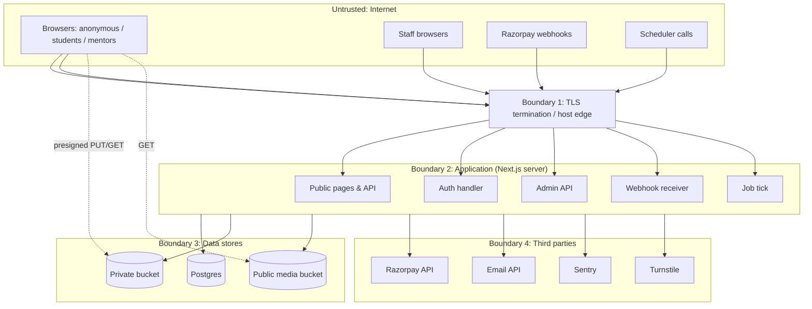

# 11 — Security Threat Model

Status: Draft v0.1 · 2026-09-17, reviewed against real Phase 0–13 code in Phase 14 (2026-09-26) · Method: asset/actor analysis + STRIDE per trust boundary + abuse cases + OWASP Top 10:2025 and API Security Top 10 (2023) mapping. Verification target: **OWASP ASVS 5.0 Level 2**.

This is a living document, updated whenever a new external integration, data class or privileged workflow is added.

**Phase 14 review note:** this document was originally written design-first, ahead of most of the implementation it describes. The Phase 14 pass (`docs/security/asvs-l2-checklist.md`) walked every ASVS 5.0 L1/L2 requirement against the actual code and found this doc's design intent mostly matches reality, with a few real gaps between what's described here and what's built — each is called out inline below with a pointer to `docs/security/accepted-risk-register.md`, rather than silently left for a reader to discover the mismatch later. Zero critical/high findings; every gap is Medium or lower.

## 1. Security objectives

1. No user can read or modify another user's private data or bookings (confidentiality/integrity of tenant-like boundaries).
2. Money moves only as business rules dictate. No client can alter prices, refunds or payouts.
3. Staff powers are least-privilege, MFA-protected, dual-controlled for high-impact actions and fully audited.
4. Verification documents and personal data are minimised and protected.
5. The platform degrades safely (fails closed) under errors, provider outages and abuse.
6. Compromises are detectable and recoverable.

## 2. Assets & data classification

| Class | Examples | Controls |
|-------|----------|----------|
| **Restricted** | Verification documents; payout account identifiers; TOTP secrets; password hashes; session tokens; API/webhook secrets; DB credentials | Encrypted at rest (provider + app-level for secrets), private buckets, step-up access, audit on read, short retention |
| **Confidential** | Email addresses; messages; booking details; dispute evidence; reports; payment records; IP addresses; birth year | Authorization + scoped queries, TLS, redacted logs, retention limits |
| **Internal** | Moderation notes, risk signals, reconciliation data, analytics | Staff-only, audit |
| **Public** | Public mentor profiles (opt-in fields), reviews, guides, events | Integrity controls (moderation), output encoding |

## 3. Threat actors

| Actor | Motivation | Capability |
|-------|-----------|-----------|
| Opportunistic attacker / bots | Credential stuffing, spam, scraping, crypto-mining via RCE | Automated tools, leaked credential lists, public exploits |
| Fraudulent student | Free sessions, chargebacks, refund abuse | Legit account, stolen cards |
| Fraudulent mentor | Fake credentials, scam students, off-platform payments, payout theft | Legit account, forged documents |
| Account takeover actor | Redirect payouts, harass under a trusted identity | Phished credentials, SIM swap (email reset) |
| Malicious insider / compromised staff | Data theft, fraudulent refunds, sabotage | Staff access |
| Supply-chain attacker | Compromise via npm package, GitHub Action | Malicious updates |
| Competitor scraper | Harvest mentor lists and contact info | Distributed scraping |
| Harasser/stalker | Locate or contact a specific user | Legit account, social engineering |

## 4. Trust boundaries



## 5. STRIDE analysis

| Boundary / component | Threat (STRIDE) | Scenario | Mitigations |
|---------------------|-----------------|----------|-------------|
| Auth handler | **S**poofing | Credential stuffing; OAuth account pre-hijacking; session fixation | Breached-password check, throttling + Turnstile, MFA, verified-email linking rules, session rotation on login ([07](07-authentication-authorization.md)) |
| Auth handler | **R**epudiation | "I didn't change my payout account" | Audit log with request id, IP prefix, UA hash; notification emails to old contacts |
| Public API | **T**ampering | Price/amount manipulation, mass assignment (`isAdmin: true`), hidden fields | Server-side pricing, zod `.strict()` DTOs, no ORM auto-binding |
| Public API | **I**nfo disclosure | BOLA on `/bookings/{id}`; enumeration of users by email; verbose errors | Policy + scoped queries + 404-for-invisible; generic auth responses; problem+json without internals |
| Public API | **D**oS | Slot generation over huge ranges; search with expensive filters; hold squatting | Range caps (31 days), query cost limits, rate limits, hold limits per student |
| Public API | **E**levation | Broken function-level authz (student calls admin API); CVE-2025-29927-style middleware bypass | Role checks in every handler + layout, no middleware-only authz, BFLA tests |
| Webhook receiver | **S**poofing | Forged "payment captured" | HMAC on raw body, secret per env, re-fetch provider state for decisions |
| Webhook receiver | **T**ampering / replay | Replayed old event | Event-id dedupe; idempotent monotonic transitions |
| Job tick | **S**poofing | Attacker triggers jobs | 256-bit bearer secret, constant-time compare; jobs idempotent anyway |
| Admin API | **E**levation / insider | Rogue refunds, bans, document browsing | MFA, step-up, 4-eyes thresholds, document access audit, least privilege, alerting on anomalous staff activity |
| Private bucket | **I**nfo disclosure | Guessable document URLs; long-lived links; public bucket misconfig | Random keys, private ACL, 60 s signed URLs, CI check that bucket policies are private |
| Uploads | **T**ampering / **E**levation | Polyglot files, SVG/HTML XSS, MIME spoofing, zip bombs, path traversal | Allowlisted types, magic-byte sniff, image re-encode, no SVG, server-generated keys, size limits in presign, `Content-Disposition: attachment`, `X-Content-Type-Options: nosniff`, separate media origin (Beta) |
| Messaging | **I**nfo disclosure / abuse | Phishing links, harassment, contact harvesting | Link warnings for external URLs, report/block, detectors, rate limits |
| Database | **I**nfo disclosure | Supabase REST exposure of tables; SQL injection | `app` schema not exposed, Data API disabled, parameterised queries only (Drizzle), no string-built SQL |
| Database | **T**ampering | Audit/ledger edits by app compromise | REVOKE UPDATE/DELETE, triggers, hash chain verification |
| Email | **S**poofing | Phishing emails impersonating the brand | SPF, DKIM, DMARC `p=quarantine→reject`; emails never ask for passwords; consistent sender |
| Third-party scripts | **T**ampering | Compromised CDN script skims checkout | Minimal third-party JS (only Razorpay Checkout, Turnstile), strict CSP allowlist, no tag managers |
| CI/CD | **T**ampering / **E**levation | Malicious dependency, compromised Action, leaked secrets in logs | Lockfile + `npm ci`, Dependabot, actions pinned to commit SHA, least-privilege `GITHUB_TOKEN`, environment-protected secrets, gitleaks, no secrets in PR builds from forks |
| Hosting runtime | **E**levation | RSC deserialization RCE (CVE-2025-55182) and future framework CVEs | Patched framework versions, Dependabot security updates auto-PR within 24 h, advisory monitoring, WAF rules where host provides |

## 6. Marketplace abuse cases

| # | Abuse case | Mitigation | Test |
|---|-----------|-----------|------|
| AC1 | Student changes `amountMinor` in the booking request | Amount not accepted from client; order amount from DB snapshot | API test: extra field rejected (422) |
| AC2 | Student confirms payment with a signature from a different order | Signature verification binds `order_id|payment_id`; provider fetch must match intent's order, amount, currency | Unit + integration |
| AC3 | Student replays a successful confirm for a second booking | Intent ↔ provider order 1:1 unique; payment id unique | Integration |
| AC4 | Mentor books own session to farm reviews | Self-booking forbidden; review author ≠ mentor constraint; payment instrument clustering (Beta) | Unit + DB constraint |
| AC5 | Student floods holds to block a mentor's calendar | Max 3 active holds; hold-abuse trust event; rate limit | Integration |
| AC6 | Mentor cancels bookings then asks students to pay directly | Late-cancel events; pattern detection (cancel + message with payment keywords) → case | Unit (detector) |
| AC7 | Attacker enumerates booking IDs | UUIDv7 not sequential + BOLA checks return 404 | BOLA matrix |
| AC8 | Staff issues refund to self-controlled booking | Conflict-of-interest guard; 4-eyes above threshold; anomaly alert on staff refund volume | Integration |
| AC9 | ATO changes payout account and drains held transfers | Step-up + MFA, 72 h cooling-off, notifications, holds | E2E |
| AC10 | Mentor uploads a forged degree | Human review checklist + KYC name match + sampling + fraud trust event | Process |
| AC11 | Open redirect via `returnTo` after login | Only relative same-origin paths accepted (`/^\/(?!\/)/`), else `/` | Unit |
| AC12 | Stored XSS via bio markdown | Markdown → HTML with sanitizer allowlist, no raw HTML, `rel="nofollow ugc noopener"`, CSP | Unit (payload corpus) |
| AC13 | CSV/formula injection in admin exports | Prefix cells starting with `= + - @ \t \r` with `'` | Unit |
| AC14 | ReDoS against contact-info detectors | Input length caps (≤ 4,000 chars), linear-time regexes reviewed, `safe-regex` lint in CI | Unit (fuzz timing) |
| AC15 | Scraping mentor directory for contact harvesting | No contact info on profiles; rate limits; pagination caps; Turnstile on abnormal patterns | Load test |
| AC16 | Free-event registration bots | Turnstile on registration, verified email required, per-account caps | E2E |
| AC17 | Meeting-link phishing (mentor sets a lookalike URL) | Strict host allowlist, punycode rejection, join via platform redirect | Unit |
| AC18 | Moderator doxxing a user from verification docs | Docs accessible only to verification reviewers, audited views, short retention | Audit review |
| AC19 | A compromised or careless `content_editor` account publishes misleading "official" immigration/legal/financial guidance under the platform's name (Phase 12 addition) | Publish gate refuses to publish with zero sources (docs/12 §14); mandatory disclaimer banner on any sensitive-topic guide; `verified_by`/`last_verified_at`/`next_review_due_at` create an accountable, auditable trail per guide; `article.published` is a `writeAudit`-logged action tied to the actor | Integration (Phase 12: publish-gate rejection test); no dedicated abuse-simulation test yet — tracked as a Phase 14 follow-up rather than assumed covered by the publish-gate test alone |

## 7. OWASP Top 10:2025 mapping

| # | Category | Primary controls in this design |
|---|----------|--------------------------------|
| A01 | Broken Access Control (incl. SSRF) | Central `authorize()`, scoped repositories, 404-for-invisible, BOLA/BFLA test matrix, no middleware-only checks, CORS disabled, no server-side fetch of user URLs (SSRF surface ≈ 0 in MVP), `next/image` remote patterns restricted to own storage host |
| A02 | Security Misconfiguration | Zod-validated env; secure headers baseline; Supabase Data API disabled; private buckets asserted in CI; `poweredByHeader: false`; production build with no dev routes (fake gateway compiled out); dependency-free defaults |
| A03 | Software Supply Chain Failures | Lockfile, `npm ci`, Dependabot/OSV scanning, `npm audit signatures`, Actions pinned to SHAs, minimal dependencies policy (new deps need justification in PR), SBOM generation (CycloneDX) in CI (Beta) |
| A04 | Cryptographic Failures | TLS everywhere (HSTS), Argon2id passwords, hashed tokens, AES-256-GCM app-level encryption for secrets with key ids and rotation, no custom crypto, `crypto.timingSafeEqual` |
| A05 | Injection | Drizzle parameterised queries; no raw SQL string concatenation (lint); output encoding by React; sanitized markdown; escaped email templates; CSV injection guard; log injection prevented by structured JSON logging |
| A06 | Insecure Design | This threat model; state machines; constraints for invariants; idempotency; abuse-case tests; business limits |
| A07 | Authentication Failures | [07](07-authentication-authorization.md): breached-password check, MFA, throttling, generic responses, secure sessions, step-up |
| A08 | Software & Data Integrity Failures | Webhook signatures; signed pagination cursors; audit hash chain; migrations reviewed; no deserialization of untrusted data outside patched framework paths; CI artifact integrity |
| A09 | Security Logging & Alerting Failures | Security event catalogue (§10), alerts, audit log, log retention |
| A10 | Mishandling of Exceptional Conditions | Fail-closed authorization (exceptions → deny), typed domain errors, transaction rollback on any error, provider errors mapped to safe responses, timeouts on all outbound calls, no partial state commits, error boundaries in UI |

## 8. OWASP API Security Top 10 (2023) mapping

| # | Risk | Controls |
|---|------|---------|
| API1 | Broken Object Level Authorization | Policies + scoped queries + BOLA matrix tests for every `{id}` route |
| API2 | Broken Authentication | Argon2id + DB-backed sessions (ADR-023); rate limits; MFA; instant session revocation |
| API3 | Broken Object Property Level Authorization | Audience-specific DTOs (Public/Owner/Admin); `.strict()` input schemas; property allowlists for PATCH |
| API4 | Unrestricted Resource Consumption | Rate limits, pagination caps, date-range caps, body size limits, upload size limits, query timeouts (`statement_timeout` 5 s for app role), outbound email quotas |
| API5 | Broken Function Level Authorization | Role checks per handler; admin routes under `/admin` with an additional guard; tests per role |
| API6 | Unrestricted Access to Sensitive Business Flows | Hold limits, booking velocity limits, event registration captcha, referral abuse checks (Beta), review eligibility |
| API7 | Server-Side Request Forgery | No user-URL fetching in MVP; if added (link previews, calendar ICS import): allowlist + DNS resolution check against private ranges + no redirects + timeouts, via a dedicated egress helper |
| API8 | Security Misconfiguration | Same as A02; security headers tests |
| API9 | Improper Inventory Management | OpenAPI generated from code, diffed in CI; dev/test endpoints (fake gateway) excluded from production builds; route inventory test |
| API10 | Unsafe Consumption of APIs | Treat provider responses as untrusted: schema-validate Razorpay/Resend responses, timeouts, retries with idempotency, verify amounts/ids against our records |

## 9. Control specifications

### 9.1 HTTP security headers (all responses)

```
Strict-Transport-Security: max-age=63072000; includeSubDomains   (add preload after domain is stable)
Content-Security-Policy: default-src 'self';
  script-src 'self' 'nonce-{random}' 'strict-dynamic' https://checkout.razorpay.com https://challenges.cloudflare.com;
  style-src 'self' 'unsafe-inline';            (tighten with nonces when feasible)
  img-src 'self' data: https://{storage-host};
  connect-src 'self' https://api.razorpay.com https://lumberjack.razorpay.com https://{sentry-ingest-host};
  frame-src https://api.razorpay.com https://checkout.razorpay.com https://challenges.cloudflare.com;
  frame-ancestors 'none'; base-uri 'none'; form-action 'self'; object-src 'none'; upgrade-insecure-requests
X-Content-Type-Options: nosniff
Referrer-Policy: strict-origin-when-cross-origin      (join redirect: no-referrer)
Permissions-Policy: camera=(), microphone=(), geolocation=(), payment=(self "https://checkout.razorpay.com")
Cross-Origin-Opener-Policy: same-origin-allow-popups   (Razorpay/Google OAuth popups)
```

Exact Razorpay/Turnstile hosts are validated during integration (CSP report-only first, then enforce). Nonce-based CSP makes pages dynamic, so for static/ISR public pages a hash-based policy or a separate stricter no-script-exception policy is evaluated at Phase 4.

**Phase 14 note:** the shipped CSP (`next.config.ts`) is otherwise this strong or stronger (`object-src 'none'`, `base-uri 'none'`, `frame-ancestors 'none'`, no third-party origins allowlisted since none are integrated yet), but `script-src` still uses `'self' 'unsafe-inline'` rather than the nonce-based policy shown above — the nonce middleware layer described here was never built. Tracked as accepted-risk register R5 (Medium severity, no known live XSS sink today, but a real defense-in-depth gap).

### 9.2 Input & output
- zod validation at every boundary (HTTP, webhooks, job payloads, env).
- String length caps on every field; Unicode normalisation (NFC) for names/slugs; slugs `[a-z0-9-]` only.
- Rich text = Markdown subset rendered server-side with `rehype-sanitize` (allowlist: p, strong, em, ul/ol/li, a[href https only], code, pre, blockquote, h3–h4). No images from arbitrary hosts. **Phase 14 note:** this markdown-to-HTML pipeline was never built — every free-text field shipped so far (mentor bios, Phase 6; guide bodies, Phase 12) renders as plain `white-space: pre-line` text via ordinary JSX interpolation instead, which React auto-escapes by construction. That sidesteps this exact risk class differently than originally designed, not by accident — but it means the moment any field *does* need real formatting (headings, lists, links), this sanitizer needs to be built before switching that field to HTML rendering, not assumed already in place.
- Email templates: escaped variables; plain-text alternative.

### 9.3 File uploads
Presigned PUT with exact `Content-Type` + `Content-Length` conditions → `POST /uploads/{id}/complete` → server HEAD + range-GET first bytes → magic-byte check (`file-type`) → size ≤ purpose limit → images: decode + re-encode with `sharp` (strips EXIF/GPS, neutralises polyglots), max 4096×4096 → mark `ready`. Rejected files are deleted immediately. Allowed: avatars `jpeg/png/webp` ≤ 5 MB; documents `pdf/jpeg/png` ≤ 10 MB. **Malware scanning is not available on free tiers**, which is a known gap. Mitigation: documents are only downloaded by staff (never rendered in app origin); Beta adds a scanning service (e.g. ClamAV worker) before the Production-critical gate.

### 9.4 Secrets management
- Local: `.env.local` (git-ignored); `.env.example` documents names only.
- CI: GitHub Actions **environment** secrets (production environment requires approval).
- Runtime: host environment variables; never `NEXT_PUBLIC_*` for secrets (lint rule: only an allowlisted set of public vars).
- Rotation: webhook secret, job tick secret and app encryption keys have documented rotation procedures supporting two active keys (`kid`). **Phase 14 note:** this is the target design; no `kid`-based rotation is actually implemented yet (`MFA_ENCRYPTION_KEY` is a single fixed key with no rotation path) — tracked as accepted-risk register R6, low urgency since no real TOTP secrets exist in production yet.
- Detection: gitleaks in pre-commit (optional) and CI (required); GitHub secret scanning (free for public repos).

### 9.5 Encryption
- In transit: TLS 1.2+ (host-managed), HSTS.
- At rest: provider disk encryption (Supabase/host). App-level AES-256-GCM (envelope-ready, `kid`-versioned) for TOTP secrets, verification reviewer notes, and any future sensitive fields. **Phase 14 note:** the key is derived via HKDF-SHA256 (fixed in Phase 14 — previously a bare SHA-256 hash), but is not yet actually `kid`-versioned; see the rotation note above.
- Hashing: Argon2id (passwords), SHA-256 (token lookup hashes), HMAC-SHA256 with a pepper (email fingerprints, cursors).

### 9.6 Rate limiting & bot defence
[06 §5](06-api-design.md#5-rate-limits-initial-configurable). Postgres-backed buckets in MVP (atomic `INSERT … ON CONFLICT DO UPDATE … RETURNING count`). Turnstile on sign-up, sign-in after failures, password reset, event registration and reports. Moves to Redis at scale ([16](16-migration-and-scaling.md)).

### 9.7 Next.js-specific hardening
- **Mutations via REST route handlers only.** Server Actions are disallowed by lint unless explicitly allowlisted (each Server Action is a public endpoint).
- No auth logic in `middleware.ts`; middleware only sets headers and nonces.
- `server-only` imports on all server modules; `NEXT_PUBLIC_` allowlist.
- `images.remotePatterns` limited to our storage host.
- Keep Next.js/React on patched minors; subscribe to `vercel/next.js` and `facebook/react` security advisories; Dependabot security updates merged within 24 h (critical) / 7 days (high).

## 10. Security logging & alerting

| Event | Logged fields | Alert |
|-------|---------------|-------|
| Sign-in success/failure, MFA challenge, lockout-throttle | user id (if known), IP prefix, UA hash, outcome | > 50 failures/min globally; > 10 accounts from one IP in 10 min |
| Password/email/MFA change, session revoke-all | user id, actor | Notify user by email |
| Role grant/revoke | actor, target, role | Always alert admins |
| Staff views verification document | staff id, request id | Daily digest; > 30 views/day per staff alerts |
| Refunds, transfer releases/holds, commission changes, settings changes | actor, amounts, before/after | Refunds > threshold alert; any commission/settings change digest |
| Webhook signature failure | provider, IP prefix | > 5 in 10 min |
| Authorization denials (403/404 from policies on id routes) | actor, route, resource type | Spike detection (possible BOLA probing) |
| Payout account change | mentor, cooling-off end | Alert finance above pending threshold |
| Ban/suspension applied or revoked | actor, subject, reason code | Digest |
| Audit hash-chain verification failure | range | **P0 alert** |

**Never logged:** passwords, tokens, cookies, TOTP codes, full card/bank/UPI identifiers, document contents, message bodies (except in moderation case views, which read from the DB, not logs).

Log retention ⚖️: CERT-In Directions (April 2022) require maintaining ICT system logs for **180 days within Indian jurisdiction** and reporting specified incidents **within 6 hours**. Hosting-region implications must be confirmed with counsel (free-tier regions may be outside India). See [12](12-privacy-compliance.md).

## 11. Incident response (MVP runbook summary)

1. **Detect**: alert, user report or provider notice → create an incident record (severity SEV1–SEV3).
2. **Contain**: kill-switch feature flags (`signup.enabled`, `booking.enabled`, `payments.enabled`, `messaging.enabled`, `uploads.enabled`), rotate affected secrets, revoke sessions, block abusive accounts.
3. **Eradicate & recover**: patch, restore from backup if needed ([15](15-observability.md)), verify ledger and audit chain integrity.
4. **Notify** ⚖️: CERT-In (6 h for reportable incidents), Data Protection Board and affected users per DPDP Rules for personal data breaches, payment partner if payment data is involved, GDPR supervisory authority within 72 h if EU data subjects are affected.
5. **Post-incident review** within 7 days: root cause, action items, threat model update.

## 12. Security verification plan

| Activity | When | Tooling |
|----------|------|---------|
| Threat model review | Each phase with new surface | This doc |
| SAST / lint security rules | Every PR | ESLint security plugins, `eslint-plugin-no-unsanitized`, CodeQL (if repo public or GHAS available) |
| Dependency scanning | Every PR + daily | Dependabot, `npm audit`, OSV-Scanner |
| Secret scanning | Every PR | gitleaks |
| Authz matrix tests | Every PR | Vitest integration ([13 §5](13-testing-strategy.md#5-authorization-bola-matrix)); route-inventory + CI drift-gate built Phase 13 (docs/21 ADR-047) — the full per-actor assertion matrix itself is still a tracked follow-up, not yet exhaustive |
| Webhook forgery / replay tests | Every PR | Integration |
| DAST baseline | Weekly (against the real production build — no staging exists yet) | OWASP ZAP baseline (`.github/workflows/weekly.yml`, built Phase 13; `fail_action: false` until a triage baseline exists, docs/21 ADR-048) |
| Header/CSP checks | Every PR | `tests/e2e/foundation.spec.ts` (Phase 5) |
| Manual review against ASVS L2 checklist | Phase 14 (2026-09-26), then before Beta and before live money | `docs/security/asvs-l2-checklist.md` — done; ~136/253 Met, ~20 Partial, 1 Not Met, ~89 N/A, zero Critical/High. Accepted risks tracked in `docs/security/accepted-risk-register.md` (founder sign-off pending) |
| External penetration test | **Production-critical, before live money** | Paid (out of ₹0 scope) |

## Sources

- OWASP Top 10:2025: https://owasp.org/Top10/2025/0x00_2025-Introduction/
- OWASP API Security Top 10 2023: https://owasp.org/API-Security/editions/2023/en/0x11-t10/
- OWASP ASVS 5.0: https://github.com/OWASP/ASVS
- OWASP Cheat Sheet Series: https://cheatsheetseries.owasp.org/
- React2Shell / Next.js advisory: https://github.com/vercel/next.js/security/advisories/GHSA-9qr9-h5gf-34mp ; https://www.microsoft.com/en-us/security/blog/2025/12/15/defending-against-the-cve-2025-55182-react2shell-vulnerability-in-react-server-components/
- Razorpay webhook validation: https://razorpay.com/docs/webhooks/validate-test/
- CERT-In Directions (28 April 2022) overview: https://www.internetsociety.org/resources/doc/2022/internet-impact-brief-india-cert-in-cybersecurity-directions-2022/ ; https://www.azbpartners.com/bank/cert-in-directions/
