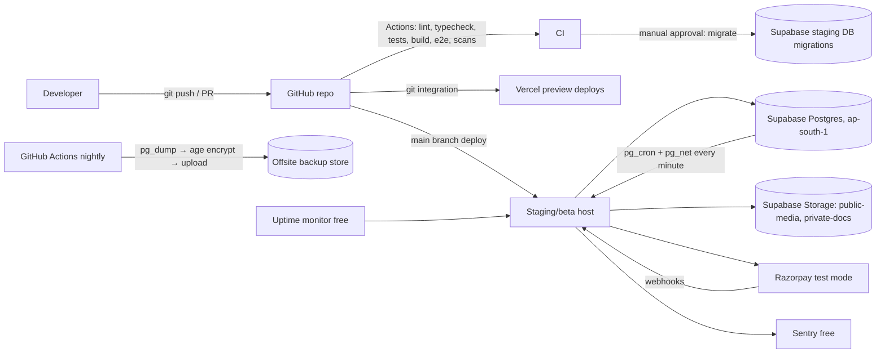

# 14 — Deployment

Status: Draft v0.1 · 2026-09-17

## 1. Environments

| Env | Purpose | App host | Database | Payments | Email | Data |
|-----|---------|----------|----------|----------|-------|------|
| `local` | Development | `next dev` on laptop | Homebrew Postgres 16 (already running on this machine) | FakeGateway | Console + in-app preview page | Seed data |
| `test` (CI) | Automated tests | GitHub Actions runner | `postgres:16` service container | FakeGateway | In-memory | Factories |
| `preview` | Per-PR review | Vercel Hobby preview deployments (**non-commercial dev use**) | Shared staging DB **read-mostly** or ephemeral seed schema | FakeGateway | Console | Seed data only |
| `staging` | Pre-release, sandbox beta | Chosen at Phase 16 (see §3) | Supabase Free project `aheadly-staging` (region **Mumbai `ap-south-1`**) | Razorpay **test mode** | Resend free (once a domain exists) | Synthetic + invited beta testers |
| `production` | Real users & money | Paid commercial-use host | Supabase Pro (or equivalent) with PITR, Mumbai | Razorpay **live** (gated) | Resend (domain, DMARC) | Real |

**Production does not exist until the Production-critical gate is met** ([08 §13](08-payment-architecture.md#13-production-critical-gate-for-live-payments), §8 below).

**Implementation note (added during Phase 6):** GitHub Pages (`https://geek-asr.github.io/MentorshipPlatform/`, via `.github/workflows/pages.yml` and `progress-site/generate.mjs`) hosts a static, `noindex` build-progress dashboard generated from [docs/19-mvp-roadmap.md](19-mvp-roadmap.md) on every push to `main`. It is not one of the environments above — Pages is static-only and this app needs a server and a live database, so the actual product still deploys per §3 once Phase 16 is reached. The dashboard exists solely so progress is externally visible before then.

## 2. MVP deployment topology

## 3. Hosting decision procedure (Phase 16)

Hosting stays portable. At Phase 16, measure: server bundle size (compressed), p95 server CPU per SSR request, monthly requests and bandwidth estimates. Then:

| If… | Choose |
|-----|--------|
| Sandbox beta, low traffic, fits 300 credits | **Netlify Free** (commercial use allowed; hard cap; ≈ 15 credits per production deploy, so batch deploys) |
| Credits insufficient, or before real money | **Cloudflare Workers Paid ($5/mo)** via OpenNext (10 MiB limit), if the bundle fits and runtime compatibility tests pass |
| Want the lowest-friction Next.js hosting with real money | **Vercel Pro ($20/mo per member)** |
| Need full control / long-running work | Container on a small VPS or managed container platform (paid) |

Dev previews on Vercel Hobby are used for **non-commercial development only**, never for the public beta.

## 4. CI/CD

### 4.1 Workflows (GitHub Actions)
| Workflow | Trigger | Steps |
|----------|---------|-------|
| `ci.yml` | PR, push to `main` | Install (`npm ci`) → lint → typecheck → unit → integration/API/BOLA (Postgres service) → build → E2E smoke → Lighthouse → gitleaks → npm audit/OSV → OpenAPI diff |
| `migrate.yml` | Manual (`workflow_dispatch`) + `staging`/`production` environment approval | Backup snapshot (`pg_dump`) → `drizzle-kit migrate` with migrator credentials → smoke query → audit log entry |
| `nightly.yml` | Cron 21:30 UTC (03:00 IST) | Full E2E, concurrency repeats, dependency audit, backup job, backup integrity check |
| `weekly.yml` | Cron Sunday | ZAP baseline vs staging, Lighthouse full, stale-content report |
| `monthly-restore-drill.yml` | Cron 1st of month | Restore latest backup into a CI Postgres → integrity checks (ledger balance, audit chain, row counts) → report |

### 4.2 Supply-chain hygiene in CI
- Third-party actions pinned to **full commit SHA**; `permissions: contents: read` by default.
- Secrets only in protected **environments** (`staging`, `production`) requiring reviewer approval. Fork PRs never receive secrets.
- `npm ci --ignore-scripts` where possible; allowlist packages that need install scripts (e.g. native Argon2, sharp).
- Dependabot for npm + GitHub Actions (weekly; security updates immediately).

### 4.3 Branching & releases
- Trunk-based: short-lived feature branches → PR → squash merge to `main`. Commits authored by the founder.
- `main` auto-deploys to staging after CI passes; production deploys are tagged releases (`vX.Y.Z`) with manual approval.
- Rollback: redeploy the previous build (host feature) + **forward-fix migrations only**. Destructive schema changes follow expand → migrate → contract across ≥ 2 releases, so the previous build remains compatible.

## 5. Configuration & secrets

`.env.example` (committed) lists every variable with a description and no values. Validated at boot by a zod schema; the app **refuses to start** on invalid or missing config.

| Variable | Secret | Notes |
|----------|:-----:|-------|
| `NODE_ENV`, `APP_ENV` (`local|test|preview|staging|production`) | | |
| `APP_BASE_URL` | | Origin allowlist for CSRF/Origin checks |
| `DATABASE_URL` | ✓ | Runtime role via pooler (`prepare: false` for transaction pooling) |
| `DATABASE_MIGRATOR_URL` | ✓ | CI only |
| `AUTH_SECRET` | ✓ | ≥ 32 bytes random |
| `GOOGLE_CLIENT_ID` / `GOOGLE_CLIENT_SECRET` | ✓ (secret) | |
| `APP_ENCRYPTION_KEYS` | ✓ | JSON `{kid: base64key}` + `APP_ENCRYPTION_ACTIVE_KID` |
| `HMAC_PEPPER` | ✓ | Email fingerprints, cursor signing |
| `PAYMENTS_PROVIDER` (`fake|razorpay`) · `PAYMENTS_MODE` (`test|live`) | | Boot guard vs key prefix |
| `RAZORPAY_KEY_ID` | | Public key id |
| `RAZORPAY_KEY_SECRET` · `RAZORPAY_WEBHOOK_SECRET` | ✓ | |
| `EMAIL_PROVIDER` (`console|resend`) · `RESEND_API_KEY` · `EMAIL_FROM` | ✓ (key) | |
| `STORAGE_S3_ENDPOINT` · `STORAGE_S3_REGION` · `STORAGE_S3_ACCESS_KEY_ID` · `STORAGE_S3_SECRET_ACCESS_KEY` · `STORAGE_BUCKET_PUBLIC` · `STORAGE_BUCKET_PRIVATE` | ✓ (keys) | |
| `TURNSTILE_SITE_KEY` · `TURNSTILE_SECRET_KEY` | ✓ (secret) | |
| `JOB_TICK_SECRET` | ✓ | ≥ 256-bit |
| `SENTRY_DSN` | | DSN is not a secret but is env-specific |
| `NEXT_PUBLIC_*` | | **Allowlist only**: `NEXT_PUBLIC_APP_BASE_URL`, `NEXT_PUBLIC_TURNSTILE_SITE_KEY`, `NEXT_PUBLIC_SENTRY_DSN`, `NEXT_PUBLIC_RAZORPAY_KEY_ID` |

Rules: never commit `.env*` (except `.env.example`), never log config values, rotate on staff departure or suspected exposure.

## 6. Cost sheet and free-tier limits

Figures from provider pages/reviews as of 2026-09-17. **Re-verify before relying on them**, because free tiers change often.

| Service | Free tier (key limits) | Expected MVP/beta usage (≤ 500 users) | What happens at the limit | Upgrade path & indicative cost |
|---------|-----------------------|---------------------------------------|---------------------------|-------------------------------|
| Supabase Free (DB + Storage) | 500 MB DB, 1 GB storage, 5 GB egress; 2 active projects; **pauses after 1 week of inactivity**; **no automated backups** | DB < 150 MB; storage < 300 MB (avatars; docs auto-deleted) | Pause: site down until manual resume. Quota overage: restrictions | Pro ≈ US$25/mo (daily backups, no pause); PITR add-on extra |
| Netlify Free (if chosen) | 300 credits/month hard cap; commercial use allowed | Must measure | **Site stops** until next cycle | Pro ≈ US$20/mo |
| Cloudflare Workers Free (alt) | 100k requests/day, 10 ms CPU/request, **3 MiB** worker | Next.js bundle likely > 3 MiB | Requests fail over daily limit | Paid US$5/mo (10 MiB, higher CPU) |
| Vercel Hobby (dev previews only) | Non-commercial use only | Previews | Terms violation risk if used commercially | Pro ≈ US$20/mo per member |
| Auth module dependencies (`@node-rs/argon2`, `jose`) | Library | — | — | ₹0 |
| Resend Free | 3,000 emails/month, **100/day**, 1 domain | ~20–60/day in beta | Sends pause (reminders/verification emails fail) | Pro ≈ US$20/mo |
| Razorpay | Test mode free; live: 2% domestic + GST; Route 0.1% + fees (verify) | Test only | — | Per transaction |
| Cloudflare Turnstile | Free | All forms | — | ₹0 |
| Sentry Developer | Free tier with limited errors/month, 1 user (verify quota) | Low | Events dropped | Team plan ≈ US$26/mo |
| GitHub Actions | Public repos: free standard runners; private repos: limited free minutes/month (verify current quota) | ~1,000–2,000 min/month if private | Jobs stop until the next cycle | Paid minutes, or make repo public |
| Uptime monitor (e.g. UptimeRobot / Better Stack free) | ~5-min checks (verify commercial-use terms) | 3 monitors | — | Paid plans |
| Offsite backups (e.g. Backblaze B2 free 10 GB, or personal Google Drive via rclone) | ~10–15 GB | < 1 GB (30 dailies compressed) | Upload fails, so we alert | ≈ US$6/TB/mo |
| Domain | **None free** (use host subdomain) | — | Resend needs a domain; `__Host-` cookies fine on subdomains | ≈ ₹800–1,500/year |

**Current monthly cost: ₹0** (local development + sandbox beta).

**Minimum responsible real-money production (estimate):** DB with backups (~US$25) + commercial hosting (US$5–20) + email (US$0–20) + domain (~₹100/month amortised) ≈ **US$35–70/month (≈ ₹3,000–6,000)**, plus payment fees per transaction and a one-time external penetration test and legal/CA fees (not infrastructure).

## 7. Things that will eventually require paid infrastructure

1. Database with automated backups, PITR and no auto-pause (**before live money**).
2. Commercial-use application hosting (**before public launch with payments**).
3. A custom domain + transactional email at volume (**before public beta**).
4. Malware scanning for uploads (**before accepting documents at scale**).
5. External penetration test (**before live money**).
6. Error tracking/log retention beyond free quotas (CERT-In 180-day logs) (**before public launch**).
7. Redis (rate limiting/cache) and a dedicated search engine (**~10k+ active users**).
8. Queue service / background worker runtime (**when outbox tick latency matters**).
9. Google Workspace or equivalent for staff MFA-enforced accounts and a support inbox (**public launch**).
10. Status page, on-call tooling (**growth stage**).

## 8. Production-critical launch checklist (infrastructure)

- [ ] Paid DB with PITR; restore drill passed in the last 30 days
- [ ] Commercial hosting plan; region close to India
- [ ] Custom domain; HSTS; SPF/DKIM/DMARC `p=quarantine` or stricter
- [ ] Secrets rotated from staging; production environment protection enabled
- [ ] Monitoring & alerts routed to an on-call person; runbooks written
- [ ] Log retention ≥ 180 days with India residency confirmed ⚖️
- [ ] Payment live gate ([08 §13](08-payment-architecture.md#13-production-critical-gate-for-live-payments)) complete
- [ ] Legal/compliance gate ([12 §16](12-privacy-compliance.md#16-compliance-checklist)) live-money items complete
- [ ] Security review + pen test findings resolved (critical/high)
- [ ] Load test at 5× expected launch traffic passed
- [ ] Kill-switch feature flags verified in production

## 9. Database migration process

1. Write the migration (Drizzle schema + generated SQL), hand-review the SQL (locks, defaults, backfills).
2. For large tables: `CREATE INDEX CONCURRENTLY` in separate non-transactional migrations; avoid `ALTER … SET NOT NULL` on big tables without a `CHECK … NOT VALID` → `VALIDATE` pattern.
3. CI runs migrations from zero **and** from the previous release's schema snapshot.
4. Staging migration via `migrate.yml` (approval) after taking a fresh dump.
5. Deploy application code compatible with both old and new schema (expand phase).
6. Contract phase in a later release.

## 10. Supabase-specific setup checklist

- [ ] Region `ap-south-1` (Mumbai)
- [ ] Disable the Data API / PostgREST exposure (or at least remove `app` from exposed schemas; revoke `anon`/`authenticated` privileges)
- [ ] Do not use Supabase Auth; keep auth tables in `app`
- [ ] Create roles `app_runtime`, `app_migrator`; strong passwords; runtime connects via transaction pooler
- [ ] Set `statement_timeout = '5s'` and `idle_in_transaction_session_timeout = '10s'` for `app_runtime`
- [ ] Enable extensions: `btree_gist`, `pg_trgm`, `citext`, `pgcrypto`, `pg_cron`, `pg_net`
- [ ] Buckets: `public-media` (public read), `private-docs` (private); S3 access keys scoped per env
- [ ] `pg_cron` job calling the tick endpoint with the secret header (secret stored in Supabase Vault)
- [ ] Network restrictions/SSL enforcement enabled where available on the plan
