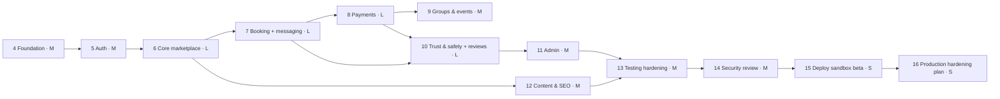

# 19 — MVP Roadmap

Status: Draft v0.1 · 2026-09-17 · Phases 0–3 (Discovery, Research, Architecture, UX) are **complete as documents** in this `docs/` folder.

Principles: build incrementally; keep the app runnable after each phase; tests with every phase; security review continuously; no phase is "done" without meeting its exit criteria. Relative size: S (days), M (1–2 weeks), L (2–4 weeks) for a single developer with AI assistance. These are rough and will be re-estimated after Phase 4.

## Phase overview



## Phase 4 — Foundation (M) ✅ complete (2026-09-17)

**Delivered**
- Next.js 16 (App Router, Turbopack) + TypeScript strict (`noUncheckedIndexedAccess`); ESLint (Next core-web-vitals + TypeScript + `sql.raw` interpolation ban), Prettier; `@/` and `@tests/` aliases; Node 24 LTS pinned.
- Platform primitives in `src/server/platform`: zod env validation (fail-fast via `instrumentation.ts`), pino logger with redaction, request context, typed errors → RFC 9457 problem+json, Drizzle/postgres.js client, `Clock`, authz (`Actor`, capability restrictions, composable guards, `authorize`), hash-chained append-only audit log, transactional outbox (claim with `SKIP LOCKED`, backoff, stale-lock reclaim, recurring jobs), idempotency keys (replay / mismatch / in-progress / stale takeover), Postgres fixed-window rate limiter, versioned settings + feature flags (audited), `defineRoute` HTTP pipeline (request id, same-origin CSRF check, JSON-only bodies with streaming size limit, validation, rate limit, idempotency, safe errors).
- Migrations: extensions, `app` schema, platform + reference tables with CHECK constraints, triggers (`updated_at`, append-only guard, audit hash chain + `app.verify_audit_chain()`).
- Idempotent reference seed: 250 countries (10 study-abroad destinations enabled), 12 currencies, 70-term two-section category tree (visa topics flagged as personal-experience).
- API: `/api/health`, secret-protected `/api/health/ready`, `/api/internal/jobs/tick`, problem+json 404 for unknown API paths.
- UI foundation: light/dark tokens, Instrument Sans + Source Serif 4 via `next/font`, Button, Badge, Card, Container, Skeleton, EmptyState, ErrorState, Logo, site header/footer, skip link; honest foundation home page; 404, error and global-error boundaries; non-production `robots.txt` disallow.
- Security headers + enforced baseline CSP (ADR-021); `X-Robots-Tag: noindex` outside production.
- Tests: Vitest unit + architecture tests (42), integration tests on throwaway databases cloned from a migrated template (43), Playwright E2E with axe (11 passing + 1 skipped for mobile keyboard).
- CI (GitHub Actions, actions pinned to SHAs): format, lint, typecheck, unit, integration (Postgres service), build + E2E, gitleaks, `npm audit`. Dependabot for npm and actions.
- Repo files: `CONTRIBUTING.md` (setup and engineering rules), `SECURITY.md`, `LICENSE` (proprietary, all rights reserved), `.env.example`, `.nvmrc`, `AGENTS.md`/`CLAUDE.md`. `README.md` is written by the maintainer.

**Deviations from plan:** module boundaries are enforced by architecture tests instead of `eslint-plugin-boundaries` (ADR-022); the CSP is an enforced baseline rather than report-only, with a strict nonce policy for authenticated areas moved to Phase 5 (ADR-021); form components (Input, Select, Dialog, Toast) move to Phase 5, where the first forms are built.

**Exit criteria (met):** `npm run dev`/`build`/`start` work against local Postgres; unit, integration and E2E suites green; outbox exactly-once, idempotency replay and audit-chain verification covered by integration tests; cross-module imports blocked by architecture tests.

## Phase 5 — Authentication (M)

**Status:** ✅ complete (2026-09-22). `src/server/modules/auth` — email/password sign-up with 18+ attestation and versioned Terms/Privacy consent; single-use hashed email-verification, password-reset, email-change and email-change-revert tokens; Argon2id (`@node-rs/argon2`, m=19 MiB t=2 p=1) with automatic rehash-on-login and a timing-equalised dummy hash for unknown accounts; DB-backed sessions (`__Host-` cookie prefix in production, sliding idle + absolute lifetimes, a much shorter lifetime for staff roles); account- and IP-scoped sign-in throttling; TOTP MFA (RFC 6238, verified against the published test vectors) with 10 hashed single-use backup codes and replay protection; Google OAuth (Authorization Code + PKCE + nonce, via `jose` against Google's live JWKS) with the pre-hijack defence from docs/07 §3.3 (a verified Google identity takes over an unverified local credential account rather than creating a duplicate); HIBP k-anonymity breach checking (fails open); step-up (`requireRecentUserAuth`) guarding password/email change, MFA enrolment/disable and "sign out everywhere"; sessions list + revoke-all; roles table with `student` auto-granted at sign-up; auth audit events on every sensitive action; a console email adapter delivered through the Phase 4 transactional outbox.

**Deviations from the original plan, decided and recorded as ADRs:** the auth core is hand-written directly on the platform's request pipeline instead of the Better Auth library (**ADR-023**), so every auth route gets the same CSRF/audit/error handling as the rest of the app instead of a second, library-owned request path. Turnstile is deferred — no domain exists yet to register a site key against — with the account/IP rate limits standing in until then (**ADR-024**). Passkeys stay Beta-deferred as originally planned. The nonce-based strict CSP that ADR-021 pencilled in for Phase 5 is also deferred: there is still no dashboard or admin UI for it to apply to (this phase shipped API routes only, no pages), so it moves to whichever phase first renders an authenticated page.

**Tested:** 23 new unit tests (RFC 6238 TOTP vectors, RFC 4648 base32 vectors, password policy, session lifetime rules) and 31 new integration tests against a real Postgres — sign-up enumeration safety, token single-use and expiry, sign-in throttling and generic-error timing safety, session lifecycle (list/current-flag/revoke-all), password reset revoking every session, authenticated password change keeping the acting session while revoking the rest, step-up rejection on a stale session, email change requiring confirmation before it applies and the old address's undo link, full MFA enrol → sign-in-with-code → replay-rejected cycle, backup-code single-use, and all three Google OAuth account-resolution paths (new account, automatic linking, pre-hijack takeover) plus state-mismatch CSRF rejection and unverified-Google-email rejection — all with the network calls (HIBP, Google) mocked so CI never depends on a live third party. 139 tests total pass (unit + integration + architecture); `npm run build` produces all 20 routes; a manual smoke test against the production build (`next start`) confirmed cookie flags, the outbox actually delivering a real console-adapter email, and `/me` round-tripping a live session.

**Known gaps, honestly stated:** "MFA required for staff" has no staff-only route to integration-test yet (no staff accounts or admin routes exist until Phase 11) — the underlying policy (`requireStaffWithMfa`) is unit-tested from Phase 4. Google-linked accounts don't get a TOTP step even if the same person is later granted a staff role, since Google's flow doesn't collect a second factor; this is a known limitation until staff onboarding (Phase 11) defines how staff accounts are created. "New device sign-in" email was explicitly marked Beta/risk-based in docs/07 and was not built. Rate limiting is Postgres fixed-window (already documented in Phase 4 as swappable for Redis at scale), applied per account and per IP as an approximation of the "progressive delay" docs/07 describes, not true exponential backoff per attempt.

**Exit criteria met:** auth test suite ([13 §4](13-testing-strategy.md#4-integration--api-test-inventory)) green including enumeration and pre-hijacking tests. The BOLA matrix framework itself is still Phase 6+ work (there is no `/me/*` resource-scoped route yet — `/me` returns only the caller's own data with no path parameter to enumerate), so that half of the original exit criterion is carried forward rather than met early.

## Phase 6 — Core marketplace (L)

**Status:** ✅ complete (2026-09-23), with explicit deferrals below. Two new modules — `src/server/modules/profiles` (student/mentor profiles, affiliations, expertise, languages, links, eligibility attestation, saved mentors, search) and `src/server/modules/verification` (email-challenge verification, credentials) — plus a `geo` reference layer (`cities`, `universities`, `university_aliases`, `university_domains`, `departments`, `programs`, `companies`, `company_domains`) in the platform layer, hand-curated for India and Germany (29 real universities, 9 companies, real institutional domains) rather than a live ROR/GeoNames import pipeline.

**Delivered:** student profile visibility settings; the full mentor application lifecycle (draft → submitted → approved/rejected/paused) with a slug generator, completeness check and an admin review endpoint (`admin`/`super_admin`, MFA-gated); affiliations (education/work, university-or-company-scoped with a DB check constraint), expertise (reusing the Phase 4 category taxonomy) and languages (a new flat `language` taxonomy vocabulary, 20 seeded languages); a work-eligibility attestation that resolves volunteer/paid mode from a configurable, country-keyed rule table (`mentor_eligibility.country_rules`) and is append-only for audit history (docs/10 §3.1); the email-challenge verification flow (docs/10 §2.4) — domain-match validation (exact or subdomain, per docs/10 §2.2), one-verified-email-per-account fingerprinting, auto-approved scoped evidence-badge credentials with kind-aware expiry (current vs. alumni), and a listing-eligibility recompute (`isListable` = approved application **and** ≥ 1 active credential) that rebuilds a denormalised, GIN-indexed `mentor_search_documents` row (`tsvector` full-text search plus array-overlap filters on university/company/category/language) on every relevant change; public `/mentors` (SSR, filterable, paginated) and `/mentors/[slug]` (SSR, `ProfilePage`+`Person`+`BreadcrumbList` JSON-LD, per-mentor `noindex` opt-out, scoped badges rendered per affiliation — never a bare "Verified") pages; saved mentors.

**Deviations from the original plan, decided and documented:**
- **Document-upload verification is out of scope this phase.** It needs a real architectural decision (an `ObjectStore` port, a local-filesystem dev adapter, magic-byte validation, image re-encoding, 60-second signed reviewer URLs, a reviewer UI) that deserves its own pass rather than being bolted on. Only the email-challenge method — which docs/10 §2.4 itself calls the low-risk, auto-approving fast path — is implemented. Document review, `verification_evidence`, and badges beyond "email confirmed" (e.g. "degree document reviewed") follow later.
- **No self-serve mentor application wizard UI.** The full API exists and is exercised end to end by the integration tests and a manual smoke test (sign-up → application → admin approval → email verification → search → profile page), but the multi-step wizard screen from docs/22 §3 J2 is dashboard UI, not SEO-critical, and was deferred to keep this phase's scope honest. A mentor can be onboarded today via the API; the wizard is a fast-follow.
- **Reference data is hand-curated, not an automated ROR/GeoNames import pipeline.** Consistent with Phase 4's taxonomy/country seeding precedent (docs/05 §8) — real institutions, real domains, admin-extensible, but a bulk importer with alias/dedup handling is separate future work.
- **Ranking is recency-only** (`ORDER BY updated_at DESC`), not the "explainable default ranking" docs/01 §5.3 describes — that needs reliability/review signals that don't exist until Phase 7 (bookings) and Phase 10 (reviews).
- **Price filtering doesn't exist** because `mentor_services`/pricing is explicitly a Phase 7 concern (docs/05 §2's own bounded-context split) — the exit criteria's "price filter" is carried forward to Phase 7.
- **University/country/city SEO hub pages, "help me choose" questionnaire, saved searches & alerts, and badges/reliability display beyond the reliability percentage stub are not built** — all explicitly named as their own line items in docs/01 §5.3 and docs/22, not silently dropped.

**Tested:** 28 new tests (167 total) — unit coverage for the eligibility rule resolver (wildcard vs. country override, protect-first default), the listing rule, slug generation (diacritics, apostrophes, collapsing), domain-match (exact/subdomain/case-insensitive/lookalike-rejection) and evidence-badge label formatting; a full integration vertical slice driving every route from sign-up through admin approval, real-domain email-challenge verification, university-filter search, keyword search and saved-mentors toggling against the actual seeded IIT Bombay data; and edge cases — domain mismatch rejection, cross-account fingerprint conflict (with a same-owner re-verification test proving it isn't a false positive), affiliation ownership scoping (404, not 403), and unlisted-profile visibility (owner sees it, everyone else gets 404). A real bug was caught by the first end-to-end test run and fixed before merge: the token-consumption query nulled its own expiry column then read that same now-null column back to check expiry, so every confirmation attempt failed regardless of actual expiry — the fix moved the expiry check into the `WHERE` clause. `npm run build` produces both pages and all 20 new routes; a manual smoke test against the production build seeded a real mentor through the entire flow via curl and confirmed the rendered pages (light, dark, mobile) show the scoped "Education: Indian Institute of Technology Bombay — university email confirmed (Sep 2026)" badge — not a bare "Verified" — matching docs/10 §2.1's explicit design decision.

**Exit criteria:** a seeded mentor can be approved, verified and found by university/category/language filters and keyword search — met. Price filtering is carried forward to Phase 7 (see above). Profile pages were visually reviewed (light/dark/mobile) but not run through an automated Lighthouse budget check in this pass. `EXPLAIN`-based index-usage tests for the search query were not added — carried forward alongside the BOLA matrix work.

## Phase 7 — Booking & messaging (L)

**Status:** ✅ core booking complete (2026-09-23), with explicit deferrals below (booking-scoped messaging did not land this pass — see Deviations). `src/server/modules/booking` — scheduling settings, weekly availability rules and absolute exceptions (vacations / extra openings), mentor services with per-duration pricing, DST-safe slot generation (`@js-temporal/polyfill`), the full booking transaction (per-mentor-day `pg_advisory_xact_lock`, lazy hold expiry, fresh-read eligibility re-check, a hand-written GiST exclusion constraint as the real no-double-booking guarantee — ADR-027), the 14-state booking state machine (docs/09 §7.1), cancellation quotes with a rolling 90-day courtesy-late-cancel exception, self-service and mentor-consent reschedule flows, RFC 5545 ICS generation, a participation-gated join redirect that never exposes the raw meeting URL, outbox-scheduled reminders and attendance prompts, and the attendance evidence/claim/finalise pipeline (docs/09 §11) including the contested-no-show path.

**Delivered:** 20 new HTTP routes under `/api/v1` (scheduling settings, availability rules/exceptions, services, public slot query, booking CRUD, cancellation quote/cancel, reschedule request/decision, attendance claims, ICS download, session join/check-in); a `RouteResult.raw` addition to the shared route pipeline (ADR-028) so the join redirect and ICS download get the same actor/CSRF/logging pipeline as every JSON route without forcing a JSON body; two new recurring jobs (attendance finaliser, reschedule-consent expiry) registered alongside Phase 4's platform jobs; a real, live "Book a session" panel added to the public `/mentors/[slug]` page showing a mentor's actual open slots (server-rendered, no client JS).

**Deviations from the original plan, decided and documented:**
- **Booking-scoped messaging and the in-app notifications center are not built this pass**, despite being named in this phase's original scope. Booking mechanics (the harder, more failure-prone half of "Booking & messaging") took the full phase; messaging is its own bounded context (`conversations`, `messages`, `notifications` — docs/05 §2) that deserves the same dedicated pass profiles/verification got in Phase 6 rather than being bolted on at the end. It is the first item of a Phase 7b.
- **No mentor scheduling/service self-management UI, and no student/mentor booking dashboard UI.** The full API exists and is exercised end-to-end by 27 new integration tests plus a real manual smoke test through the production build, but these are dashboard screens, not SEO-critical pages — the same call Phase 6 made for the mentor-application wizard. A mentor can configure availability and services today via the API.
- **No interactive "pick a slot and book" widget on the mentor profile page**, specifically because there is still no sign-in *page* (Phase 5 shipped auth as API routes only). Building a book button that would 401 for every anonymous visitor would be misleading rather than useful, so the profile page instead server-renders the mentor's real upcoming availability and links nowhere — genuinely live data, honestly scoped.
- **Only `one_on_one` sessions are implemented.** `group`/`event` stay in the `kind` enum and the schema (`sessions.capacity`, `min_participants`, `waitlist`-shaped columns are absent by design) for Phase 9 to extend without a breaking migration, per docs/05 §3.3's own bounded-context split.
- **Only the free-booking path is reachable.** `evaluateBookingEligibility` implements the full documented payability gate (`payout_mode=paid` AND an active payout account AND a valid eligibility attestation), but `payout_accounts` doesn't exist until Phase 8, so `mentorHasActivePayoutAccount` is always `false` — a priced service is correctly, honestly unbookable until then, exactly matching docs/19's original phasing ("money effects stubbed until Phase 8"), not a shortcut.
- **Trust-event/reliability consequences are audit-log signals, not a ledger.** A mentor cancellation's notice-scaled point value (docs/17 §5) and a hold-abuse pattern are recorded via `writeAudit` rather than a `trust_events` table and enforcement engine, which is Phase 10's bounded context (`trust_events`, `policy_rules`, `user_restrictions`). Similarly, `user_restrictions` and `user_blocks` don't exist yet, so the eligibility checks for them are wired (calling the real `activeRestriction` helper on the acting student) but structurally always pass for the mentor side and for blocks — both become live the moment Phase 10 adds the tables, with no booking-module code change needed.
- **A conflicting attendance claim mid-dispute and a "technical issue" claim both route to `disputed`** rather than to the separate reschedule-or-refund resolution flow docs/09 §11 describes, since that flow needs staff tooling (Phase 10/11) this phase doesn't build. `disputed` bookings sit and wait for that tooling; the state transition into `disputed` is real and tested, the resolution isn't.
- **`reschedule_requests` exists** even though docs/05 §2's bounded-context table doesn't list it — docs/09 §7.1 itself calls for "a separate `reschedule_requests` entity," which this phase treats as the source of truth over the summary table's omission.

**Tested:** 85 new tests (252 total) — unit coverage for DST-safe time conversion against every documented fixture (Berlin spring-forward/fall-back, `America/New_York`, `Asia/Kolkata`, `Asia/Kathmandu`, `Australia/Lord_Howe`'s half-hour DST), slot generation (rule stepping, exceptions, buffered-block exclusion, the daily cap), the full booking eligibility gate, the 14-state machine, the cancellation refund policy including the courtesy exception, the attendance outcome table from docs/09 §11 (every documented claim/signal combination), and RFC 5545 ICS formatting (line folding, escaping, `SEQUENCE`, `METHOD`); an integration vertical slice driving booking creation through the real HTTP routes from a fully onboarded, listed mentor (slots → book → view → ICS → cancellation quote → cancel → slot reopens), self-service reschedule, and duration-rejection error shape; four concurrency tests against a real Postgres — 20 parallel bookings for one slot (exactly one winner, verified by both the settled-promise count and a direct `calendar_blocks` row count), partially overlapping slots, adjacent slots exactly at the buffer boundary (both succeed), and the daily cap under parallel load — directly satisfying docs/13 §6; and application-layer tests for the attendance finaliser (silent-vs-explicit timing, no-show grace period) and the reschedule consent/expiry flow, using explicit `now` values since these are time-travel scenarios the HTTP pipeline's real clock can't express. `npm run build` produces all 20 new routes plus the updated profile page; a manual smoke test against the production build ran the entire mentor-onboarding-through-booking-through-cancellation pipeline via curl, confirmed real confirmation/cancellation emails in the outbox, downloaded and visually verified a well-formed `.ics` file, and confirmed the live `/mentors/[slug]` page renders real available slots in the mentor's own time zone.

**Exit criteria:** concurrency test suite (docs/13 §6) — met, four scenarios green against a real database. DST unit fixtures — met, all documented zones and transitions covered. E2E E1/E2 — **not run**: this repo's E2E suite (Playwright) covers Phase 4/5/6 journeys only; extending E1/E2 to a free-booking path is carried forward alongside the BOLA matrix work already carried from Phases 5–6, now joined by booking-specific authorization scenarios (a student viewing another student's booking, a mentor cancelling another mentor's session).

## Phase 8 — Payments (L)

**Status:** ✅ core payments complete (2026-09-23), fake-provider only — no live/test Razorpay adapter this pass (see Deviations). A new `src/server/modules/payments` module: orders/order items with commission snapshotted at checkout time; payment intent, payment, refund, transfer and payout-account state machines (docs/08 §5) including rank-based stale/out-of-order webhook detection; the commission engine (scope precedence — mentor > promotion > category > service_kind > global — with priority/`validFrom` tie-breaks, floor/clamp integer-minor-unit math); a hand-written double-entry ledger (`ledger_accounts`/`ledger_journals`/`ledger_lines`) enforced by a `DEFERRABLE INITIALLY DEFERRED` constraint trigger that rejects any journal whose debits and credits don't balance at commit time, plus the append-only immutability trigger reused from Phase 4; a `FakeGateway` implementing the real `PaymentGateway` port against its own separate `fake_psp` schema, so the dev checkout flow and tests exercise genuinely HMAC-signed webhooks through the real `/api/webhooks/fake` route rather than a shortcut that only pokes our own rows; the payment sweeper (expires held intents / re-verifies late captures) and transfer-release job as recurring outbox jobs; refund recomputation that re-runs the *snapshotted* commission rule against what's retained, clawing back the mentor's transfer wherever it currently sits (before release: reversing journal; after release: reversal attempt, then a goodwill-style journal either way); orphan-booking handling (a late-but-verified capture that lost its slot to someone else gets an automatic full refund).

**Booking integration:** `booking`'s own checkout call, paid-confirmation (including the late-capture slot-reacquire-or-orphan path from docs/09 §6.3) and a payment-sync poller (`syncPaidBookingsOnce`) were added to `src/server/modules/booking`, alongside 12 new HTTP routes (payout-account onboarding, payment-intent polling, my-payments/my-refunds/my-transfers, admin commission-rules CRUD, admin refund/hold/release, admin webhook-events, and a dev-only fake-checkout trigger).

**Deviations from the original plan, decided and documented:**
- **No real Razorpay adapter.** docs/19's own founder-action list ("Before Phase 8: create a Razorpay account and generate test API keys") was never actioned — there's no domain or business entity to register one against yet at $0 budget. `PAYMENTS_PROVIDER`/`PAYMENTS_MODE` env config and the boot-time guard refusing `rzp_live_*` keys outside `NODE_ENV=production && PAYMENTS_MODE=live` (docs/08 §13 point 9) are built so a real adapter is a drop-in `PaymentGateway` implementation later, but only `fake` exists this phase.
- **No chargeback/dispute resolution workflow.** A dispute webhook is received and recorded (`payments.disputed`), but resolving one needs staff tooling that's Phase 10/11's bounded context; disputed payments sit and wait, same pattern Phase 7 used for `disputed` bookings.
- **No invoices, invoice sequences, PDF receipts, coupons, or GST/TDS split computation.** The ledger posts platform-currency amounts only — tax withholding and invoice numbering are out of scope until a CA is engaged (Phase 16's own gate).
- **No money dashboard UI.** The full API (payments/refunds/transfers list endpoints, admin commission-rules/refund/transfer/webhook-events routes) exists and is exercised end-to-end by integration tests, but a student/mentor "my payments" screen and an admin money console are dashboard UI, not SEO-critical — the same call Phases 6 and 7 made for their own dashboards.
- **The two-approver goodwill-refund escalation above `refund.goodwill_max_minor` is not implemented.** Every admin refund goes through today, audited with the acting admin's id; a second-approver gate needs its own approval-request workflow, deferred alongside invoices/chargebacks.

**Two real bugs were caught by the first end-to-end integration test run and fixed before merge** — both were dormant because no unit test ever inserted a payment through the real tables, and both would have silently broken every paid booking in production:
1. The commission engine's platform-default fallback (used whenever no admin has authored a `commission_rules` row) tagged its synthetic quote with the literal id `"default-global"` and that string was written straight into `order_items.commission_rule_id`, a `uuid` column — every paid checkout on a fresh install (no seeded commission rules, the exact state this app ships in) would 500. Fixed by making `Quote.commissionRuleId` nullable and only ever persisting a real `commission_rules` row's id.
2. `payment_intents` were inserted at their table's `created` default status, and `transfers` at `pending` — but nothing in the codebase ever fires the `provider_order_created` or `payment_captured` events that would move either forward, since `createCheckout`/`createTransferForOrderItem` only ever run *after* the provider order or capture already succeeded. Both were permanently stranded: a payment could genuinely capture while its intent stayed `created` forever (so `booking`'s own poll for "has this booking's payment succeeded?" would never see it), and every transfer stayed `pending` instead of `on_hold` (so the release job's `WHERE status = 'on_hold'` query would never find it either). Fixed by inserting both rows directly into the state their only caller's precondition actually guarantees (`pending` and `on_hold` respectively) instead of the table's generic default.

**Tested:** 44 new tests (296 total) — 38 unit tests including two 500-run `fast-check` property-based suites (newly added, per docs/13 §1: commission-plus-mentor-share always sums to the base amount; commission never exceeds `min(maxFeeMinor, baseMinor)`) and two more combining `recomputeAfterRefund` with the ledger journal builders end-to-end; full state-machine coverage including the rank-based stale-webhook detector; every ledger journal builder asserted to balance by construction, plus multi-currency independence. 6 new integration tests against real Postgres: the full order → checkout → fake-capture → webhook → booking-confirm → transfer-`on_hold` → admin-release lifecycle with the ledger balance re-checked at every step; refund-before-release (full mentor-share clawback, transfer `reversed`); refund-after-release (admin reverses a settled payout); and three concurrency scenarios directly satisfying docs/13 §6 — a duplicate webhook storm (the same signed payload dispatched 10× concurrently, verified to produce exactly one `accepted` + nine `duplicate` responses and one capture), a confirm-vs-cancel race (payment capture and a student cancel racing on a still-`held` booking, converging to `confirmed` after a second sweep tick via the late-capture-reacquire path — no payment silently lost), and a refund double-submit (two concurrent admin refunds of the same payment, verified to leave exactly one `refunds` row and `refunded_minor` never exceeding `amount_minor`). `npm run build` produces all payments routes; a manual smoke test against the production build (`next start`, `NODE_ENV=production`) confirmed `/api/health/ready` reports all 10 migrations applied, and confirmed the dev-only `/api/webhooks/fake` route correctly 404s outside development — it cannot be reached in a real production deployment.

**Exit criteria:** ledger invariants hold under property-based and integration testing — met. The concurrency/failure-matrix scenarios docs/13 §6 names for payments — met (webhook storm, refund double-submit, confirm-vs-cancel race). Randomised property-based *sequences* of pay/cancel/refund/dispute (as opposed to the targeted scenarios above) were not built as a dedicated stateful-model test — carried forward alongside Phase 13's testing-hardening pass, which owns exactly this kind of broader sequence fuzzing. E2E E2–E5 and the Razorpay test-mode manual check are **not met**: this repo's Playwright suite still covers Phase 4–6 journeys only (carried forward since Phase 7), and there is no Razorpay adapter to verify (see Deviations) — both are now Phase 13/15 carries.

## Phase 9 — Group sessions & free events (M)

**Status:** ✅ complete (2026-09-25). Extends `src/server/modules/booking` (no separate `events` module — ADR-032) rather than adding a new bounded context: `sessions.capacity`/`min_participants`/`seat_price_minor`/`registration_closes_at`/`min_participants_check_at` were already shaped for this back in Phase 7 (docs/05 §3.3), so this phase is three new tables (`waitlist_entries`, `event_details`, `event_invites`) plus the application logic that actually uses those columns. Group sessions are mentor-created directly (topic, time, capacity, minimum, a target-total seat-pricing helper) rather than booked through the 1:1 slot-generation flow; free events are host-created (an approved mentor granted `event_host`, or staff) with public/unlisted/private visibility. Both share one seat-booking transaction (`bookSeat`, docs/09 §6.2: row-lock the session, lazily expire this session's own stale holds, count live seats against capacity) — a paid group seat runs the same checkout path 1:1 bookings use; a free event registration confirms immediately, matching the existing free-1:1 pattern.

**Waitlist:** one `waitlist_entries` table serves both paths but the mechanics diverge deliberately (docs/09 §8 vs §9) — a freed paid group seat gets a time-boxed *offer* (`waitlist.claim_window_min`, capped at registration close) the student must actively claim; a freed free-event seat *auto-promotes* the next person directly into a confirmed registration with no claim step, until `events.waitlist_auto_promote_until_min` before start. A claim re-verifies capacity under the same session row lock direct booking uses — an offer is a soft promise, not a hard hold, so a concurrent direct booking (or a second claim) can still win the seat; the loser's offer is expired and cascades to whoever's next (ADR-033).

**Min-participants check:** scheduled once per session at creation time (an outbox job keyed `session:{id}:min-check`, mirroring the reminder-job pattern from docs/09 §13) plus a belt-and-suspenders recurring sweep (matching the payment sweeper's own precedent, docs/08 §10) — no explicit job algorithm exists in the docs for this, both were designed from the "at the deadline: confirmed or auto-cancelled with full refunds" requirement alone. A group seat that's still `held` (payment in flight) when the check fires gets a new `held → cancelled_system` transition with no per-booking intents; a payment that captures after that (or after the min-check cancelled the whole session) always orphans for a full refund rather than attempting to reconcile into a session that may no longer exist — the same "an explicit system decision is never silently overridden by a late-arriving payment" rule Phase 8's confirm-vs-cancel fix established for `cancelled_by_student`.

**Group-seat cancellation** reuses `cancellation.ts`'s existing `cancelBooking` (the same tiered `cancellation.student.*` refund-window settings 1:1 bookings use, docs/17 §5's own header: "1:1 **and group seats**") rather than the separate binary "full refund before 24h, none after" table docs/09 §8 sketches locally — read docs/17's business-rules doc as authoritative over that local table, since Phase 6–8 consistently resolved this kind of cross-doc tension the same way (ADR-034). This surfaced a real gap `cancelBooking` had carried since Phase 7: it unconditionally released the session's calendar block and marked the *whole session* cancelled on any single booking cancellation — harmless for 1:1 (the booking *is* the session) but would have cancelled an entire live group session out from under its other confirmed seats the first time one student cancelled their own seat. Fixed by making both session-kind-aware; a group/event seat cancellation now just frees that one seat and triggers the waitlist cascade instead.

**No-show tracking** splits three ways in the attendance finaliser (docs/09 §11, docs/10 §4.2): 1:1 is unchanged; **group** sessions reuse the full claim/signal/contest machinery but a session-wide cascade (docs/18 S12: any participant's `mentor_absent` claim plus no mentor signal marks every otherwise-silent seat provisionally no-show, not just the one that claimed — a mentor has no seat of their own to claim against); **free events** skip claims and the contest window entirely — a registrant with no join/check-in signal is a no-show, full stop, generating the automatic `free_event_no_show` audit signal docs/10 §4.2 describes (Phase 10 owns the real trust-event ledger, same "signal until then" pattern Phase 7 used for mentor-cancel reliability points).

**Delivered:** 19 new HTTP routes (`POST/PUT /me/mentor/group-sessions[/preview-pricing]`, `PATCH .../:id/capacity`, `POST .../:id/cancel`, `GET .../:id`; `POST /sessions/:id/bookings`; `POST/DELETE /sessions/:id/waitlist`; `GET /me/waitlist`; `POST /waitlist-offers/:id/claim`; `POST /me/events`, `POST .../:id/cancel`, `PUT .../:id/recording`, `POST/GET .../:id/invites`; `GET /events`, `GET /events/:slug`; `POST /admin/users/:id/roles`, the only way `event_host` — already reserved in the roles enum since Phase 4 — is ever granted); public `/events` and `/events/[slug]` pages (SSR, `Event` JSON-LD with `OnlineEventAttendanceMode`/`isAccessibleForFree`/`organizer`, matching the `/mentors` precedent from Phase 6) with a first-class nav entry; a recording-URL allowlist validator (YouTube/Drive/Vimeo, https-only, no embedded credentials/IP-literal/punycode host — mirrors the meeting-link allowlist discipline docs/09 §12 already established); single-use, SHA-256-hashed invite tokens for private events (`randomToken()`, the same at-rest hashing discipline the auth module uses for password-reset/email-verification tokens).

**Deviations from the original plan, decided and documented:**
- **No separate draft/publish step for events**, despite docs/06 naming `POST /me/events/{id}/publish`. No other session-creation flow in this codebase (mentor services, group sessions, 1:1 bookings) has a draft state either — an event is live from creation, discoverable per whatever `visibility` the host chose.
- **Event hosts must already have an approved mentor profile.** docs/07 §6.1 describes `event_host` grantees as "approved mentors or partners" — read as requiring an existing mentor profile (matching `sessions.host_user_id`'s existing FK to `mentor_profiles`, unchanged this phase) rather than relaxing that FK for an unscaffolded "partner" concept.
- **No mentor/host dashboard UI** for creating group sessions or events — API-only, the same call every phase since 6 has made for its own creation flows; the public event pages (the SEO-critical half) are real.
- **No Zoom/YouTube-live meeting-provider adapters** and **no paid events** — both explicitly named as Future scope in docs/20 §2/§3, not silently dropped.
- **No randomised property-based sequence testing** of the group/waitlist state space (pay → cancel → claim → expire in arbitrary order) — carried forward alongside the same carry from Phase 8, both now Phase 13's testing-hardening scope.
- **E2E E7/E8 were not built as Playwright browser tests.** This repo's E2E suite still covers Phase 4–6 journeys only (carried forward since Phase 7); both scenarios are instead covered as real integration tests against Postgres driving the actual HTTP route handlers, which is where this codebase's concurrency and money-safety guarantees have been verified every phase so far.

**Tested:** 31 new tests (327 total) — 22 unit tests (seat-pricing derivation and its ₹2,400/4-seat rounding-up worked example from docs/09 §8, the group-min-participants and capacity-reduction guards, the recording-URL allowlist including punycode/IP-literal/credential rejection, the new `held → cancelled_system` and `cancelled_system → payment_orphaned` state-machine rows, the group mentor-absence cascade predicate, and the free-event signal-only outcome function) and 9 integration tests against real Postgres: **E7** (group session below minimum auto-cancels with a full refund at the check deadline, re-run to confirm the sweep is idempotent), **E8** (a full free event queues a waitlist entry and auto-promotes it on a cancellation, with no claim step), a paid group-seat waitlist claim, a private event gated by invite token (including a reused-token rejection), a mentor cancelling a live group session (every seat cancelled and refunded, a second cancel correctly rejected), recording-URL validation, the admin `event_host` role grant, and two docs/13 §6 concurrency scenarios — **50 parallel seat requests for a capacity-10 event leave exactly 10 live seats** (verified by both the settled-promise count and a direct `bookings` row count) and **a waitlist claim racing a direct booking for one freed seat, exactly one winner**. `npm run build` produces all new routes and pages; a manual smoke test against the production build drove real mentor onboarding through curl (application → admin approval → email-challenge verification → payout account), created a real paid group session (seat price correctly derived from a target total) and a real free event, registered a student for the free event and confirmed it immediately, and verified both public event pages render with `Event` JSON-LD present — the dev-only `/api/v1/dev/fake-checkout` route (needed to drive the paid group-seat flow to a captured payment) correctly 404s in production, the same gate Phase 8 verified, so that leg of the flow is covered by the integration suite instead.

**Exit criteria:** E7/E8 — met, as real integration tests rather than Playwright E2E (see Deviations above). The capacity concurrency test docs/13 §6 names for this phase — met, alongside the waitlist-claim-race scenario from the same table.

## Phase 10 — Trust & safety + reviews (L)

**Status:** ✅ complete (2026-09-25). A new `src/server/modules/trust` module sitting at the top of the module DAG (ADR-035): it imports `auth`, `booking`, `payments` and `profiles`, and nothing imports it back. `user_blocks`/`user_restrictions` live in `auth` instead — the one module every other module already depends on — rather than in `trust` itself, specifically so `authorize()`'s existing restriction checks and `booking`'s real-time `booking.accept`/`booking.create` gates needed no new cross-module edge. `booking` pushes plain `writeAudit(...)` signal rows for every trust-relevant fact (a no-show, a late cancel) rather than importing `trust` directly, mirroring ADR-029's payments precedent exactly; `trust`'s own audit-log ingestion poller (watermarked, idempotent, `sourceType: "booking"` keyed by booking id) is the only thing that turns those signals into real, decaying `trust_events` rows.

**Policy engine:** a pure `evaluatePolicyRule` function (docs/10 §4.1/§4.3) takes a rule body plus trust-event facts and returns at most one proposed action — `sum_points_gte`/`count_type_gte`/`rate_gte` conditions, windowed, decay- and excusal-aware, with a 90-day probation halving (docs/10 §5). Its own hard invariant — `autoApply: rule.autoApply && AUTO_APPLICABLE_ACTION_TYPES.has(rule.action)` — makes it structurally impossible for a misconfigured rule to auto-apply anything above `warn`/`restrict`, satisfying this phase's exit criterion in the evaluator itself rather than as an admin-UI convention. The evaluator also reports exactly which live trust-event ids fed a triggered condition (ADR-036), threaded through `moderation_actions.restriction_scope` so an overturned appeal or a direct staff revoke can excuse precisely those events, never a whole subject's unrelated history. Eleven default rules (mentor Levels 1/2/3/4 from docs/10 §5, a student no-show/free-event-no-show restriction, hold-abuse, chargeback, report-upheld minor/major, review manipulation, verification fraud) are seeded via an idempotent `seedPolicyRules`, run both by `scripts/db/seed.ts` and the integration test template database.

**Enforcement, appeals, disputes:** `applyModerationAction` materialises all seven action types (docs/10 §7.3) — restrictions, suspend/ban with session revocation, `hide_profile` folded directly into `profiles.isListable()`'s existing recompute (a third `listingRestricted` parameter, so a lifted restriction naturally un-hides on the mentor's next unrelated edit with no special-case "reinstate" logic) — and notifies the subject by email. Appeals (docs/10 §7.4) and a direct staff revoke share one `reverseModerationAction` (ADR-036). Disputes (docs/10 §8) reuse booking's *existing* `disputed → completed`/`disputed → resolved_refunded` transitions rather than adding new state-machine states for partial refunds — `trust` computes the refund percentage itself (`domain/dispute-math.ts`, including the doc's worked evidence-comparison example) and calls `payments.refundOrderItem` directly (ADR-037); a dispute resolved for the mentor excuses the wrongly-recorded no-show event, and a review already published on that booking is held for the dispute's duration and restored on resolution.

**Reviews & detectors:** eligibility (`completed` booking only, 14-day window, 48h edit window), automated publication checks (profanity, contact-info/payment-solicitation, claim phrases, same-author duplicate text) with immediate publish-or-hold, one mentor response per review, and a Bayesian-average ranking input (`domain/reliability.ts`) computed nightly alongside `mentor_stats` (sessions completed, 90-day reliability %, review count/average) — pushed into `profiles` via the same ADR-025 "push a fact in" pattern Phase 6 established, so `profiles` never needs to read `trust`/`booking`/reviews data directly. The off-platform-circumvention/claim-phrase detectors (docs/10 §9, §3.2) are built as pure, input-agnostic functions with no messaging module to call them yet (ADR-038); this phase wires them into review bodies/responses only. Detector ReDoS-safety needed real fixing, not just review: an initial phone-number pattern with an optional inter-digit separator was correctly flagged unsafe by `eslint-plugin-security` and replaced with a provably-linear two-pass scan (a plain unbroken-digit-run regex plus a manual digit-chunk walk for spaced/obfuscated numbers), empirically verified under 5ms against a 4,000-char adversarial input.

**Delivered:** 22 new HTTP routes (reviews and responses; reports; disputes and evidence; `GET /me/enforcement`; moderation-action appeals; user block/unblock; nine `/admin/*` routes for reports, cases, case actions, case assignment, moderation-action revoke, appeals and appeal decisions, trust-event excusal, and dispute listing/resolution — the last folding a dispute's own appeal step into the one documented route rather than adding an undocumented second endpoint); the full `trust` module (11 tables, policy evaluator, enforcement, moderation, appeals, disputes, reviews, reliability, an audit-log ingestion poller, four recurring jobs).

**Deviations from the original plan, decided and documented:**
- **`suspend`/`ban` don't cancel the subject's existing confirmed bookings**, despite docs/10 §7.3 naming that as part of the action's effect. `booking` has no staff-initiated cancel path yet (only student/mentor self-cancel) and building one was judged out of an already-large phase's scope; the restriction itself still blocks every *new* booking attempt immediately.
- **Four catalog trust-event types have no automatic producer this phase**: `hold_abuse`, `mentor_late_arrival_reported`, `chargeback_lost_friendly_fraud`, `verification_fraud`, and the two `off_platform_solicitation_*` types (ADR-038) — each needs a source this codebase doesn't build yet (a hold-abuse detector, attendance lateness tracking, finance's chargeback confirmation, verification's fraud-confirmation flow, or messaging). Their policy rules are seeded and dormant, ready the moment a producer exists.
- **docs/10 §5 Level 3's "no-show rate over the last 20 sessions" is approximated as a 90-day time window with a minimum-session floor**, and **Level 4's "trigger again within 12 months of reinstatement" is approximated as the same conditions over a 365-day window** rather than literally gated on a prior reinstatement — the evaluator's condition vocabulary (sum/count/rate over one rolling window) doesn't model a session-count window or a "did rule X fire before" lookup, and building either for one rule each wasn't worth the added complexity (documented in `seed-policy-rules.ts` itself).
- **§6's "max 1 upcoming booking" / "48h notice required" / "max 2 upcoming free registrations" text rules have no matching `Capability`** in `authorize()`'s enum — approximated as a blanket `booking.create` restriction.
- **A dispute appeal that overturns the original decision never reverses money already refunded** — only the at-fault finding and any contributing trust events. Re-charging a student's payment method to claw back a processed refund is its own workflow this phase doesn't build, matching real dispute/chargeback appeal limitations elsewhere.
- **No `GET`/`PUT /admin/policy-rules/{id}` admin route** — policy-rule tuning is an admin-dashboard UI concern (docs/19 Phase 11), not a core trust-safety API; the rules are fully readable/writable at the data layer (`upsertPolicyRule`) today.
- **The `hide_profile`/appeal-reversal listing refresh surfaced a real pre-existing-shape bug, not a new one**: `profiles.refreshMentorListing` was typed to take a `Database` and always open its own transaction, so calling it from inside an already-open transaction needed an `as never` cast and a silently-swallowed `.catch()` — meaning a failed listing refresh would leave a moderation action recorded as "applied" while the profile stayed listed, invisibly. Fixed by changing it to accept the caller's `Executor` directly, so a refresh failure now correctly aborts the whole moderation-action transaction instead of failing silently.
- **The Phase 10 no-show auto-refund (docs/10 §5 Level 0: "any mentor no-show → student full refund") needed wiring into `booking`'s attendance finaliser that wasn't there before** — and the first version of that wiring re-triggered exactly the class of bug ADR-031 already named and fixed once in Phase 8: calling `refundOrderItem` (which posts a multi-line, deferred-constraint-checked ledger journal) against a bare, auto-committing `Database` handle instead of an explicit transaction, caught immediately by the E9 integration test rather than by inspection. Fixed the same way ADR-031 prescribes — wrapped in `db.transaction(...)` — and left as a live example in the code of why that ADR's discipline is load-bearing, not just a style preference.
- **E2E E9/E10 were not built as Playwright browser tests**, carried forward from the same Phase 7–9 pattern: both are real integration tests against Postgres driving the actual HTTP route handlers (E10) or the real attendance-finalizer/ingestion pipeline (E9), which is where this codebase's money-safety and concurrency guarantees have been verified every phase so far.

**Tested:** 75 new test cases (402 total: 291 unit / 111 integration) — 64 new unit tests across four new files (`policy-evaluator.test.ts`: windowed sums/counts/rate-thresholds-with-min-sessions/excused/decay/idempotent-proposals/probation-halving/the auto-apply invariant across every action type, exactly docs/13 §3's required case list; `detectors.test.ts`: phone/email/UPI/URL-shortener/payment-keyword corpus including spaced, hyphenated and word-spelled digit obfuscation, a false-positive corpus of years/prices/clock-times, and a ReDoS timing guard; `reliability.test.ts`; `dispute-math.test.ts`, including the doc's worked evidence-comparison example), plus 9 new cases in `booking/cancellation.test.ts` for the notice-window-to-trust-event-type mapping and 1 new case in `profiles/listing.test.ts` for the `listing.visible`-restricted branch. Two new integration tests drive the actual named E2E scenarios end to end against real Postgres: **E9** — a real paid, checked-out, webhook-captured booking driven through the attendance finalizer to `no_show_mentor`, asserting a real `refunds` row for the full price, the audit signal, the real `trust_events` row the ingestion poller produces from it (idempotent on a second ingestion run), and the `warn` action the policy engine auto-applies once the mentor crosses the Level 1 points threshold; **E10** — report a user → a case opens and groups it → a moderator confirms it with a `warn` (recording `report_upheld_minor`) → the subject sees it via `GET /me/enforcement` with `appealableActionIds` correctly populated → the subject appeals → the moderator sees it in the open-appeals queue and upholds it. `npm run build` produces all 22 new routes; `npm run typecheck`/`lint`/`format:check`/`test`/`test:integration` all pass.

**Exit criteria:** E9/E10 — met (as integration tests, see Deviations). Policy engine unit suite — met (docs/13 §3's full case list, see Tested). Auto actions limited to low severity — met, and asserted directly: `policy-evaluator.test.ts`'s "auto-apply invariant" cases construct a rule with `autoApply: true` for every non-`warn`/`restrict` action type and confirm the evaluator itself downgrades `autoApply` to `false` in the result, not merely by admin-UI convention.

## Phase 11 — Admin dashboard (M)

**Scope:** staff shell with MFA/step-up; overview metrics; users & mentors management; verification queue with audited document viewing; bookings/payments/refunds/transfers/reconciliation views and actions (4-eyes thresholds); webhook & outbox inspectors with retry; disputes, reports, cases, appeals queues; taxonomy/countries/cities/universities (merge)/programs CRUD; events management; settings & commission rules & policy rules editors (versioned, reasons); feature flags; audit log viewer; ops monitors page; basic analytics funnels.

**Exit criteria:** every admin action audited (integration test sweeps the admin route inventory); BOLA/BFLA matrix covers staff roles; E2E E11 green.

## Phase 12 — Content & SEO (M)

**Scope:** articles/guides with source metadata, last-verified dates, intake, disclaimers, review-due queue; country, city and university landing pages (quality thresholds for indexing); section hubs; sitemaps (index + per type), robots.txt, canonical rules, Open Graph images, structured data (`Organization`, `WebSite`, `BreadcrumbList`, `CollegeOrUniversity`, `Event`, `Article`); legal pages (draft Terms, Privacy, Refund, Community Guidelines, Grievance). **Community Q&A is deferred to Beta** (moderation load + UGC legal exposure; not needed for liquidity at launch).

**Exit criteria:** Lighthouse SEO ≥ 95 on sample pages; structured data validates; no thin pages indexed (test on seed data).

## Phase 13 — Testing hardening (M)

**Scope:** fill gaps in the test inventory; full E2E suite across browsers; mobile viewport runs; accessibility audit fixes (keyboard, screen reader spot checks with VoiceOver/NVDA); performance budgets; load test on staging (k6); chaos-style tests (provider timeouts, webhook delays).

**Exit criteria:** all [13](13-testing-strategy.md) gates green for 7 consecutive nightly runs.

## Phase 14 — Security review (M)

**Scope:** ASVS 5.0 L2 checklist walk-through with evidence; threat model refresh; ZAP baseline + manual testing of authz, payments, uploads, CSRF, headers; dependency review; secrets review; logging review (no PII leaks); fix all critical/high findings; document accepted risks.

**Exit criteria:** zero open critical/high findings; accepted-risk register signed off by the founder.

## Phase 15 — Deploy sandbox beta (S)

**Scope:** host decision per [14 §3](14-deployment.md#3-hosting-decision-procedure-phase-15); Supabase staging (Mumbai) setup checklist; Razorpay test-mode webhooks; `pg_cron` tick; backups + restore drill; uptime + alerts; Sentry; invite-only beta (feature flag); beta feedback loop.

**Exit criteria:** staging runs 14 days with no P0/P1 alerts unresolved; restore drill passed; reconciliation shows zero unexplained items.

## Phase 16 — Production hardening plan (S)

**Scope:** consolidated gap list from [08 §13](08-payment-architecture.md#13-production-critical-gate-for-live-payments), [12 §16](12-privacy-compliance.md#16-compliance-checklist) and [14 §8](14-deployment.md#8-production-critical-launch-checklist-infrastructure); cost plan; legal/CA engagement checklist; go/no-go criteria for live payments.

**Exit criteria:** written go/no-go document; **live payments remain disabled** until all Production-critical items are complete.

## Founder action items (outside code)

| When | Action |
|------|--------|
| Before Phase 5 | Decide repo visibility + license; confirm brand working name |
| Phase 5 (optional) | Create Google OAuth client (basic scopes need no verification) |
| Before Phase 8 | Create a Razorpay account and generate **test** API keys (no KYC needed for test mode) |
| Before Phase 11 | Choose second admin/moderator (for 4-eyes); otherwise document single-staff mode |
| Before Phase 15 | Supabase account (staging project, Mumbai); Cloudflare account (Turnstile); Sentry account; offsite backup storage account; host account |
| Before public beta | Domain purchase (~₹1,000/yr); Resend domain verification; grievance officer designation; recruit 15–30 founding mentors |
| Before live money | Legal entity; Razorpay KYC + Route activation; lawyer + CA review; paid infrastructure |

## Readiness classification at end of Phase 15

| Capability | Classification |
|-----------|---------------|
| Auth, profiles, discovery, availability, booking, holds, double-booking prevention | **Beta** (functionally complete; free-tier infra) |
| Payments (fake + Razorpay test) | **MVP / sandbox**, *architecturally correct*, **not production-ready** until the live gate |
| Refund/payout/ledger/reconciliation | **MVP / sandbox**, needs provider live verification |
| Trust & safety tooling | **Beta** (needs staffing + counsel-reviewed policies) |
| Admin dashboard | **Beta** |
| Infrastructure (free tiers) | **MVP only, NOT for real money** |
| Legal documents | **Draft**, needs counsel |
| Backups | **MVP** (24 h RPO), **not production-ready** |

## Progress report template (end of each phase)

```
## Phase N report — <name> — <date>
Completed:
Tested: (suites, counts, notable cases)
Remaining:
Known issues:
Architectural decisions (links to ADRs added/changed):
Security concerns:
Next milestone:
```
