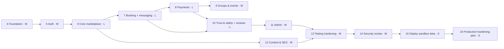

# 19 — MVP Roadmap

Status: Draft v0.1 · 2026-09-17 · Phases 0–3 (Discovery, Research, Architecture, UX) are **complete as documents** in this `docs/` folder.

Principles: build incrementally; keep the app runnable after each phase; tests with every phase; security review continuously; no phase is "done" without meeting its exit criteria. Relative size: S (days), M (1–2 weeks), L (2–4 weeks) for a single developer with AI assistance. These are rough and will be re-estimated after Phase 4.

## Phase overview



## Phase 4 — Foundation (M) ✅ complete (2026-09-17)

**Delivered**
- Next.js 16 (App Router, Turbopack) + TypeScript strict (`noUncheckedIndexedAccess`); ESLint (Next core-web-vitals + TypeScript + `sql.raw` interpolation ban), Prettier; `@/` and `@tests/` aliases; Node 24 LTS pinned.
- Platform primitives in `src/server/platform`: zod env validation (fail-fast via `instrumentation.ts`), pino logger with redaction, request context, typed errors → RFC 9457 problem+json, Drizzle/postgres.js client, `Clock`, authz (`Actor`, capability restrictions, composable guards, `authorize`), hash-chained append-only audit log, transactional outbox (claim with `SKIP LOCKED`, backoff, stale-lock reclaim, recurring jobs), idempotency keys (replay / mismatch / in-progress / stale takeover), Postgres fixed-window rate limiter, versioned settings + feature flags (audited), `defineRoute` HTTP pipeline (request id, same-origin CSRF check, JSON-only bodies with streaming size limit, validation, rate limit, idempotency, safe errors).
- Migrations: extensions, `app` schema, platform + reference tables with CHECK constraints, triggers (`updated_at`, append-only guard, audit hash chain + `app.verify_audit_chain()`).
- Idempotent reference seed: 250 countries (10 study-abroad destinations enabled), 12 currencies, 70-term two-section category tree (visa topics flagged as personal-experience).
- API: `/api/health`, secret-protected `/api/health/ready`, `/api/internal/jobs/tick`, problem+json 404 for unknown API paths.
- UI foundation: light/dark tokens, Instrument Sans + Source Serif 4 via `next/font`, Button, Badge, Card, Container, Skeleton, EmptyState, ErrorState, Logo, site header/footer, skip link; honest foundation home page; 404, error and global-error boundaries; non-production `robots.txt` disallow.
- Security headers + enforced baseline CSP (ADR-021); `X-Robots-Tag: noindex` outside production.
- Tests: Vitest unit + architecture tests (42), integration tests on throwaway databases cloned from a migrated template (43), Playwright E2E with axe (11 passing + 1 skipped for mobile keyboard).
- CI (GitHub Actions, actions pinned to SHAs): format, lint, typecheck, unit, integration (Postgres service), build + E2E, gitleaks, `npm audit`. Dependabot for npm and actions.
- Repo files: `CONTRIBUTING.md` (setup and engineering rules), `SECURITY.md`, `LICENSE` (proprietary, all rights reserved), `.env.example`, `.nvmrc`, `AGENTS.md`/`CLAUDE.md`. `README.md` is written by the maintainer.

**Deviations from plan:** module boundaries are enforced by architecture tests instead of `eslint-plugin-boundaries` (ADR-022); the CSP is an enforced baseline rather than report-only, with a strict nonce policy for authenticated areas moved to Phase 5 (ADR-021); form components (Input, Select, Dialog, Toast) move to Phase 5, where the first forms are built.

**Exit criteria (met):** `npm run dev`/`build`/`start` work against local Postgres; unit, integration and E2E suites green; outbox exactly-once, idempotency replay and audit-chain verification covered by integration tests; cross-module imports blocked by architecture tests.

## Phase 5 — Authentication (M)

**Status:** ✅ complete (2026-09-22). `src/server/modules/auth` — email/password sign-up with 18+ attestation and versioned Terms/Privacy consent; single-use hashed email-verification, password-reset, email-change and email-change-revert tokens; Argon2id (`@node-rs/argon2`, m=19 MiB t=2 p=1) with automatic rehash-on-login and a timing-equalised dummy hash for unknown accounts; DB-backed sessions (`__Host-` cookie prefix in production, sliding idle + absolute lifetimes, a much shorter lifetime for staff roles); account- and IP-scoped sign-in throttling; TOTP MFA (RFC 6238, verified against the published test vectors) with 10 hashed single-use backup codes and replay protection; Google OAuth (Authorization Code + PKCE + nonce, via `jose` against Google's live JWKS) with the pre-hijack defence from docs/07 §3.3 (a verified Google identity takes over an unverified local credential account rather than creating a duplicate); HIBP k-anonymity breach checking (fails open); step-up (`requireRecentUserAuth`) guarding password/email change, MFA enrolment/disable and "sign out everywhere"; sessions list + revoke-all; roles table with `student` auto-granted at sign-up; auth audit events on every sensitive action; a console email adapter delivered through the Phase 4 transactional outbox.

**Deviations from the original plan, decided and recorded as ADRs:** the auth core is hand-written directly on the platform's request pipeline instead of the Better Auth library (**ADR-023**), so every auth route gets the same CSRF/audit/error handling as the rest of the app instead of a second, library-owned request path. Turnstile is deferred — no domain exists yet to register a site key against — with the account/IP rate limits standing in until then (**ADR-024**). Passkeys stay Beta-deferred as originally planned. The nonce-based strict CSP that ADR-021 pencilled in for Phase 5 is also deferred: there is still no dashboard or admin UI for it to apply to (this phase shipped API routes only, no pages), so it moves to whichever phase first renders an authenticated page.

**Tested:** 23 new unit tests (RFC 6238 TOTP vectors, RFC 4648 base32 vectors, password policy, session lifetime rules) and 31 new integration tests against a real Postgres — sign-up enumeration safety, token single-use and expiry, sign-in throttling and generic-error timing safety, session lifecycle (list/current-flag/revoke-all), password reset revoking every session, authenticated password change keeping the acting session while revoking the rest, step-up rejection on a stale session, email change requiring confirmation before it applies and the old address's undo link, full MFA enrol → sign-in-with-code → replay-rejected cycle, backup-code single-use, and all three Google OAuth account-resolution paths (new account, automatic linking, pre-hijack takeover) plus state-mismatch CSRF rejection and unverified-Google-email rejection — all with the network calls (HIBP, Google) mocked so CI never depends on a live third party. 139 tests total pass (unit + integration + architecture); `npm run build` produces all 20 routes; a manual smoke test against the production build (`next start`) confirmed cookie flags, the outbox actually delivering a real console-adapter email, and `/me` round-tripping a live session.

**Known gaps, honestly stated:** "MFA required for staff" has no staff-only route to integration-test yet (no staff accounts or admin routes exist until Phase 11) — the underlying policy (`requireStaffWithMfa`) is unit-tested from Phase 4. Google-linked accounts don't get a TOTP step even if the same person is later granted a staff role, since Google's flow doesn't collect a second factor; this is a known limitation until staff onboarding (Phase 11) defines how staff accounts are created. "New device sign-in" email was explicitly marked Beta/risk-based in docs/07 and was not built. Rate limiting is Postgres fixed-window (already documented in Phase 4 as swappable for Redis at scale), applied per account and per IP as an approximation of the "progressive delay" docs/07 describes, not true exponential backoff per attempt.

**Exit criteria met:** auth test suite ([13 §4](13-testing-strategy.md#4-integration--api-test-inventory)) green including enumeration and pre-hijacking tests. The BOLA matrix framework itself is still Phase 6+ work (there is no `/me/*` resource-scoped route yet — `/me` returns only the caller's own data with no path parameter to enumerate), so that half of the original exit criterion is carried forward rather than met early.

## Phase 6 — Core marketplace (L)

**Status:** ✅ complete (2026-09-23), with explicit deferrals below. Two new modules — `src/server/modules/profiles` (student/mentor profiles, affiliations, expertise, languages, links, eligibility attestation, saved mentors, search) and `src/server/modules/verification` (email-challenge verification, credentials) — plus a `geo` reference layer (`cities`, `universities`, `university_aliases`, `university_domains`, `departments`, `programs`, `companies`, `company_domains`) in the platform layer, hand-curated for India and Germany (29 real universities, 9 companies, real institutional domains) rather than a live ROR/GeoNames import pipeline.

**Delivered:** student profile visibility settings; the full mentor application lifecycle (draft → submitted → approved/rejected/paused) with a slug generator, completeness check and an admin review endpoint (`admin`/`super_admin`, MFA-gated); affiliations (education/work, university-or-company-scoped with a DB check constraint), expertise (reusing the Phase 4 category taxonomy) and languages (a new flat `language` taxonomy vocabulary, 20 seeded languages); a work-eligibility attestation that resolves volunteer/paid mode from a configurable, country-keyed rule table (`mentor_eligibility.country_rules`) and is append-only for audit history (docs/10 §3.1); the email-challenge verification flow (docs/10 §2.4) — domain-match validation (exact or subdomain, per docs/10 §2.2), one-verified-email-per-account fingerprinting, auto-approved scoped evidence-badge credentials with kind-aware expiry (current vs. alumni), and a listing-eligibility recompute (`isListable` = approved application **and** ≥ 1 active credential) that rebuilds a denormalised, GIN-indexed `mentor_search_documents` row (`tsvector` full-text search plus array-overlap filters on university/company/category/language) on every relevant change; public `/mentors` (SSR, filterable, paginated) and `/mentors/[slug]` (SSR, `ProfilePage`+`Person`+`BreadcrumbList` JSON-LD, per-mentor `noindex` opt-out, scoped badges rendered per affiliation — never a bare "Verified") pages; saved mentors.

**Deviations from the original plan, decided and documented:**
- **Document-upload verification is out of scope this phase.** It needs a real architectural decision (an `ObjectStore` port, a local-filesystem dev adapter, magic-byte validation, image re-encoding, 60-second signed reviewer URLs, a reviewer UI) that deserves its own pass rather than being bolted on. Only the email-challenge method — which docs/10 §2.4 itself calls the low-risk, auto-approving fast path — is implemented. Document review, `verification_evidence`, and badges beyond "email confirmed" (e.g. "degree document reviewed") follow later.
- **No self-serve mentor application wizard UI.** The full API exists and is exercised end to end by the integration tests and a manual smoke test (sign-up → application → admin approval → email verification → search → profile page), but the multi-step wizard screen from docs/22 §3 J2 is dashboard UI, not SEO-critical, and was deferred to keep this phase's scope honest. A mentor can be onboarded today via the API; the wizard is a fast-follow.
- **Reference data is hand-curated, not an automated ROR/GeoNames import pipeline.** Consistent with Phase 4's taxonomy/country seeding precedent (docs/05 §8) — real institutions, real domains, admin-extensible, but a bulk importer with alias/dedup handling is separate future work.
- **Ranking is recency-only** (`ORDER BY updated_at DESC`), not the "explainable default ranking" docs/01 §5.3 describes — that needs reliability/review signals that don't exist until Phase 7 (bookings) and Phase 10 (reviews).
- **Price filtering doesn't exist** because `mentor_services`/pricing is explicitly a Phase 7 concern (docs/05 §2's own bounded-context split) — the exit criteria's "price filter" is carried forward to Phase 7.
- **University/country/city SEO hub pages, "help me choose" questionnaire, saved searches & alerts, and badges/reliability display beyond the reliability percentage stub are not built** — all explicitly named as their own line items in docs/01 §5.3 and docs/22, not silently dropped.

**Tested:** 28 new tests (167 total) — unit coverage for the eligibility rule resolver (wildcard vs. country override, protect-first default), the listing rule, slug generation (diacritics, apostrophes, collapsing), domain-match (exact/subdomain/case-insensitive/lookalike-rejection) and evidence-badge label formatting; a full integration vertical slice driving every route from sign-up through admin approval, real-domain email-challenge verification, university-filter search, keyword search and saved-mentors toggling against the actual seeded IIT Bombay data; and edge cases — domain mismatch rejection, cross-account fingerprint conflict (with a same-owner re-verification test proving it isn't a false positive), affiliation ownership scoping (404, not 403), and unlisted-profile visibility (owner sees it, everyone else gets 404). A real bug was caught by the first end-to-end test run and fixed before merge: the token-consumption query nulled its own expiry column then read that same now-null column back to check expiry, so every confirmation attempt failed regardless of actual expiry — the fix moved the expiry check into the `WHERE` clause. `npm run build` produces both pages and all 20 new routes; a manual smoke test against the production build seeded a real mentor through the entire flow via curl and confirmed the rendered pages (light, dark, mobile) show the scoped "Education: Indian Institute of Technology Bombay — university email confirmed (Sep 2026)" badge — not a bare "Verified" — matching docs/10 §2.1's explicit design decision.

**Exit criteria:** a seeded mentor can be approved, verified and found by university/category/language filters and keyword search — met. Price filtering is carried forward to Phase 7 (see above). Profile pages were visually reviewed (light/dark/mobile) but not run through an automated Lighthouse budget check in this pass. `EXPLAIN`-based index-usage tests for the search query were not added — carried forward alongside the BOLA matrix work.

## Phase 7 — Booking & messaging (L)

**Status:** ✅ core booking complete (2026-09-23), with explicit deferrals below (booking-scoped messaging did not land this pass — see Deviations). `src/server/modules/booking` — scheduling settings, weekly availability rules and absolute exceptions (vacations / extra openings), mentor services with per-duration pricing, DST-safe slot generation (`@js-temporal/polyfill`), the full booking transaction (per-mentor-day `pg_advisory_xact_lock`, lazy hold expiry, fresh-read eligibility re-check, a hand-written GiST exclusion constraint as the real no-double-booking guarantee — ADR-027), the 14-state booking state machine (docs/09 §7.1), cancellation quotes with a rolling 90-day courtesy-late-cancel exception, self-service and mentor-consent reschedule flows, RFC 5545 ICS generation, a participation-gated join redirect that never exposes the raw meeting URL, outbox-scheduled reminders and attendance prompts, and the attendance evidence/claim/finalise pipeline (docs/09 §11) including the contested-no-show path.

**Delivered:** 20 new HTTP routes under `/api/v1` (scheduling settings, availability rules/exceptions, services, public slot query, booking CRUD, cancellation quote/cancel, reschedule request/decision, attendance claims, ICS download, session join/check-in); a `RouteResult.raw` addition to the shared route pipeline (ADR-028) so the join redirect and ICS download get the same actor/CSRF/logging pipeline as every JSON route without forcing a JSON body; two new recurring jobs (attendance finaliser, reschedule-consent expiry) registered alongside Phase 4's platform jobs; a real, live "Book a session" panel added to the public `/mentors/[slug]` page showing a mentor's actual open slots (server-rendered, no client JS).

**Deviations from the original plan, decided and documented:**
- **Booking-scoped messaging and the in-app notifications center are not built this pass**, despite being named in this phase's original scope. Booking mechanics (the harder, more failure-prone half of "Booking & messaging") took the full phase; messaging is its own bounded context (`conversations`, `messages`, `notifications` — docs/05 §2) that deserves the same dedicated pass profiles/verification got in Phase 6 rather than being bolted on at the end. It is the first item of a Phase 7b.
- **No mentor scheduling/service self-management UI, and no student/mentor booking dashboard UI.** The full API exists and is exercised end-to-end by 27 new integration tests plus a real manual smoke test through the production build, but these are dashboard screens, not SEO-critical pages — the same call Phase 6 made for the mentor-application wizard. A mentor can configure availability and services today via the API.
- **No interactive "pick a slot and book" widget on the mentor profile page**, specifically because there is still no sign-in *page* (Phase 5 shipped auth as API routes only). Building a book button that would 401 for every anonymous visitor would be misleading rather than useful, so the profile page instead server-renders the mentor's real upcoming availability and links nowhere — genuinely live data, honestly scoped.
- **Only `one_on_one` sessions are implemented.** `group`/`event` stay in the `kind` enum and the schema (`sessions.capacity`, `min_participants`, `waitlist`-shaped columns are absent by design) for Phase 9 to extend without a breaking migration, per docs/05 §3.3's own bounded-context split.
- **Only the free-booking path is reachable.** `evaluateBookingEligibility` implements the full documented payability gate (`payout_mode=paid` AND an active payout account AND a valid eligibility attestation), but `payout_accounts` doesn't exist until Phase 8, so `mentorHasActivePayoutAccount` is always `false` — a priced service is correctly, honestly unbookable until then, exactly matching docs/19's original phasing ("money effects stubbed until Phase 8"), not a shortcut.
- **Trust-event/reliability consequences are audit-log signals, not a ledger.** A mentor cancellation's notice-scaled point value (docs/17 §5) and a hold-abuse pattern are recorded via `writeAudit` rather than a `trust_events` table and enforcement engine, which is Phase 10's bounded context (`trust_events`, `policy_rules`, `user_restrictions`). Similarly, `user_restrictions` and `user_blocks` don't exist yet, so the eligibility checks for them are wired (calling the real `activeRestriction` helper on the acting student) but structurally always pass for the mentor side and for blocks — both become live the moment Phase 10 adds the tables, with no booking-module code change needed.
- **A conflicting attendance claim mid-dispute and a "technical issue" claim both route to `disputed`** rather than to the separate reschedule-or-refund resolution flow docs/09 §11 describes, since that flow needs staff tooling (Phase 10/11) this phase doesn't build. `disputed` bookings sit and wait for that tooling; the state transition into `disputed` is real and tested, the resolution isn't.
- **`reschedule_requests` exists** even though docs/05 §2's bounded-context table doesn't list it — docs/09 §7.1 itself calls for "a separate `reschedule_requests` entity," which this phase treats as the source of truth over the summary table's omission.

**Tested:** 85 new tests (252 total) — unit coverage for DST-safe time conversion against every documented fixture (Berlin spring-forward/fall-back, `America/New_York`, `Asia/Kolkata`, `Asia/Kathmandu`, `Australia/Lord_Howe`'s half-hour DST), slot generation (rule stepping, exceptions, buffered-block exclusion, the daily cap), the full booking eligibility gate, the 14-state machine, the cancellation refund policy including the courtesy exception, the attendance outcome table from docs/09 §11 (every documented claim/signal combination), and RFC 5545 ICS formatting (line folding, escaping, `SEQUENCE`, `METHOD`); an integration vertical slice driving booking creation through the real HTTP routes from a fully onboarded, listed mentor (slots → book → view → ICS → cancellation quote → cancel → slot reopens), self-service reschedule, and duration-rejection error shape; four concurrency tests against a real Postgres — 20 parallel bookings for one slot (exactly one winner, verified by both the settled-promise count and a direct `calendar_blocks` row count), partially overlapping slots, adjacent slots exactly at the buffer boundary (both succeed), and the daily cap under parallel load — directly satisfying docs/13 §6; and application-layer tests for the attendance finaliser (silent-vs-explicit timing, no-show grace period) and the reschedule consent/expiry flow, using explicit `now` values since these are time-travel scenarios the HTTP pipeline's real clock can't express. `npm run build` produces all 20 new routes plus the updated profile page; a manual smoke test against the production build ran the entire mentor-onboarding-through-booking-through-cancellation pipeline via curl, confirmed real confirmation/cancellation emails in the outbox, downloaded and visually verified a well-formed `.ics` file, and confirmed the live `/mentors/[slug]` page renders real available slots in the mentor's own time zone.

**Exit criteria:** concurrency test suite (docs/13 §6) — met, four scenarios green against a real database. DST unit fixtures — met, all documented zones and transitions covered. E2E E1/E2 — **not run**: this repo's E2E suite (Playwright) covers Phase 4/5/6 journeys only; extending E1/E2 to a free-booking path is carried forward alongside the BOLA matrix work already carried from Phases 5–6, now joined by booking-specific authorization scenarios (a student viewing another student's booking, a mentor cancelling another mentor's session).

## Phase 8 — Payments (L)

**Scope:** orders, order items, payment intents/payments state machines; commission engine; FakeGateway + dev checkout page + signed webhooks; webhook receiver (verify → inbox → outbox processing); client confirm path; payment sweeper; orphan handling + auto-refund; refunds; payout accounts (fake onboarding) and transfers with holds/release/reversal; double-entry ledger + invariants; reconciliation job (fake provider); Razorpay adapter (test mode: orders, checkout, webhooks, refunds, Route transfers where test mode supports it); receipts (HTML/PDF) with invoice sequences (sandbox); money views for students and mentors (payments, refunds, earnings).

**Exit criteria:** failure matrix ([08 §11](08-payment-architecture.md#11-failure-scenario-matrix-payment-concurrency-brief-38)) covered by integration tests; ledger invariants hold after randomised scenario tests (property-based sequences of pay/cancel/refund/dispute); E2E E2–E5 with fake payments green; Razorpay test-mode happy path verified manually on staging.

## Phase 9 — Group sessions & free events (M)

**Scope:** group session creation (seat pricing helper, min/max, deadlines), seat booking TX, min-participants check job with refunds, waitlist offers/claims, free events (registration, capacity, auto-promotion, visibility, invites), recordings, event pages (SEO + `Event` structured data), event no-show tracking.

**Exit criteria:** E2E E7/E8 green; capacity concurrency test green.

## Phase 10 — Trust & safety + reviews (L)

**Scope:** reports; moderation cases + timeline; trust events + policy rules (seeded defaults); policy evaluator; restrictions enforced via `authorize()`; enforcement actions + notifications; appeals; disputes + evidence + resolution with money effects; contact-info/payment detectors in messaging and profiles; claim-phrase detection; block user; reviews (eligibility, publication checks, holds, mentor responses, reporting, Bayesian ranking input); reliability metrics on profiles.

**Exit criteria:** E2E E9/E10 green; policy engine unit suite green; auto actions limited to low severity (test asserts suspensions/bans are never auto-applied).

## Phase 11 — Admin dashboard (M)

**Scope:** staff shell with MFA/step-up; overview metrics; users & mentors management; verification queue with audited document viewing; bookings/payments/refunds/transfers/reconciliation views and actions (4-eyes thresholds); webhook & outbox inspectors with retry; disputes, reports, cases, appeals queues; taxonomy/countries/cities/universities (merge)/programs CRUD; events management; settings & commission rules & policy rules editors (versioned, reasons); feature flags; audit log viewer; ops monitors page; basic analytics funnels.

**Exit criteria:** every admin action audited (integration test sweeps the admin route inventory); BOLA/BFLA matrix covers staff roles; E2E E11 green.

## Phase 12 — Content & SEO (M)

**Scope:** articles/guides with source metadata, last-verified dates, intake, disclaimers, review-due queue; country, city and university landing pages (quality thresholds for indexing); section hubs; sitemaps (index + per type), robots.txt, canonical rules, Open Graph images, structured data (`Organization`, `WebSite`, `BreadcrumbList`, `CollegeOrUniversity`, `Event`, `Article`); legal pages (draft Terms, Privacy, Refund, Community Guidelines, Grievance). **Community Q&A is deferred to Beta** (moderation load + UGC legal exposure; not needed for liquidity at launch).

**Exit criteria:** Lighthouse SEO ≥ 95 on sample pages; structured data validates; no thin pages indexed (test on seed data).

## Phase 13 — Testing hardening (M)

**Scope:** fill gaps in the test inventory; full E2E suite across browsers; mobile viewport runs; accessibility audit fixes (keyboard, screen reader spot checks with VoiceOver/NVDA); performance budgets; load test on staging (k6); chaos-style tests (provider timeouts, webhook delays).

**Exit criteria:** all [13](13-testing-strategy.md) gates green for 7 consecutive nightly runs.

## Phase 14 — Security review (M)

**Scope:** ASVS 5.0 L2 checklist walk-through with evidence; threat model refresh; ZAP baseline + manual testing of authz, payments, uploads, CSRF, headers; dependency review; secrets review; logging review (no PII leaks); fix all critical/high findings; document accepted risks.

**Exit criteria:** zero open critical/high findings; accepted-risk register signed off by the founder.

## Phase 15 — Deploy sandbox beta (S)

**Scope:** host decision per [14 §3](14-deployment.md#3-hosting-decision-procedure-phase-15); Supabase staging (Mumbai) setup checklist; Razorpay test-mode webhooks; `pg_cron` tick; backups + restore drill; uptime + alerts; Sentry; invite-only beta (feature flag); beta feedback loop.

**Exit criteria:** staging runs 14 days with no P0/P1 alerts unresolved; restore drill passed; reconciliation shows zero unexplained items.

## Phase 16 — Production hardening plan (S)

**Scope:** consolidated gap list from [08 §13](08-payment-architecture.md#13-production-critical-gate-for-live-payments), [12 §16](12-privacy-compliance.md#16-compliance-checklist) and [14 §8](14-deployment.md#8-production-critical-launch-checklist-infrastructure); cost plan; legal/CA engagement checklist; go/no-go criteria for live payments.

**Exit criteria:** written go/no-go document; **live payments remain disabled** until all Production-critical items are complete.

## Founder action items (outside code)

| When | Action |
|------|--------|
| Before Phase 5 | Decide repo visibility + license; confirm brand working name |
| Phase 5 (optional) | Create Google OAuth client (basic scopes need no verification) |
| Before Phase 8 | Create a Razorpay account and generate **test** API keys (no KYC needed for test mode) |
| Before Phase 11 | Choose second admin/moderator (for 4-eyes); otherwise document single-staff mode |
| Before Phase 15 | Supabase account (staging project, Mumbai); Cloudflare account (Turnstile); Sentry account; offsite backup storage account; host account |
| Before public beta | Domain purchase (~₹1,000/yr); Resend domain verification; grievance officer designation; recruit 15–30 founding mentors |
| Before live money | Legal entity; Razorpay KYC + Route activation; lawyer + CA review; paid infrastructure |

## Readiness classification at end of Phase 15

| Capability | Classification |
|-----------|---------------|
| Auth, profiles, discovery, availability, booking, holds, double-booking prevention | **Beta** (functionally complete; free-tier infra) |
| Payments (fake + Razorpay test) | **MVP / sandbox**, *architecturally correct*, **not production-ready** until the live gate |
| Refund/payout/ledger/reconciliation | **MVP / sandbox**, needs provider live verification |
| Trust & safety tooling | **Beta** (needs staffing + counsel-reviewed policies) |
| Admin dashboard | **Beta** |
| Infrastructure (free tiers) | **MVP only, NOT for real money** |
| Legal documents | **Draft**, needs counsel |
| Backups | **MVP** (24 h RPO), **not production-ready** |

## Progress report template (end of each phase)

```
## Phase N report — <name> — <date>
Completed:
Tested: (suites, counts, notable cases)
Remaining:
Known issues:
Architectural decisions (links to ADRs added/changed):
Security concerns:
Next milestone:
```
