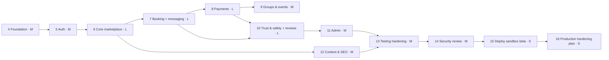

# 19 — MVP Roadmap

Status: Draft v0.1 · 2026-09-17 · Phases 0–3 (Discovery, Research, Architecture, UX) are **complete as documents** in this `docs/` folder.

Principles: build incrementally; keep the app runnable after each phase; tests with every phase; security review continuously; no phase is "done" without meeting its exit criteria. Relative size: S (days), M (1–2 weeks), L (2–4 weeks) for a single developer with AI assistance. These are rough and will be re-estimated after Phase 4.

## Phase overview



## Phase 4 — Foundation (M)

**Scope**
- Next.js (App Router) + TypeScript strict; ESLint (incl. `eslint-plugin-boundaries`, security rules, `no-restricted-imports` for `server/`), Prettier; path aliases.
- Platform primitives: env schema (zod), logger (pino), request context, typed errors → problem+json, DB client + transaction helper (Drizzle, `postgres`), `Clock`, authz skeleton (`Actor`, `authorize`), audit writer (hash chain), outbox (table + tick endpoint + worker loop), idempotency middleware, Postgres rate limiter, settings service (versioned), feature flags.
- Migrations baseline: `app` schema, extensions, platform tables (settings, flags, outbox, idempotency, rate limits, audit).
- Reference data seed: countries (ISO), currencies, initial taxonomy (career + study-abroad categories).
- Design system foundation: tokens (light/dark), fonts via `next/font`, Button, Input, Select, Card, Dialog, Toast, Skeleton, EmptyState, ErrorState; app shell with header/footer; accessible nav.
- Security headers baseline + CSP (report-only), `/api/health`.
- Testing harness: Vitest (unit + DB template cloning), Playwright config, axe helper.
- CI workflow (lint, typecheck, unit, integration, build, e2e smoke, gitleaks, audit).
- Repo files: `README.md`, `CONTRIBUTING.md`, `SECURITY.md`, `LICENSE` (per founder decision), `.env.example`, `.nvmrc`, Dependabot config.

**Exit criteria:** `npm run dev` works against local Postgres; `npm test` and CI green; platform primitives have unit/integration tests (outbox exactly-once, idempotency replay, audit chain verification); lint blocks cross-module imports.

## Phase 5 — Authentication (M)

**Scope:** Better Auth (email/password, email verification, reset, Google OAuth, TOTP + backup codes); Argon2id; session config (DB sessions, `__Host-` cookie, no cookie cache); sign-in throttling + Turnstile; age gate + consents; roles table + staff MFA enforcement; step-up; account settings (sessions list, revoke all, email change flow); account states; auth audit events; email adapter (console).

**Exit criteria:** auth test suite ([13 §4](13-testing-strategy.md#4-integration--api-test-inventory)) green including enumeration and pre-hijacking tests; BOLA matrix framework running on `/me/*` routes.

## Phase 6 — Core marketplace (L)

**Scope:** student profile with visibility; mentor application → approval (minimal admin screen); mentor profile (affiliations, expertise, languages, links); eligibility attestation + volunteer/paid mode; universities/cities import scripts (ROR + GeoNames + domains) for the launch countries (India, Germany first); verification (university/work email challenge; document upload via `ObjectStore` with a local filesystem adapter in dev); credentials + badges; `mentor_search_documents` builder; explore page with filters and explainable ranking; mentor profile page (SSR, metadata, structured data); saved mentors; "help me choose" questionnaire.

**Exit criteria:** a seeded mentor can be approved, verified and found by university/category/price/language filters; profile pages pass Lighthouse budgets; search queries use indexes (EXPLAIN tests).

## Phase 7 — Booking & messaging (L)

**Scope:** scheduling settings, availability rules/exceptions UI (mentor-local); slot generation API (DST fixtures); booking transaction with holds + exclusion constraint + lazy expiry; booking state machine; free 1:1 booking end-to-end; cancellation quotes and cancellations (money effects stubbed until Phase 8); reschedule flows; meeting link validation + join redirect; ICS generation; reminders via outbox; attendance check-in, claims, finaliser; booking-scoped messaging (async threads) + in-app notifications center; student and mentor booking dashboards.

**Exit criteria:** concurrency test suite ([13 §6](13-testing-strategy.md#6-concurrency-tests)) green; E2E E1/E2 (with free booking) green; DST unit fixtures green.

## Phase 8 — Payments (L)

**Scope:** orders, order items, payment intents/payments state machines; commission engine; FakeGateway + dev checkout page + signed webhooks; webhook receiver (verify → inbox → outbox processing); client confirm path; payment sweeper; orphan handling + auto-refund; refunds; payout accounts (fake onboarding) and transfers with holds/release/reversal; double-entry ledger + invariants; reconciliation job (fake provider); Razorpay adapter (test mode: orders, checkout, webhooks, refunds, Route transfers where test mode supports it); receipts (HTML/PDF) with invoice sequences (sandbox); money views for students and mentors (payments, refunds, earnings).

**Exit criteria:** failure matrix ([08 §11](08-payment-architecture.md#11-failure-scenario-matrix-payment-concurrency-brief-38)) covered by integration tests; ledger invariants hold after randomised scenario tests (property-based sequences of pay/cancel/refund/dispute); E2E E2–E5 with fake payments green; Razorpay test-mode happy path verified manually on staging.

## Phase 9 — Group sessions & free events (M)

**Scope:** group session creation (seat pricing helper, min/max, deadlines), seat booking TX, min-participants check job with refunds, waitlist offers/claims, free events (registration, capacity, auto-promotion, visibility, invites), recordings, event pages (SEO + `Event` structured data), event no-show tracking.

**Exit criteria:** E2E E7/E8 green; capacity concurrency test green.

## Phase 10 — Trust & safety + reviews (L)

**Scope:** reports; moderation cases + timeline; trust events + policy rules (seeded defaults); policy evaluator; restrictions enforced via `authorize()`; enforcement actions + notifications; appeals; disputes + evidence + resolution with money effects; contact-info/payment detectors in messaging and profiles; claim-phrase detection; block user; reviews (eligibility, publication checks, holds, mentor responses, reporting, Bayesian ranking input); reliability metrics on profiles.

**Exit criteria:** E2E E9/E10 green; policy engine unit suite green; auto actions limited to low severity (test asserts suspensions/bans are never auto-applied).

## Phase 11 — Admin dashboard (M)

**Scope:** staff shell with MFA/step-up; overview metrics; users & mentors management; verification queue with audited document viewing; bookings/payments/refunds/transfers/reconciliation views and actions (4-eyes thresholds); webhook & outbox inspectors with retry; disputes, reports, cases, appeals queues; taxonomy/countries/cities/universities (merge)/programs CRUD; events management; settings & commission rules & policy rules editors (versioned, reasons); feature flags; audit log viewer; ops monitors page; basic analytics funnels.

**Exit criteria:** every admin action audited (integration test sweeps the admin route inventory); BOLA/BFLA matrix covers staff roles; E2E E11 green.

## Phase 12 — Content & SEO (M)

**Scope:** articles/guides with source metadata, last-verified dates, intake, disclaimers, review-due queue; country, city and university landing pages (quality thresholds for indexing); section hubs; sitemaps (index + per type), robots.txt, canonical rules, Open Graph images, structured data (`Organization`, `WebSite`, `BreadcrumbList`, `CollegeOrUniversity`, `Event`, `Article`); legal pages (draft Terms, Privacy, Refund, Community Guidelines, Grievance). **Community Q&A is deferred to Beta** (moderation load + UGC legal exposure; not needed for liquidity at launch).

**Exit criteria:** Lighthouse SEO ≥ 95 on sample pages; structured data validates; no thin pages indexed (test on seed data).

## Phase 13 — Testing hardening (M)

**Scope:** fill gaps in the test inventory; full E2E suite across browsers; mobile viewport runs; accessibility audit fixes (keyboard, screen reader spot checks with VoiceOver/NVDA); performance budgets; load test on staging (k6); chaos-style tests (provider timeouts, webhook delays).

**Exit criteria:** all [13](13-testing-strategy.md) gates green for 7 consecutive nightly runs.

## Phase 14 — Security review (M)

**Scope:** ASVS 5.0 L2 checklist walk-through with evidence; threat model refresh; ZAP baseline + manual testing of authz, payments, uploads, CSRF, headers; dependency review; secrets review; logging review (no PII leaks); fix all critical/high findings; document accepted risks.

**Exit criteria:** zero open critical/high findings; accepted-risk register signed off by the founder.

## Phase 15 — Deploy sandbox beta (S)

**Scope:** host decision per [14 §3](14-deployment.md#3-hosting-decision-procedure-phase-15); Supabase staging (Mumbai) setup checklist; Razorpay test-mode webhooks; `pg_cron` tick; backups + restore drill; uptime + alerts; Sentry; invite-only beta (feature flag); beta feedback loop.

**Exit criteria:** staging runs 14 days with no P0/P1 alerts unresolved; restore drill passed; reconciliation shows zero unexplained items.

## Phase 16 — Production hardening plan (S)

**Scope:** consolidated gap list from [08 §13](08-payment-architecture.md#13-production-critical-gate-for-live-payments), [12 §16](12-privacy-compliance.md#16-compliance-checklist) and [14 §8](14-deployment.md#8-production-critical-launch-checklist-infrastructure); cost plan; legal/CA engagement checklist; go/no-go criteria for live payments.

**Exit criteria:** written go/no-go document; **live payments remain disabled** until all Production-critical items are complete.

## Founder action items (outside code)

| When | Action |
|------|--------|
| Before Phase 5 | Decide repo visibility + license; confirm brand working name |
| Phase 5 (optional) | Create Google OAuth client (basic scopes need no verification) |
| Before Phase 8 | Create a Razorpay account and generate **test** API keys (no KYC needed for test mode) |
| Before Phase 11 | Choose second admin/moderator (for 4-eyes); otherwise document single-staff mode |
| Before Phase 15 | Supabase account (staging project, Mumbai); Cloudflare account (Turnstile); Sentry account; offsite backup storage account; host account |
| Before public beta | Domain purchase (~₹1,000/yr); Resend domain verification; grievance officer designation; recruit 15–30 founding mentors |
| Before live money | Legal entity; Razorpay KYC + Route activation; lawyer + CA review; paid infrastructure |

## Readiness classification at end of Phase 15

| Capability | Classification |
|-----------|---------------|
| Auth, profiles, discovery, availability, booking, holds, double-booking prevention | **Beta** (functionally complete; free-tier infra) |
| Payments (fake + Razorpay test) | **MVP / sandbox**, *architecturally correct*, **not production-ready** until the live gate |
| Refund/payout/ledger/reconciliation | **MVP / sandbox**, needs provider live verification |
| Trust & safety tooling | **Beta** (needs staffing + counsel-reviewed policies) |
| Admin dashboard | **Beta** |
| Infrastructure (free tiers) | **MVP only, NOT for real money** |
| Legal documents | **Draft**, needs counsel |
| Backups | **MVP** (24 h RPO), **not production-ready** |

## Progress report template (end of each phase)

```
## Phase N report — <name> — <date>
Completed:
Tested: (suites, counts, notable cases)
Remaining:
Known issues:
Architectural decisions (links to ADRs added/changed):
Security concerns:
Next milestone:
```
