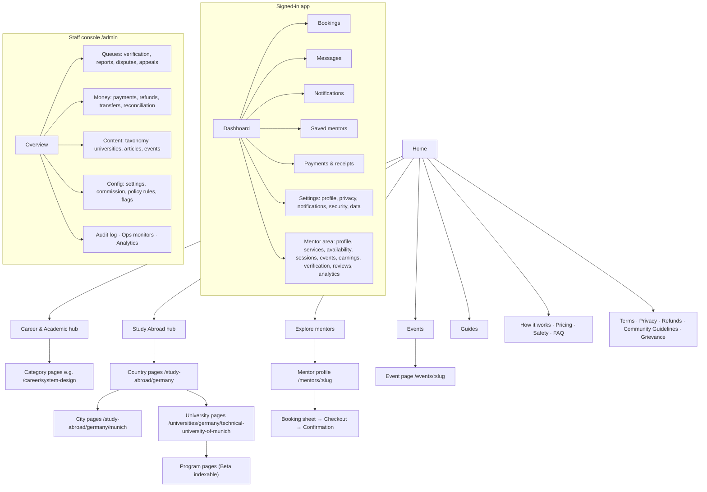

# 22 — UX, Information Architecture, SEO & Design System

Status: Draft v0.1 · 2026-09-17

## 1. UX research synthesis (patterns, not copies)

What credible marketplaces, scheduling tools, education platforms and professional networks consistently do well, and how we apply it:

| Principle | Observed pattern | Our application |
|-----------|-----------------|-----------------|
| **Trust before transaction** | Credentials, reviews and protections sit next to the primary CTA | Profile header: scoped badges + reliability + review summary directly above "Book" |
| **Price clarity** | Total price visible early; fees never appear at the last step | Price per duration on cards and profile; total including any fees before slot selection (dark-pattern compliance) |
| **Time clarity** | Viewer's time zone default, explicit zone labels | Every time shows zone; mentor's local time as secondary line |
| **Progressive disclosure** | Simple first view, details on demand | Card → profile → booking sheet; policy summary with a "full policy" link |
| **Specific over generic** | "Studied MSc Informatics at TUM, 2024" beats "Top mentor" | Structured affiliations; no vanity labels |
| **Low-commitment entry** | Free trials/content before paid | Free events + guides on every hub; "Join a free session" CTA alongside paid |
| **Recoverable errors** | Clear next step when something fails | "Slot just got booked — here are 3 nearby slots" |
| **Calm, dense information design** | Professional tools use restrained colour, strong typography, tables where useful | Editorial typography, neutral palette, one accent |
| **Mobile-first booking** | Most students browse on phones | Bottom-sheet slot picker, sticky price/CTA bar on mobile |

## 2. Information architecture

## 3. Key journeys (screen-level)

**J1 Book 1:1 (mobile-first)**
1. *Mentor card* (explore): photo, name, headline, top 2 badges, rating (or "New mentor"), "from ₹X / 30 min", next available.
2. *Profile*: header (badges, reliability, reviews summary, languages, time zone) → sticky "Book" bar with price → sections: About, Experience & education (per-item badges), Services (durations & prices), Reviews (histogram + list), Free events by this mentor.
3. *Booking sheet*: service → duration → date strip (next 14 days with availability dots) → time chips in viewer's zone (+ mentor local secondary) → intake questions → summary with total + policy summary → "Continue to payment" (hold starts, countdown visible).
4. *Checkout*: provider modal; on return → "Confirming your payment…" (polls) → *Confirmation*: add-to-calendar buttons, what happens next, message mentor.
5. *Dashboard booking card*: countdown, join button (active T−15), reschedule/cancel with refund preview.

**J2 Mentor onboarding (wizard with save-and-resume)**
Basics → Expertise → Education & work → Eligibility (country, status; explains volunteer vs paid) → Verification (email challenge or upload) → Services & prices (earnings preview) → Availability (weekly grid in local zone; buffer/notice/max per day) → Payout setup (paid mode) → Review & submit → status page with checklist.

**J3 Report & appeal**
"⋯ → Report" on any item → reason → optional details → confirmation ("We'll review within X"). The enforcement notice explains what, why, duration and how to appeal → appeal form → status.

## 4. UI state requirements (every screen)

| State | Requirement |
|-------|-------------|
| Loading | Skeletons matching final layout (no layout shift); spinners only for < 1 s actions inside buttons |
| Empty | Explain why it's empty + one primary next action (e.g. "No upcoming sessions. Explore mentors or join a free event") |
| Error | Human message + retry + request id (small, copyable) for support; never raw errors |
| Success | Inline confirmation or toast with next step; destructive actions offer undo where feasible |
| Partial/degraded | e.g. email provider down → in-app notice still shows; payment confirming → polling state with reassurance |
| Restricted | Clear notice with reason and appeal link instead of disabled buttons without explanation |

## 5. Brand (temporary)

- **Working name:** Aheadly (placeholder; trademark/domain clearance pending). Name lives only in `src/config/brand.ts` (ADR-020). A web search found no mentorship platform using this name; "Been There" is taken by a UK mentoring app.
- **Tagline:** *Guidance from people who've been there.*
- **Logo concept:** lowercase wordmark `aheadly` with a mark of **two offset rounded squares forming a step** ("one step ahead"). The mark works as a monochrome favicon; no gradients.
- **Voice:** clear, warm, specific, honest about limits ("mentor experience, not official advice"). No hype ("guaranteed", "top 1%").
- **Imagery:** real mentor photos (consented), simple line illustrations for empty states; no stock-photo handshakes.

## 6. Design language & tokens

### 6.1 Colour (WCAG-checked pairs)

| Token | Light | Dark | Use | Contrast note |
|-------|-------|------|-----|---------------|
| `--bg` | `#FAFAF7` | `#0E1419` | Page background | — |
| `--surface` | `#FFFFFF` | `#151D24` | Cards, sheets | — |
| `--border` | `#E4E2DC` | `#26313A` | Dividers, inputs | Non-text |
| `--text` | `#0B1B2B` | `#E7ECEF` | Body text | ≈ 17:1 on `--bg` (light) |
| `--text-muted` | `#5B6470` | `#9AA7B2` | Secondary text | ≈ 5.7:1 on `--bg` (light) ✓ AA |
| `--primary` | `#0E5A6B` (Harbor) | `#5CC3D6` | Primary buttons, links | White on `#0E5A6B` ≈ 7.8:1 ✓; dark mode uses dark text on `#5CC3D6` |
| `--accent` | `#E8A33D` (Saffron) | `#F0B55A` | Highlights, badges background, focus ring accent | Use **dark text** on accent (≈ 8:1) |
| `--success` | `#1F7A4D` | `#4CC38A` | Confirmed states | White on light token ≈ 5.3:1 ✓ |
| `--warning` | `#B45309` | `#F5A524` | Holds, expiring | White on light token ≈ 5.0:1 ✓ |
| `--danger` | `#B42318` | `#F97066` | Errors, destructive | White on light token ≈ 6.6:1 ✓ |
| `--focus` | `#0E5A6B` 2px + 2px offset | `#5CC3D6` | Focus ring | ≥ 3:1 against adjacent colours |

Colour is never the only carrier of meaning (icons + text for statuses). Final values are re-verified with an automated contrast check in the design-system test suite.

### 6.2 Typography
- **UI & headings:** *Instrument Sans* (open licence), weights 400/500/600.
- **Long-form guides:** *Source Serif 4* for article body to give an editorial reading feel.
- Self-hosted via `next/font` (no runtime Google requests → privacy + performance). Fallbacks: system UI stacks; Devanagari fallback *Noto Sans Devanagari* when Hindi ships.
- Scale (rem): 0.75 / 0.875 / 1 / 1.125 / 1.25 / 1.5 / 1.875 / 2.25 / 3; line-height 1.5 body, 1.2 headings; max line length ~70ch.
- **Tabular numerals** for prices, times, countdowns.

### 6.3 Layout, spacing, shape, motion
- 4 px spacing base (4/8/12/16/24/32/48/64); container max 1200 px; 12-column grid ≥ 1024 px, single column < 640 px.
- Radius: 8 px (inputs, buttons), 12 px (cards), 16 px (sheets). Borders over shadows; one subtle elevation shadow for overlays.
- Motion 150–200 ms ease-out for state changes only; **`prefers-reduced-motion` disables** non-essential animation. No parallax, no autoplay.

### 6.4 Component inventory (Radix primitives + owned components)
Buttons (primary/secondary/ghost/destructive; loading), Input/Textarea/Select/Combobox (typeahead for universities), Checkbox/Radio/Switch, Date strip + Time-slot chips, Dialog/Sheet (mobile bottom sheet), Tabs, Accordion, Toast, Tooltip, Badge (credential badge with method + date popover), Avatar, Card (mentor card, event card), Rating display + histogram, Price breakdown, Countdown (hold), Stepper (wizards), Table (admin; sortable, filterable, paginated), Empty/Error/Loading states, Banner (outdated content, restriction notice, disclaimer), Timeline (case view, booking history), Pagination (cursor "Load more"), Breadcrumbs, Skip link.

## 7. Responsive behaviour

| Breakpoint | Behaviour |
|-----------|-----------|
| < 640 px | Filters in a full-screen sheet with result count button; sticky bottom booking bar; slot picker as bottom sheet; tables → stacked cards (admin read-only on mobile, full admin needs ≥ 768 px) |
| 640–1024 px | Two-column profile (content + sticky booking card below header) |
| ≥ 1024 px | Explore with left filter rail; profile with right sticky booking card |

Touch targets ≥ 44×44 px; no hover-only affordances.

## 8. Accessibility (WCAG 2.2 AA)

- Semantic HTML landmarks; one `h1` per page; logical heading order; skip link.
- All interactive elements keyboard-operable; visible focus (2.4.7) with non-obscured focus (2.4.11); focus trapped in dialogs and restored on close.
- Slot picker: roving tabindex grid with `aria-label` "Friday 3 October, 2:00 PM IST, available"; announces hold countdown changes politely (`aria-live="polite"`, not every second).
- Forms: persistent labels (no placeholder-only), inline errors linked via `aria-describedby`, error summary on submit, no CAPTCHA puzzles (Turnstile non-interactive; accessible fallback).
- Target size ≥ 24×24 CSS px minimum (2.5.8), 44 px preferred.
- Redundant entry avoided (3.3.7): reuse profile data in booking forms. Accessible authentication (3.3.8): allow paste and password managers; email magic links as an alternative for verification flows.
- Colour contrast per §6.1; text resizable to 200%; reflow at 320 px width.
- Media: event recordings link to captions when the host provides them (host checklist).
- Testing: axe in CI, manual keyboard passes, VoiceOver (macOS/iOS) and NVDA spot checks per release ([13 §8](13-testing-strategy.md#8-accessibility--ux-quality-tests)).

## 9. Dark-pattern avoidance checklist (every UI PR)

- [ ] Full price (including any fees) visible before commitment
- [ ] Scarcity/urgency text is literally true (seat counts from DB; hold countdown is real)
- [ ] No pre-checked optional consents or add-ons
- [ ] Declining options use neutral language (no confirm-shaming)
- [ ] Cancellation is as easy as booking, with an upfront refund preview
- [ ] Sponsored items (if ever) are labelled
- [ ] Notifications/emails respect preferences; unsubscribe one click
- [ ] No disguised ads in guides; mentor-contributed content attributed

## 10. SEO architecture

### 10.1 URL structure (stable, human-readable, lowercase, hyphenated)

| Page type | URL | Indexable |
|-----------|-----|-----------|
| Home | `/` | ✓ |
| Section hubs | `/career`, `/study-abroad` | ✓ |
| Career category | `/career/{category-slug}` (e.g. `/career/system-design`) | ✓ if ≥ 1 listed mentor or a guide |
| Country | `/study-abroad/{country-slug}` (e.g. `/study-abroad/germany`) | ✓ when country enabled + content present |
| City | `/study-abroad/{country}/{city}` (e.g. `/study-abroad/germany/munich`) | ✓ if quality threshold met |
| University | `/universities/{country}/{university-slug}` (e.g. `/universities/germany/technical-university-of-munich`) | ✓ if ≥ 1 verified mentor affiliation **or** a guide; else `noindex` |
| Program | `/universities/{country}/{university}/{program-slug}` | `noindex` in MVP |
| Explore | `/mentors?…` | Base `/mentors` ✓; filtered combinations `noindex, follow` with canonical to base (curated combos become hub pages instead) |
| Mentor profile | `/mentors/{slug}` | ✓ if listed and the mentor opted in to search indexing (default on, toggle in privacy settings) |
| Events | `/events`, `/events/{slug}` | Public ✓; unlisted/private `noindex` |
| Guides | `/guides/{slug}` (+ `/guides/country/{country}` listings) | ✓ |
| Community (Beta) | `/community/...` | Questions `noindex` until answered and moderated |
| Legal & trust | `/legal/*`, `/how-it-works`, `/safety`, `/pricing`, `/faq` | ✓ |
| App/admin | `/dashboard/*`, `/admin/*`, `/api/*` | `noindex` + disallowed in robots |

Renamed slugs keep a `slug_redirects` history → **301**.

### 10.2 Rendering & metadata
- Public pages SSR/ISR with the Next.js Metadata API: unique `<title>` (≤ 60 chars) and meta description (≤ 155), canonical URL, Open Graph + Twitter cards, generated OG images (mentor name + headline; university name).
- `lang` attribute; `hreflang` added when locales ship.
- Core Web Vitals budgets ([13 §9](13-testing-strategy.md#9-performance-tests)); images via `next/image` with explicit sizes; lazy-load below the fold; no client-side-only rendering of primary content.

### 10.3 Structured data (JSON-LD)
| Page | Types |
|------|-------|
| All | `Organization`, `WebSite` (with `SearchAction` to `/mentors?q=`), `BreadcrumbList` |
| University | `CollegeOrUniversity` (name, address locality, sameAs official website) |
| Event | `Event` / `EducationEvent` (`eventAttendanceMode: OnlineEventAttendanceMode`, `isAccessibleForFree`, `organizer`, `offers` when paid) |
| Guide | `Article` (author, `datePublished`, `dateModified`) |
| Mentor profile | `ProfilePage` with `mainEntity: Person` (name, jobTitle, alumniOf, knowsAbout). **No self-serving `AggregateRating` markup** that search engines won't honour or may treat as spam |
| FAQ page | `FAQPage` where genuinely Q&A formatted (rich result eligibility is limited; markup still valid) |

### 10.4 Sitemaps & robots
- `/sitemap.xml` index → `sitemap-static.xml`, `sitemap-mentors-N.xml`, `sitemap-universities-N.xml`, `sitemap-events.xml`, `sitemap-guides.xml` (≤ 50k URLs each), with `lastmod` from real updates. Regenerated daily and on publish.
- `robots.txt`: allow public; disallow `/dashboard`, `/admin`, `/api`, `/dev`; sitemap reference. Preview/staging environments send `X-Robots-Tag: noindex` globally.

### 10.5 Internal linking
Country → cities → universities → mentors & guides; mentor profiles link to their universities, categories and events; guides link to relevant mentors and events (contextual CTAs); breadcrumbs everywhere; "related mentors" blocks by shared affiliation.

### 10.6 Programmatic page quality rules (avoid scaled thin content)
- A university/city/category page is indexable only when it has **unique value**: ≥ 1 verified mentor or ≥ 1 guide or upcoming event, plus an editorial intro (not template filler).
- No auto-generated text from templates alone; no AI-mass-generated pages.
- Freshness lines and sources on study-abroad pages (supports E-E-A-T signals and user trust).
- Monitor Search Console coverage; prune or `noindex` pages that stay thin.

### 10.7 Target query themes (initial wedge)
"Indian students in Germany", "TU Munich Indian students", "APS certificate process experience", "blocked account Germany experience", "cost of living Munich student", "system design mock interview mentor", "resume review mentor India", "study in Germany free webinar".
