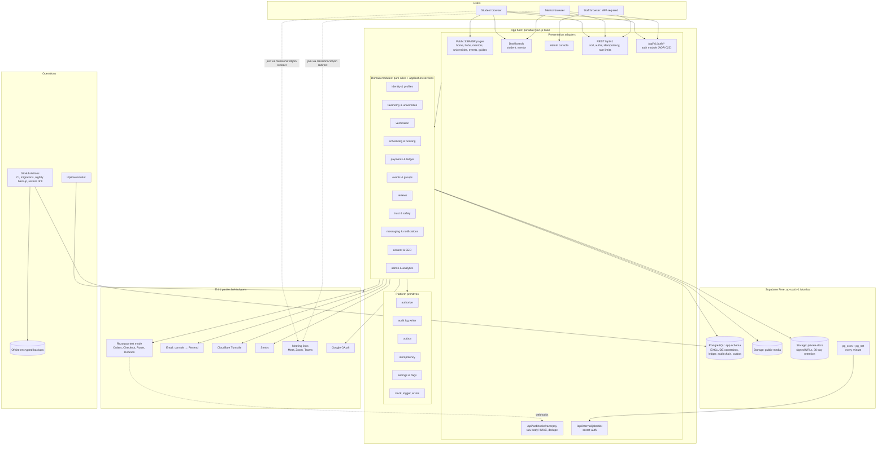
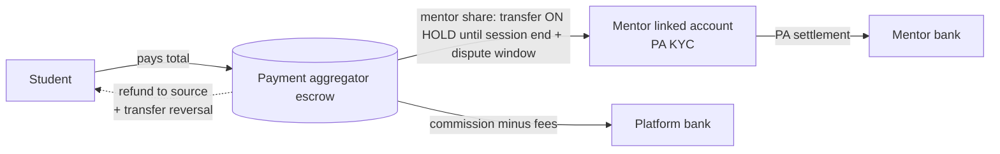
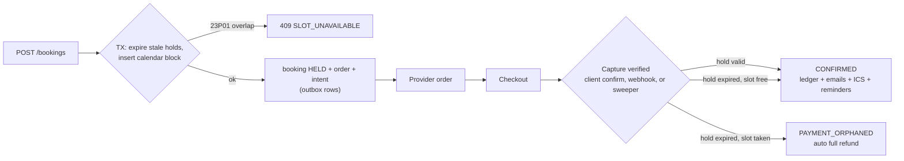

# Architecture Diagrams

GitHub renders these Mermaid diagrams natively. Explanations: [04 — System Architecture](../04-system-architecture.md).

## 1. MVP system architecture (₹0 tier)

## 2. Money flow (Razorpay Route)

## 3. Booking + payment consistency (summary)

